<div align="center">

# ☕ Java DSA – NMIMS


%20&%20CS%20(Batch%204)-red?style=for-the-badge)


### 🚀 *Master Data Structures & Algorithms with Java!*

**Welcome to your comprehensive DSA learning journey!**
Everything you need to ace coding interviews and become a problem-solving expert.

[📚 Start Learning](#-topics-covered) • [💻 Problems Solved](#-problems-covered---day-1) • [🎯 What's Next](#-whats-coming-next)

---

</div>

## 🎯 Quick Navigation

<table>
<tr>
<td width="33%" align="center">

### 📦 **Collections**
Arrays, ArrayList, Lists

[Jump to Topics →](#-collections-framework)

</td>
<td width="33%" align="center">

### 🔢 **Arrays**
Manipulation & Problem Solving

[View Algorithms →](#-arrays--arraylist)

</td>
<td width="33%" align="center">

### 🏆 **Problems**
Practice Questions

[See Problems →](#-problems-covered---day-1)

</td>
</tr>
</table>

---

## 📊 Learning Progress

```
Day 1 - Collections & Arrays:
████████████████████████████████ 100%

✅ Arrays - Basics & Manipulation
✅ ArrayList - Dynamic Arrays
✅ Collections Framework Overview
✅ Lists - ArrayList, LinkedList
✅ Move Zeroes to End Problem
✅ Remove Duplicates Problem
✅ Practice Problems

Day 2 - Interfaces: Set & Map:
████████████████████████████████ 100%

✅ Set Interface (HashSet, LinkedHashSet, TreeSet)
✅ Iterator & Iteration Patterns
✅ Check Duplicates Using Sets
✅ Map Interface (HashMap, TreeMap, LinkedHashMap)
✅ HashMap Operations & Methods
✅ Entry Set Iteration
✅ Frequency Counting Problems

Day 3 - Queue, Comparators & Advanced Techniques:
████████████████████████████████ 100%

✅ Queue Interface (Queue, Deque, PriorityQueue)
✅ ArrayDeque - Double-Ended Queue
✅ PriorityQueue - Min & Max Heaps
✅ Two Pointers Technique (All 3 types)
✅ Sliding Window Technique (Both types)
✅ Comparators - Custom sorting
✅ Sorting with Comparators
✅ Problem Solving & Practice
✅ Maximum Sum Subarray of size K

Day 4 - Recursion & Pattern Matching:
████████████████████████████████ 100%

✅ Regular Expressions (Pattern Matching)
✅ RegEx Special Codes (\d, \w, \s, \D, \W, \S, etc.)
✅ Character Classes & Quantifiers ([A-Z], {n}, +, *, ?, etc.)
✅ Pattern & Matcher in Java - Pattern.compile()
✅ Matcher Methods - matches(), find(), group()
✅ Real-world RegEx Examples (Emails, URLs, Phone Numbers)
✅ Recursion Basics & Base Cases
✅ Understanding Call Stack & Dry Run
✅ Recursion Problems: 1 to N & N to 1
✅ Sum of N Natural Numbers (Recursive)
✅ Factorial (Recursive Implementation)
✅ Permutation Calculation (P(n,r) = n!/(n-r)!)
✅ Combination Calculation (C(n,r) = n!/(r!(n-r)!))
✅ Quick Sort (Recursive Implementation)
✅ Problem Solving & Practice

Day 5 - Backtracking, Recursion & LinkedList (Singly, Doubly, Circular):
████████████████████████████████ 100%

✅ Backtracking Concepts - N Queens Problem Explanation
✅ Recursion - Count Total Paths (Maze Path Problem)
✅ Singly LinkedList - Creation, Traversal, Insertion & Deletion
✅ Doubly LinkedList - Creation, Traversal, Insertion & Deletion
✅ Circular Doubly LinkedList - All Operations with Circular Structure
✅ Advanced LinkedList Problems & Practice

Day 6 - Stack Implementation:
████████████████████████████████ 100%

✅ Stack - Array Implementation
✅ Stack - ArrayList Implementation
✅ Stack - LinkedList Implementation
✅ Stack using Collections Framework
✅ Valid Parentheses Problem (using Stack)
✅ Problem Solving & Practice

Day 7 - Prefix, Infix, Postfix & Queue:
████████████████████████████████ 100%

✅ Prefix, Infix, Postfix Notation - Concepts & Conversions
✅ Queue Implementations using LinkedList
✅ Queue Implementations using ArrayList
✅ Queue Implementations using Array
✅ Deque (Double Ended Queue) Operations
✅ Circular Queue Implementation
✅ Queue-based Problem Solving

Day 8 - Binary Trees:
████████████████████████████████ 100%

✅ Binary Trees - All Concepts
✅ Different Types of Binary Trees (Full, Complete, Perfect, etc.)
✅ Binary Tree Creation using Array Input
✅ Tree Traversals - PreOrder Traversal
✅ Tree Traversals - InOrder Traversal
✅ Tree Traversals - PostOrder Traversal
✅ Sum of All Nodes in Tree
✅ Height of Binary Tree
✅ Problem Solving & Practice

Day 9 - Binary Search Tree (BST):
████████████████████████████████ 100%

✅ Binary Search Tree Properties
✅ BST Creation & Node Insertion
✅ BST Traversals (InOrder - Sorted Output)
✅ BST Search Operations
✅ BST Deletion (All Cases - 0, 1, 2 children)
✅ InOrder Successor Finding
✅ Problem Solving & Practice

Day 10 - Graphs & Dynamic Programming:
████████████████████████████████ 100%

✅ Graph Basics & Terminology
✅ Graph Representations (Adjacency Matrix & List)
✅ Breadth-First Search (BFS) Introduction
✅ Dynamic Programming Fundamentals
✅ Fibonacci Problem - Recursive Approach
✅ Fibonacci - Memoization (Top-Down DP)
✅ Fibonacci - Tabulation (Bottom-Up DP)
✅ Problem Solving & Practice
```

---

## 🗺️ Learning Path 

```mermaid
graph TB
    subgraph Day1["📅 DAY 1: Collections & Arrays"]
        A["📦 Arrays"] --> B["📋 ArrayList"]
        B --> C["🎯 Collections"]
        C --> D["📚 Lists"]
        D --> E["🔧 Move Zeroes"]
        E --> F["🗑️ Remove Duplicates"]
    end
    
    subgraph Day2["📅 DAY 2: Set & Map"]
        G["🎭 Set Interface"] --> H["🔍 HashSet"]
        H --> I["🔄 LinkedHashSet"]
        I --> J["📊 TreeSet"]
        J --> K["🗺️ Map Interface"]
        K --> L["🎛️ HashMap"]
        L --> M["📈 Frequency Counting"]
    end
    
    subgraph Day3["📅 DAY 3: Queue & Advanced Techniques"]
        N["📬 Queue Interface"] --> O["🔗 LinkedList Queue"]
        O --> P["↔️ ArrayDeque"]
        P --> Q["⚡ PriorityQueue"]
        Q --> R["👥 Comparators"]
        R --> S["🪟 Sliding Window"]
        S --> T["👉 Two Pointers"]
        T --> U["📊 Max Sum Subarray K"]
    end
    
    subgraph Day4["📅 DAY 4: Recursion & Patterns"]
        V["🔤 Regular Expressions"] --> W["🔀 Recursion Basics"]
        W --> X["📝 String Recursion"]
        X --> Y["🔢 Array Recursion"]
        Y --> Z["🔀 Merge Sort"]
        Z --> AA["🎯 Quick Sort"]
        AA --> AB["🔥 Advanced Problems"]
    end

    subgraph Day5["📅 DAY 5: Backtracking & LinkedList"]
        AC["🎯 Backtracking"] --> AD["🔀 N Queens"]
        AD --> AE["🌉 Maze Paths"]
        AE --> AF["🔗 Singly LL"]
        AF --> AG["↔️ Doubly LL"]
        AG --> AH["⭕ Circular LL"]
    end
    
    subgraph Day6["📅 DAY 6: Stack Implementation"]
        AI["🥞 Stack Concept"] --> AJ["📚 Array Stack"]
        AJ --> AK["🎯 ArrayList Stack"]
        AK --> AL["🔗 LinkedList Stack"]
        AL --> AM["📦 Collections Stack"]
        AM --> AN["✅ Valid Parentheses"]
    end
    
    subgraph Day7["📅 DAY 7: Infix/Postfix & Queue"]
        AO["🔤 Prefix Notation"] --> AP["🔄 Infix Notation"]
        AP --> AQ["➡️ Postfix Notation"]
        AQ --> AR["🔀 Conversions"]
        AR --> AS["📬 Queue Basics"]
        AS --> AT["🔗 LinkedList Queue"]
        AT --> AU["🏗️ Deque Operations"]
    end
    
    subgraph Day8["📅 DAY 8: Binary Trees"]
        AV["🌳 Tree Basics"] --> AW["📊 Tree Types"]
        AW --> AX["🏗️ Tree Creation"]
        AX --> AY["↔️ PreOrder"]
        AY --> AZ["↔️ InOrder"]
        AZ --> BA["↔️ PostOrder"]
        BA --> BB["📈 Tree Operations"]
    end
    
    subgraph Day9["📅 DAY 9: Binary Search Tree"]
        BC["🌳 BST Properties"] --> BD["➕ BST Insert"]
        BD --> BE["🔍 BST Search"]
        BE --> BF["➖ BST Delete"]
        BF --> BG["📊 InOrder Traversal"]
    end

    subgraph Day10["📅 DAY 10: Graphs & DP"]
        BH["📚 Graph Intro"] --> BI["🗺️ Representations"]
        BI --> BJ["🔍 BFS"]
        BJ --> BK["📈 Dynamic Programming"]
        BK --> BL["🔢 Fibonacci"]
    end
    
    F --> G
    M --> N
    U --> V
    AB --> AC
    AH --> AI
    AN --> AO
    AU --> AV
    BB --> BC
    BG --> BH
    
    style Day1 fill:#90EE90,stroke:#228B22,stroke-width:3px
    style Day2 fill:#87CEEB,stroke:#4169E1,stroke-width:3px
    style Day3 fill:#FFD700,stroke:#FF8C00,stroke-width:3px
    style Day4 fill:#90EE90,stroke:#228B22,stroke-width:3px
    style Day5 fill:#DDA0DD,stroke:#8B008B,stroke-width:3px
    style Day6 fill:#FFB6C1,stroke:#FF1493,stroke-width:3px
    style Day7 fill:#98FB98,stroke:#228B22,stroke-width:3px
    style Day8 fill:#87CEEB,stroke:#4169E1,stroke-width:3px
    style Day9 fill:#FFD700,stroke:#FF8C00,stroke-width:3px
    style Day10 fill:#98FB98,stroke:#228B22,stroke-width:3px
```



---

# 📅 DAY 1: Collections & Arrays

## 📚 DAY 1 - Topics

<details open>
<summary><h3>📦 Arrays & ArrayList</h3></summary>

> **Array:** Fixed-size collection of elements of the same type stored in contiguous memory locations.
> **ArrayList:** Dynamic array that grows automatically when needed.

### 1️⃣ **Arrays Basics**

#### 📊 Array Declaration & Initialization

```java
// Declaration
int[] arr;
int arr2[];
int[] arr3 = new int[5];

// Initialization with values
int[] numbers = {1, 2, 3, 4, 5};
String[] fruits = {"Apple", "Banana", "Mango"};

// Multi-dimensional arrays
int[][] matrix = {{1, 2, 3}, {4, 5, 6}};

// Getting array size
int length = numbers.length;  // 5

// Accessing elements (0-indexed)
int first = numbers[0];   // 1
int last = numbers[4];    // 5
```

#### ⏱️ Time & Space Complexity

| Operation | Time | Space |
|:----------|:----:|:-----:|
| Access | O(1) | O(n) |
| Search | O(n) | — |
| Insert | O(n) | — |
| Delete | O(n) | — |

#### 🔧 Array Traversal Methods

```java
// Enhanced for loop
int[] arr = {10, 20, 30, 40, 50};

for (int val : arr) {
    System.out.println(val);
}

// Traditional for loop
for (int i = 0; i < arr.length; i++) {
    System.out.println(arr[i]);
}

// While loop
int i = 0;
while (i < arr.length) {
    System.out.println(arr[i]);
    i++;
}
```

---

### 2️⃣ **ArrayList - Complete Guide**

> **ArrayList** is a resizable implementation of the List interface, part of the Collections Framework.

#### 📦 ArrayList Declaration & Creation

```java
// Basic declaration
ArrayList<Integer> list = new ArrayList<>();

// With initial capacity
ArrayList<Integer> list2 = new ArrayList<>(10);

// Different data types
ArrayList<String> names = new ArrayList<>();
ArrayList<Double> prices = new ArrayList<>();
ArrayList<Boolean> flags = new ArrayList<>();
```

#### ⚙️ ArrayList Operations

```java
ArrayList<Integer> numbers = new ArrayList<>();

// ADD - Insert elements at end | O(1) amortized
numbers.add(10);
numbers.add(20);
numbers.add(30);
// Output: [10, 20, 30]

// ADD AT INDEX - Insert at specific position | O(n)
numbers.add(1, 15);  // Insert 15 at index 1
// Output: [10, 15, 20, 30]

// GET - Retrieve element by index | O(1)
int element = numbers.get(2);  // 20

// SET - Modify element at index | O(1)
numbers.set(0, 5);
// Output: [5, 15, 20, 30]

// REMOVE - Delete element by index | O(n)
numbers.remove(2);
// Output: [5, 15, 30]

// REMOVE by value | O(n)
numbers.remove(Integer.valueOf(15));
// Output: [5, 30]

// SIZE - Get total elements | O(1)
int size = numbers.size();  // 2

// CHECK IF EMPTY | O(1)
boolean isEmpty = numbers.isEmpty();

// CONTAINS - Check if element exists | O(n)
boolean has10 = numbers.contains(10);  // true

// CLEAR - Remove all elements | O(n)
// numbers.clear();
```

#### 📊 Complete ArrayList Example

```java
public class ArrayListDemo {
    public static void main(String[] args) {
        ArrayList<Integer> numbers = new ArrayList<>();
        
        // Adding elements
        numbers.add(10);
        numbers.add(20);
        numbers.add(30);
        System.out.println("After adding: " + numbers);
        // Output: After adding: [10, 20, 30]
        
        // Adding at index
        numbers.add(1, 15);
        System.out.println("After adding at index 1: " + numbers);
        // Output: After adding at index 1: [10, 15, 20, 30]
        
        // Getting element
        System.out.println("Element at index 2: " + numbers.get(2));
        // Output: Element at index 2: 20
        
        // Setting element
        numbers.set(0, 5);
        System.out.println("After setting index 0: " + numbers);
        // Output: After setting index 0: [5, 15, 20, 30]
        
        // Removing element
        numbers.remove(2);
        System.out.println("After removing index 2: " + numbers);
        // Output: After removing index 2: [5, 15, 30]
        
        // Size and isEmpty
        System.out.println("Size: " + numbers.size());
        System.out.println("Is empty: " + numbers.isEmpty());
        // Output: Size: 3, Is empty: false
    }
}
```

---

### 3️⃣ **ArrayList vs Array**

| Feature | Array | ArrayList |
|:--------|:-----:|:---------:|
| **Size** | Fixed | Dynamic |
| **Type** | Primitive/Object | Object only |
| **Performance** | Faster (fixed size) | Slower (resizable) |
| **Memory** | Exact | Extra buffer |
| **Type Safety** | Weak | Type-safe with Generics |
| **Flexibility** | Low | High |
| **Access** | O(1) | O(1) |
| **Insert/Delete** | O(n) | O(n) |

#### 📈 When to Use What?

**Use Array when:**
- ✅ Fixed size known in advance
- ✅ Maximum performance needed
- ✅ Working with primitives
- ✅ Memory is critical

**Use ArrayList when:**
- ✅ Size changes frequently
- ✅ Code flexibility needed
- ✅ Need dynamic growth
- ✅ Convenience > Performance

</details>

---

<details open>
<summary><h3>🎯 Collections Framework</h3></summary>

> **Collections Framework** provides unified architecture for representing and manipulating collections efficiently.

### 📊 Collections Hierarchy

```
Iterable (Interface)
    ↓
Collection (Interface)
    ├── List (Interface)
    │   ├── ArrayList ← Most used
    │   ├── LinkedList
    │   └── Vector (Legacy)
    ├── Set (Interface)
    │   ├── HashSet
    │   ├── LinkedHashSet
    │   ├── TreeSet
    │   └── EnumSet
    └── Queue (Interface)
        ├── PriorityQueue
        ├── Deque
        └── LinkedList (dual-purpose)

Map (Separate Interface)
    ├── HashMap ← Most used
    ├── LinkedHashMap
    ├── TreeMap
    ├── Hashtable (Legacy)
    └── WeakHashMap
```

</details>

<details open>
<summary><h3>📚 Lists Collection</h3></summary>

> **List** is an ordered collection that allows duplicates and index-based access.

### 1️⃣ **ArrayList** - Already Covered Above ✅

---

### 2️⃣ **LinkedList** - Linked Structure

```java
import java.util.LinkedList;

public class LinkedListDemo {
    public static void main(String[] args) {
        LinkedList<String> list = new LinkedList<>();
        
        // ADD operations
        list.add("Java");
        list.add("Python");
        list.add("C++");
        System.out.println("After add: " + list);
        // Output: [Java, Python, C++]
        
        // ADD at specific index
        list.add(1, "JavaScript");
        System.out.println("After add at index 1: " + list);
        // Output: [Java, JavaScript, Python, C++]
        
        // FIRST and LAST elements
        System.out.println("First: " + list.getFirst());  // Java
        System.out.println("Last: " + list.getLast());    // C++
        
        // REMOVE operations
        list.removeFirst();  // Remove Java
        list.removeLast();   // Remove C++
        System.out.println("After removals: " + list);
        // Output: [JavaScript, Python]
        
        // ADD operations (queue-style)
        list.addFirst("HTML");
        list.addLast("SQL");
        System.out.println("After queue operations: " + list);
        // Output: [HTML, JavaScript, Python, SQL]
    }
}
```

**Characteristics:**
- ✅ Allows duplicates
- ✅ Maintains insertion order
- ✅ Linked structure (nodes with pointers)
- ✅ O(n) random access, O(1) add/remove at ends
- ✅ More memory (pointers) per element

---

### 📊 ArrayList vs LinkedList

| Operation | ArrayList | LinkedList |
|:----------|:---------:|:----------:|
| **Access (get)** | O(1) | O(n) |
| **Add (end)** | O(1) amortized | O(1) |
| **Add (middle)** | O(n) | O(n) |
| **Remove** | O(n) | O(n) |
| **Memory** | Less | More (pointers) |
| **Cache** | Better | Worse |
| **Best For** | Search | Queue/Stack |

</details>

---

<details open>
<summary><h3>💾 Array Problem Solving - Move Zeroes</h3></summary>

> **Problem:** Move all zeros to the end of the array while maintaining the relative order of non-zero elements.

### 🎯 Approach: Two Pointers

The two-pointer technique uses one pointer to mark the position for the next non-zero element.

#### 🔧 Implementation

```java
public class MoveZeroes {
    public static void main(String[] args) {
        int[] arr = {0, 4, 0, 9};
        
        moveZeroes(arr);
        
        // Print result
        for (int val : arr) {
            System.out.print(val + " ");
        }
        // Output: 4 9 0 0
    }
    
    public static void moveZeroes(int[] arr) {
        /*
        Two-pointer approach:
        - j tracks position for next non-zero element
        - i traverses the entire array
        - When we find non-zero, swap with position j
        
        Time Complexity: O(n) - single pass
        Space Complexity: O(1) - in-place operation
        */
        
        int j = 0;  // Position for next non-zero element
        
        for (int i = 0; i < arr.length; i++) {
            if (arr[i] != 0) {
                // Found a non-zero element
                // Swap it to position j
                int temp = arr[i];
                arr[i] = arr[j];
                arr[j] = temp;
                j++;
            }
        }
    }
}
```

#### 🎯 Dry Run Example: `{0, 4, 0, 9}`

```
Initial: arr = [0, 4, 0, 9], j = 0

i=0: arr[0]=0 → Skip (is zero)

i=1: arr[1]=4 → Not zero
     Swap arr[1] and arr[0]
     arr = [4, 0, 0, 9]
     j = 1

i=2: arr[2]=0 → Skip (is zero)

i=3: arr[3]=9 → Not zero
     Swap arr[3] and arr[1]
     arr = [4, 9, 0, 0]
     j = 2

Final Result: [4, 9, 0, 0] ✅
```

#### 📊 Visualization

```
Step 1: [0, 4, 0, 9]  (j=0, i=0: skip zero)
        ↑
        j
        
Step 2: [4, 0, 0, 9]  (i=1: found 4, swap)
           ↑
           j
           
Step 3: [4, 0, 0, 9]  (j=1, i=2: skip zero)
           ↑
           j
           
Step 4: [4, 9, 0, 0]  (i=3: found 9, swap)
              ↑
              j
              
Final: [4, 9, 0, 0] ✅
```

#### ⏱️ Complexity Analysis

- **Time Complexity:** O(n)
  - Single pass through array
  - Each element visited once
  
- **Space Complexity:** O(1)
  - No extra space used
  - In-place swapping
  
- **Why this works:**
  - When arr[i] ≠ 0, we move it forward
  - Position j always marks the next available spot for non-zero
  - By the end, all non-zeros are before all zeros

#### 🔄 More Examples

```java
// Example 1: All zeros
Input: [0, 0, 0]
Output: [0, 0, 0]

// Example 2: No zeros
Input: [1, 2, 3]
Output: [1, 2, 3]

// Example 3: Mixed
Input: [0, 1, 0, 3, 12]
Output: [1, 3, 12, 0, 0]

// Example 4: Zeros at end
Input: [1, 2, 3, 0, 0]
Output: [1, 2, 3, 0, 0]
```

</details>

---

<details open>
<summary><h3>💾 Removing Duplicates - Complete Solution</h3></summary>

> **Problem:** Remove all duplicate elements from an ArrayList while preserving elements.

### ❌ Approach 1: Brute Force (O(n²))

```java
public class RemoveDuplicatesBruteForce {
    public static void main(String[] args) {
        ArrayList<Integer> arr = new ArrayList<>();
        int[] input = {1, 4, 1, 1, 1, 1, 1, 4, 3, 133, 345, 13, 13};
        
        for (int val : input) {
            arr.add(val);
        }
        
        // Compare each element with all elements after it
        for (int i = 0; i < arr.size(); i++) {
            for (int j = i + 1; j < arr.size(); j++) {
                // If duplicate found, remove it
                if (arr.get(i).equals(arr.get(j))) {
                    arr.remove(j);
                    j--;  // Adjust index after removal
                }
            }
        }
        
        System.out.println("Result: " + arr);
        // Output: [1, 4, 3, 133, 345, 13]
    }
}
```

---

### ⚡ Approach 2: Using HashSet Constructor (O(n))

```java
public class RemoveDuplicatesHashSet {
    public static void main(String[] args) {
        ArrayList<Integer> arr = new ArrayList<>();
        int[] input = {1, 4, 1, 1, 1, 1, 1, 4, 3, 133, 345, 13, 13};
        
        for (int val : input) {
            arr.add(val);
        }
        
        // Convert ArrayList to HashSet and back
        // HashSet automatically removes duplicates
        ArrayList<Integer> result = new ArrayList<>(new HashSet<>(arr));
        
        System.out.println("Result: " + result);
        // Output: [1, 4, 3, 133, 345, 13]
    }
}
```

---

### 🎯 Complete Solution Comparison

```java
import java.util.*;

public class RemoveDuplicates {
    
    // Method 1: Brute Force (O(n²) time, O(1) space)
    public static ArrayList<Integer> removeDuplicatesBruteForce(int[] input) {
        ArrayList<Integer> arr = new ArrayList<>();
        for (int val : input) arr.add(val);
        
        for (int i = 0; i < arr.size(); i++) {
            for (int j = i + 1; j < arr.size(); j++) {
                if (arr.get(i).equals(arr.get(j))) {
                    arr.remove(j);
                    j--;
                }
            }
        }
        return arr;
    }
    
    // Method 2: Using HashSet Constructor (O(n) time, O(n) space) - RECOMMENDED
    public static ArrayList<Integer> removeDuplicatesHashSet(int[] input) {
        ArrayList<Integer> arr = new ArrayList<>();
        for (int val : input) arr.add(val);
        
        return new ArrayList<>(new HashSet<>(arr));
    }
    
    public static void main(String[] args) {
        int[] input = {1, 4, 1, 1, 1, 1, 1, 4, 3, 133, 345, 13, 13};
        
        System.out.println("Original: " + Arrays.toString(input));
        System.out.println("Brute Force: " + removeDuplicatesBruteForce(input));
        System.out.println("HashSet: " + removeDuplicatesHashSet(input));
    }
}
```

#### 📊 Approach Comparison

| Aspect | Brute Force | HashSet |
|:-------|:-----------:|:-------:|
| **Time** | O(n²) | O(n) |
| **Space** | O(1) | O(n) |
| **Speed** | Slow | Fast ⭐ |
| **Order Preserved** | ✅ Yes | ❌ No |
| **Code Simplicity** | Simple | Simpler ⭐ |
| **Use Case** | Learning | Production |

</details>

---

## ✅ DAY 1 - Problems Covered

### 📋 **Collections & Arrays**

| # | Problem | Difficulty | Concept | Status |
|:-:|:--------|:----------:|:--------|:------:|
| 1 | Array Input/Output | 🟢 Easy | Array Basics | ✅ |
| 2 | ArrayList Operations | 🟢 Easy | ArrayList Methods | ✅ |
| 3 | Move Zeroes to End | 🟡 Medium | Two Pointers | ✅ |
| 4 | Remove Duplicates (Brute Force) | 🟡 Medium | Nested Loops | ✅ |
| 5 | Remove Duplicates (HashSet) | 🟡 Medium | Collections | ✅ |
| 6 | ArrayList Iteration Methods | 🟢 Easy | Collections | ✅ |

---

# 📅 DAY 2: Set & Map Interfaces

## 📚 DAY 2 - Topics

<details open>
<summary><h3>🎭 Set Interface - Complete Guide</h3></summary>

> **Set** is a collection that contains no duplicate elements. It models the mathematical set abstraction.

### Set Hierarchy

```
Collection (Interface)
    └── Set (Interface)
        ├── HashSet ← Most used, unordered
        ├── LinkedHashSet ← Insertion order
        └── TreeSet ← Sorted order
```

---

### 1️⃣ **HashSet - Unordered Unique Elements**

> **HashSet** stores unique elements in no particular order using hash table internally.

#### 🔧 Basic Operations

```java
import java.util.*;

public class HashSetDemo {
    public static void main(String[] args) {
        Set<Integer> set = new HashSet<>();
        
        // ADD - Insert element | O(1) average
        set.add(43);
        set.add(51);
        set.add(12);
        set.add(99);
        set.add(51);  // Duplicate - will be ignored
        
        System.out.println("Set: " + set);
        // Output: [12, 43, 51, 99] (order not guaranteed)
        
        // CONTAINS - Check if element exists | O(1) average
        System.out.println(set.contains(434));  // false
        System.out.println(set.contains(43));   // true
        
        // REMOVE - Delete element | O(1) average
        set.remove(51);
        System.out.println("After remove: " + set);
        // Output: [12, 43, 99]
        
        // SIZE - Get total elements | O(1)
        System.out.println("Size: " + set.size());  // 3
        
        // isEmpty - Check if empty | O(1)
        System.out.println("Is empty: " + set.isEmpty());  // false
    }
}
```

**Key Characteristics:**
- ✅ No duplicates allowed
- ✅ Unordered (random order)
- ✅ Hash-based implementation
- ✅ O(1) average add, remove, contains
- ✅ No index-based access

#### ⏱️ HashSet Complexity

| Operation | Time | Space |
|:----------|:----:|:-----:|
| Add | O(1) avg, O(n) worst | O(n) |
| Remove | O(1) avg, O(n) worst | — |
| Contains | O(1) avg, O(n) worst | — |
| Size | O(1) | — |

---

### 2️⃣ **LinkedHashSet - Insertion Order Preserved**

> **LinkedHashSet** maintains insertion order while preventing duplicates using doubly-linked list + hash table.

```java
import java.util.*;

public class LinkedHashSetDemo {
    public static void main(String[] args) {
        Set<Integer> set = new LinkedHashSet<>();
        
        set.add(43);
        set.add(51);
        set.add(12);
        set.add(99);
        set.add(51);  // Duplicate ignored
        
        System.out.println(set);
        // Output: [43, 51, 12, 99]  ← Order preserved!
    }
}
```

**When to use:**
- ✅ Need unique elements
- ✅ Need insertion order preserved
- ✅ Don't need sorting
- ❌ Slightly slower than HashSet

---

### 3️⃣ **TreeSet - Sorted Unique Elements**

> **TreeSet** maintains sorted order while preventing duplicates using Red-Black Tree internally.

```java
import java.util.*;

public class TreeSetDemo {
    public static void main(String[] args) {
        Set<Integer> set = new TreeSet<>();
        
        set.add(43);
        set.add(51);
        set.add(12);
        set.add(99);
        set.add(51);  // Duplicate ignored
        
        System.out.println(set);
        // Output: [12, 43, 51, 99]  ← Automatically sorted!
    }
}
```

**Key Features:**
- ✅ Sorted order (natural or custom)
- ✅ No duplicates
- ✅ Can get first/last elements
- ✅ Range operations available
- ✅ O(log n) operations

```java
// Additional operations
TreeSet<Integer> set = new TreeSet<>();
set.addAll(Arrays.asList(43, 51, 12, 99));

System.out.println(set.first());   // 12 (smallest)
System.out.println(set.last());    // 99 (largest)
System.out.println(set.lower(51)); // 43 (next lower)
System.out.println(set.higher(51)); // 99 (next higher)
```

---

### 📊 Set Comparison Table

| Feature | HashSet | LinkedHashSet | TreeSet |
|:--------|:-------:|:-------------:|:-------:|
| **Order** | Random | Insertion | Sorted |
| **Add** | O(1) avg | O(1) avg | O(log n) |
| **Remove** | O(1) avg | O(1) avg | O(log n) |
| **Contains** | O(1) avg | O(1) avg | O(log n) |
| **Memory** | Low | Medium | High |
| **Use Case** | Speed | Order + Speed | Sorted |

</details>

---

<details open>
<summary><h3>🔄 Iterator Pattern - Collection Traversal</h3></summary>

> **Iterator** provides a uniform way to access elements of a collection sequentially without exposing the underlying structure.

### 🎯 Iterator Basics

```java
import java.util.*;

public class IteratorDemo {
    public static void main(String[] args) {
        Set<Integer> set = new HashSet<>();
        
        int[] arr = {43, 1, 56, 11, 87, 94};
        for(int val: arr)
            set.add(val);
        
        // Create iterator
        Iterator<Integer> it = set.iterator();
        
        // Traverse using iterator
        System.out.println("Using Iterator:");
        while(it.hasNext()) {
            System.out.print(it.next() + " ");
        }
        // Output: 43 1 56 11 87 94
    }
}
```

### 📋 Iterator Methods

```java
Iterator<T> iterator = collection.iterator();

// hasNext() - Check if more elements | O(1)
while(iterator.hasNext()) {
    // next() - Get next element | O(1)
    T element = iterator.next();
    
    // remove() - Remove current element | O(1) typically
    iterator.remove();
}
```

---

</details>

<details open>
<summary><h3>🔍 Check Duplicates - Using Sets</h3></summary>

> **Problem:** Determine if an array contains duplicate elements efficiently.

### ⚡ Approach 1: Set Size Comparison

**Logic:** If set size < array length, duplicates exist!

```java
import java.util.*;

public class CheckDuplicatesMethod1 {
    public static void main(String[] args) {
        Set<Integer> set = new HashSet<>();
        
        int[] arr = {1, 4, 1, 4, 2, 6, 7, 9, 1};
        
        for(int val : arr) {
            set.add(val);
        }
        
        if (arr.length != set.size()) {
            System.out.println(true);  // Duplicates found
        }
        else {
            System.out.println(false); // No duplicates
        }
    }
}
```

**Complexity:**
- ⏱️ **Time:** O(n)
- 💾 **Space:** O(n)

---

### 🔎 Approach 2: Set Contains Check + List Collection

**Logic:** Track which duplicates were found!

```java
import java.util.*;

public class CheckDuplicatesMethod2 {
    public static void main(String[] args) {
        Set<Integer> set = new HashSet<>();
        List<Integer> duplicates = new ArrayList<>();
        
        int[] arr = {1, 4, 1, 4, 2, 6, 7, 9, 1};
        
        boolean hasDuplicates = false;
        
        for(int i = 0; i < arr.length; i++) {
            if(set.contains(arr[i])) {
                duplicates.add(arr[i]);
                hasDuplicates = true;
            }
            set.add(arr[i]);
        }
        
        System.out.println("Has Duplicates: " + hasDuplicates);
        System.out.println("Duplicates Found: " + duplicates);
    }
}
```

</details>

---

<details open>
<summary><h3>🗺️ Map Interface - Key-Value Pairs</h3></summary>

> **Map** represents a mapping from keys to values. Each key maps to exactly one value. No duplicate keys allowed.

### Map Hierarchy

```
Map (Interface)
├── HashMap ← Unordered, most used
├── LinkedHashMap ← Insertion order
├── TreeMap ← Sorted keys
└── Hashtable (Legacy)
```

---

### 1️⃣ **HashMap - Fast Key-Value Mapping**

> **HashMap** uses hash table to store key-value pairs with O(1) average access time.

#### 🔧 Basic Operations

```java
import java.util.*;

public class HashMapDemo {
    public static void main(String[] args) {
        HashMap<String, Integer> map = new HashMap<>();
        
        // PUT - Insert key-value pair | O(1) average
        map.put("Shivam", 99);
        map.put("Sejal", 12);
        map.put("Tithee", 56);
        
        System.out.println(map);
        // Output: {Tithee=56, Shivam=99, Sejal=12}
        
        // GET - Retrieve value by key | O(1) average
        System.out.println(map.get("Shivam"));  // 99
        System.out.println(map.get("Mohini"));  // null
        
        // CONTAINS KEY - Check if key exists | O(1) average
        System.out.println(map.containsKey("Shivam"));  // true
        System.out.println(map.containsKey("Mohini"));  // false
        
        // REMOVE - Delete key-value pair | O(1) average
        map.remove("Sejal");
        System.out.println("After remove: " + map);
        
        // SIZE - Get total pairs | O(1)
        System.out.println("Size: " + map.size());  // 2
    }
}
```

#### ⏱️ HashMap Complexity

| Operation | Time | Space |
|:----------|:----:|:-----:|
| Put | O(1) avg, O(n) worst | O(n) |
| Get | O(1) avg, O(n) worst | — |
| Remove | O(1) avg, O(n) worst | — |
| Contains | O(1) avg, O(n) worst | — |
| Size | O(1) | — |

---

### 2️⃣ **HashMap - Entry Set Iteration**

> **Entry Set** provides efficient iteration over key-value pairs.

```java
import java.util.*;

public class HashMapIterationDemo {
    public static void main(String[] args) {
        HashMap<String, Integer> map = new HashMap<>();
        
        map.put("Shivam", 99);
        map.put("Sejal", 12);
        map.put("Tithee", 56);
        
        System.out.println("Using entrySet():");
        for (Map.Entry<String, Integer> entry : map.entrySet()) {
            System.out.println(entry.getKey() + " → " + entry.getValue());
        }
    }
}
```

---

### 3️⃣ **HashMap Frequency Counting - Practical Problem**

> **Problem:** Find all elements appearing more than n/3 times in an array.

```java
import java.util.*;

public class FrequencyCountingDemo {
    public static void main(String[] args) {
        Map<Integer, Integer> map = new HashMap<>();
        
        int[] arr = {1, 4, 1, 4, 2, 1, 7, 9, 1};
        
        // Step 1: Count frequencies
        for (int i = 0; i < arr.length; i++) {
            if(map.containsKey(arr[i])) {
                map.put(arr[i], map.get(arr[i]) + 1);
            }
            else {
                map.put(arr[i], 1);
            }
        }
        
        System.out.println("Frequency Map: " + map);
        // Output: {1=4, 2=1, 4=2, 7=1, 9=1}
        
        // Step 2: Find elements appearing > n/3 times
        int threshold = arr.length / 3;
        System.out.println("\nElements appearing more than " + threshold + " times:");
        
        for (Map.Entry<Integer, Integer> entry : map.entrySet()) {
            if (entry.getValue() > threshold) {
                System.out.println(entry.getKey() + " appears " + entry.getValue() + " times");
            }
        }
    }
}
```

**Complexity:** O(n) time, O(n) space

</details>

---

## ✅ DAY 2 - Problems Covered

### 📋 **Set & Map Interfaces**

| # | Problem | Difficulty | Concept | Status |
|:-:|:--------|:----------:|:--------|:------:|
| 1 | Set Interface Basics | 🟢 Easy | HashSet, LinkedHashSet, TreeSet | ✅ |
| 2 | Iterator Pattern | 🟢 Easy | Iterator, hasNext(), next() | ✅ |
| 3 | Check Duplicates Method 1 | 🟡 Medium | Set Size Comparison | ✅ |
| 4 | Check Duplicates Method 2 | 🟡 Medium | Set + List Combination | ✅ |
| 5 | HashMap Basic Operations | 🟡 Medium | put(), get(), containsKey() | ✅ |
| 6 | HashMap Frequency Counting | 🟡 Medium | Frequency Map Pattern | ✅ |
| 7 | Entry Set Iteration | 🟡 Medium | Map.Entry, entrySet() | ✅ |

---

# 📅 DAY 3: Queue, Comparators & Advanced Techniques

## 📚 DAY 3 - Topics

<details open>
<summary><h3>📬 Queue Interface - FIFO & Priority</h3></summary>

> **Queue** is a First-In-First-Out (FIFO) collection where elements are added at the end and removed from the front.

### Queue Hierarchy

```
Collection (Interface)
    └── Queue (Interface)
        ├── LinkedList - General purpose queue
        ├── ArrayDeque - Efficient deque
        ├── PriorityQueue - Ordered by priority
        └── Deque - Double-ended queue
```

---

### 1️⃣ **Queue Basics - FIFO Behavior**

```java
import java.util.*;

public class QueueBasics {
    public static void main(String[] args) {
        Queue<Integer> q = new LinkedList<>();
        
        // ADD - Insert element at end | O(1)
        q.add(55);
        q.add(98);
        System.out.println("Queue: " + q);
        // Output: [55, 98]
        
        // ELEMENT - Get first element without removing | O(1)
        System.out.println("Element: " + q.element());  // 55
        
        // REMOVE - Delete and return first element | O(1)
        System.out.println("Removed: " + q.remove());  // 55
        System.out.println("Queue: " + q);  // [98]
        
        // PEEK - Get first element (returns null if empty) | O(1)
        System.out.println("Peek: " + q.peek());  // 98
    }
}
```

---

### 2️⃣ **ArrayDeque - Double-Ended Queue**

> **ArrayDeque** allows insertion and removal from both ends efficiently.

```java
import java.util.*;

public class ArrayDequeDemo {
    public static void main(String[] args) {
        ArrayDeque<Integer> deque = new ArrayDeque<>();
        
        // OFFER operations - Add elements
        deque.offer(55);        // Add at end
        deque.offerFirst(2);    // Add at front
        deque.offerLast(100);   // Add at end
        System.out.println(deque);
        // Output: [2, 55, 100]
        
        // PEEK operations - View elements
        System.out.println("First: " + deque.peekFirst());  // 2
        System.out.println("Last: " + deque.peekLast());    // 100
        
        // POLL operations - Remove elements
        System.out.println("Poll first: " + deque.pollFirst());  // 2
        System.out.println("Poll last: " + deque.pollLast());    // 100
        System.out.println("After polls: " + deque);  // [55]
    }
}
```

**Complexity:** O(1) for all operations

---

### 3️⃣ **PriorityQueue - Min/Max Heap**

> **PriorityQueue** maintains elements in priority order (default: min heap).

```java
import java.util.*;

public class PriorityQueueDemo {
    public static void main(String[] args) {
        // Min Heap (default)
        PriorityQueue<Integer> minHeap = new PriorityQueue<>();
        
        minHeap.offer(55);
        minHeap.offer(100);
        minHeap.offer(1);
        minHeap.offer(8);
        
        System.out.println("Min Heap: " + minHeap);
        // Output: [1, 8, 55, 100]
        
        System.out.println("Polled: " + minHeap.poll());  // 1
        
        // Max Heap
        PriorityQueue<Integer> maxHeap = new PriorityQueue<>(
            Comparator.reverseOrder()
        );
        
        maxHeap.offer(55);
        maxHeap.offer(100);
        maxHeap.offer(1);
        maxHeap.offer(8);
        
        System.out.println("Max Heap: " + maxHeap);
        // Output: [100, 55, 8, 1]
        
        System.out.println("Polled: " + maxHeap.poll());  // 100
    }
}
```

**Complexity:**
| Operation | Time |
|:----------|:----:|
| add/offer | O(log n) |
| peek | O(1) |
| poll | O(log n) |

</details>

---

<details open>
<summary><h3>👥 Comparators - Custom Sorting</h3></summary>

> **Comparator** defines custom sorting logic for objects beyond natural ordering.

### 1️⃣ **Lambda Expression Comparator (Java 8+)**

```java
import java.util.*;

public class ComparatorDemo {
    public static void main(String[] args) {
        List<Integer> arrList = new ArrayList<>(
            Arrays.asList(45, 12, 23, 90)
        );
        
        // Sort by last digit
        Comparator<Integer> byLastDigit = (Integer a, Integer b) -> {
            return (a % 10) - (b % 10);
        };
        
        Collections.sort(arrList, byLastDigit);
        System.out.println(arrList);
        // Output: [12, 23, 45, 90]
    }
}
```

**Compare return values:**
```
Positive  → First param comes after second
Negative  → First param comes before second
Zero      → Equal order
```

---

### 2️⃣ **Sorting Custom Objects**

```java
class Student {
    String name;
    int age;
    
    public Student(int age, String name) {
        this.age = age;
        this.name = name;
    }
    
    @Override
    public String toString() {
        return "Student{" + "name=" + name + ", age=" + age + '}';
    }
}

public class SortStudents {
    public static void main(String[] args) {
        List<Student> students = new ArrayList<>();
        
        Comparator<Student> byAge = (Student a, Student b) -> {
            return a.age - b.age;
        };
        
        students.add(new Student(26, "Shivam"));
        students.add(new Student(29, "Mohini"));
        students.add(new Student(24, "Sejal"));
        students.add(new Student(22, "Tithee"));
        
        Collections.sort(students, byAge);
        
        for (Student val : students)
            System.out.println(val);
    }
}
```

</details>

---

<details open>
<summary><h3>👉 Two Pointers Technique</h3></summary>

> **Two Pointers** uses two indices to solve problems efficiently, reducing complexity from O(n²) to O(n).

### 1️⃣ **Type 1: Opposite Direction (Start & End)**

```java
public class TwoPointersOpposite {
    // Problem: Find two numbers that sum to target
    public static void main(String[] args) {
        int[] arr = {1, 5, 7, 11};
        int target = 12;
        
        int left = 0;
        int right = arr.length - 1;
        
        while (left < right) {
            int sum = arr[left] + arr[right];
            
            if (sum == target) {
                System.out.println("Found: " + arr[left] + " + " + arr[right]);
                return;
            } else if (sum < target) {
                left++;
            } else {
                right--;
            }
        }
    }
}
```

**Complexity:** O(n) time, O(1) space

---

### 2️⃣ **Type 2: Same Direction (Slow & Fast)**

```java
public class TwoPointersSameDirection {
    public static void moveZeroes(int[] arr) {
        int j = 0;
        
        for (int i = 0; i < arr.length; i++) {
            if (arr[i] != 0) {
                int temp = arr[i];
                arr[i] = arr[j];
                arr[j] = temp;
                j++;
            }
        }
    }
    
    public static void main(String[] args) {
        int[] arr = {0, 4, 0, 9};
        moveZeroes(arr);
        System.out.println(Arrays.toString(arr));
        // Output: [4, 9, 0, 0]
    }
}
```

**Complexity:** O(n) time, O(1) space

---

### 3️⃣ **Type 3: Pointer in Different Arrays**

```java
public class TwoPointersDifferentArrays {
    public static void merge(int[] arr1, int[] arr2, int[] result) {
        int p1 = 0, p2 = 0, p = 0;
        
        while (p1 < arr1.length && p2 < arr2.length) {
            if (arr1[p1] <= arr2[p2]) {
                result[p++] = arr1[p1++];
            } else {
                result[p++] = arr2[p2++];
            }
        }
        
        while (p1 < arr1.length) result[p++] = arr1[p1++];
        while (p2 < arr2.length) result[p++] = arr2[p2++];
    }
    
    public static void main(String[] args) {
        int[] arr1 = {1, 3, 5};
        int[] arr2 = {2, 4, 6};
        int[] result = new int[6];
        
        merge(arr1, arr2, result);
        System.out.println(Arrays.toString(result));
        // Output: [1, 2, 3, 4, 5, 6]
    }
}
```

</details>

---

<details open>
<summary><h3>🪟 Sliding Window Technique</h3></summary>

> **Sliding Window** maintains a fixed-size or variable-size window that slides through the array.

### 1️⃣ **Fixed-Size Window**

**Problem:** Find maximum sum of contiguous subarray of size k.

```java
public class FixedSlidingWindow {
    public static void main(String[] args) {
        int[] arr = {1, 12, -5, -6, 50, 3};
        int k = 4;
        
        // Step 1: Calculate sum of first window
        int currentSum = 0;
        for (int i = 0; i < k; i++) {
            currentSum += arr[i];
        }
        
        int maxSum = currentSum;
        
        // Step 2: Slide window across array
        for (int i = k; i < arr.length; i++) {
            currentSum += arr[i] - arr[i - k];
            maxSum = Math.max(maxSum, currentSum);
        }
        
        System.out.println("Maximum sum: " + maxSum);
        // Output: Maximum sum: 51
    }
}
```

**Complexity:** O(n) time, O(1) space

---

### 2️⃣ **Variable-Size Window**

**Problem:** Find longest substring without repeating characters.

```java
import java.util.*;

public class VariableSlidingWindow {
    public static void main(String[] args) {
        String s = "abcabcbb";
        
        Map<Character, Integer> charIndex = new HashMap<>();
        int maxLength = 0;
        int left = 0;
        
        for (int right = 0; right < s.length(); right++) {
            char ch = s.charAt(right);
            
            if (charIndex.containsKey(ch)) {
                left = Math.max(left, charIndex.get(ch) + 1);
            }
            
            charIndex.put(ch, right);
            maxLength = Math.max(maxLength, right - left + 1);
        }
        
        System.out.println("Longest substring length: " + maxLength);
        // Output: 3
    }
}
```

**Complexity:** O(n) time, O(min(m, n)) space

</details>

---

## ✅ DAY 3 - Problems Covered

### 📋 **Queue, Comparators & Advanced Techniques**

| # | Problem | Difficulty | Concept | Status |
|:-:|:--------|:----------:|:--------|:------:|
| 1 | Queue Basic Operations | 🟢 Easy | Queue FIFO | ✅ |
| 2 | ArrayDeque Operations | 🟢 Easy | Deque double-ended | ✅ |
| 3 | PriorityQueue Min Heap | 🟡 Medium | Min priority ordering | ✅ |
| 4 | PriorityQueue Max Heap | 🟡 Medium | Max priority ordering | ✅ |
| 5 | Comparator - Custom Sorting | 🟡 Medium | Custom comparators | ✅ |
| 6 | Student Object Sorting | 🟡 Medium | Custom object sorting | ✅ |
| 7 | Two Pointers - Opposite Direction | 🟡 Medium | Two pointers basics | ✅ |
| 8 | Two Pointers - Same Direction | 🟡 Medium | Move elements | ✅ |
| 9 | Two Pointers - Different Arrays | 🟡 Medium | Merge sorted arrays | ✅ |
| 10 | Sliding Window - Fixed Size | 🟡 Medium | Max sum subarray K | ✅ |
| 11 | Sliding Window - Variable Size | 🟡 Medium | Longest substring | ✅ |

---

# 📅 DAY 4: Recursion & Pattern Matching

## 📚 DAY 4 - Topics

<details open>
<summary><h3>🔤 Regular Expressions - Pattern Matching</h3></summary>

> **Regular Expression (RegEx)** is a pattern used to match and manipulate strings.

### 1️⃣ **RegEx Metacharacters - Special Codes**

| Code | Matches | Example |
|:----:|:--------|:--------|
| `\d` | Any digit (0-9) | `\d{3}` matches "123" |
| `\D` | Any non-digit | `\D+` matches "abc" |
| `\w` | Word char (a-z, A-Z, 0-9, _) | `\w+` matches "hello_world" |
| `\W` | Any non-word character | `\W+` matches "@#$" |
| `\s` | Whitespace | `\s+` matches " " |
| `\S` | Any non-whitespace | `\S+` matches "hello" |

---

### 2️⃣ **Pattern & Matcher in Java**

```java
import java.util.regex.Pattern;
import java.util.regex.Matcher;

public class RegExDemo {
    public static void main(String[] args) {
        Pattern pattern = Pattern.compile("[A-Za-z]+");
        Matcher matcher = pattern.matcher("Subscribe");
        
        boolean result = matcher.matches();
        System.out.println(result);  // true
    }
}
```

**Matcher Methods:**
```java
// matches() - Entire string must match
matcher.matches()  // true/false

// find() - Find pattern occurrence
while(matcher.find()) {
    System.out.println(matcher.group());
}

// group() - Get matched text
matcher.group()
```

---

### 3️⃣ **Real-World RegEx Examples**

#### 📧 Email Validation

```java
Pattern emailPattern = Pattern.compile(
    "[a-zA-z0-9]+[.-]?[a-z0-9]+[-]?[a-z]*@{1}[a-z]+-?[a-z]*[.][a-z]+"
);

String email = "ShivamRBansal@gmail.com";
Matcher mat = emailPattern.matcher(email);
System.out.println(mat.matches());  // true
```

</details>

---

<details open>
<summary><h3>🔀 Recursion Fundamentals</h3></summary>

> **Recursion** is a programming technique where a function calls itself directly or indirectly.

### 1️⃣ **Recursion Basics - Key Concepts**

#### Components of Recursion

1. **Base Case:** Condition that stops recursion
2. **Recursive Case:** Function calls itself with modified parameters
3. **Call Stack:** Stores function calls in memory

#### 📚 Example: Print Numbers 1 to N

```java
public class RecursionBasics {
    
    public static void print1ToN(int i, int n) {
        if (i == n + 1)
            return;
        
        System.out.println(i);
        print1ToN(i + 1, n);
    }
    
    public static void main(String[] args) {
        print1ToN(1, 10);
        // Output: 1 2 3 4 5 6 7 8 9 10
    }
}
```

---

### 2️⃣ **Factorial - n!**

**Definition:** n! = n × (n-1) × (n-2) × ... × 1

```java
public class Factorial {
    
    public static int fact(int n) {
        if (n == 1 || n == 0) {
            return 1;
        }
        
        return n * fact(n - 1);
    }
    
    public static void main(String[] args) {
        System.out.println("5! = " + fact(5));   // 120
        System.out.println("10! = " + fact(10)); // 3628800
    }
}
```

---

### 3️⃣ **Permutation & Combination**

#### Permutation - P(n, r) = n! / (n-r)!

```java
public class Permutation {
    
    public static int fact(int n) {
        if (n == 1 || n == 0) return 1;
        return n * fact(n - 1);
    }
    
    public static void main(String[] args) {
        int n = 5, r = 3;
        int perm = fact(n) / fact(n - r);
        System.out.println("P(" + n + "," + r + ") = " + perm);
        // Output: P(5,3) = 60
    }
}
```

#### Combination - C(n, r) = n! / (r! × (n-r)!)

```java
public class Combination {
    
    public static int fact(int n) {
        if (n == 1 || n == 0) return 1;
        return n * fact(n - 1);
    }
    
    public static void main(String[] args) {
        int n = 5, r = 3;
        int comb = fact(n) / (fact(r) * fact(n - r));
        System.out.println("C(" + n + "," + r + ") = " + comb);
        // Output: C(5,3) = 10
    }
}
```

---

### 4️⃣ **Sum of N Natural Numbers**

```java
public class SumOfN {
    
    public static int sumOfN(int n) {
        if (n == 0) return 0;
        return n + sumOfN(n - 1);
    }
    
    public static void main(String[] args) {
        int n = 5;
        int result = sumOfN(n);
        System.out.println("Sum = " + result);  // 15
    }
}
```

---

</details>

---

<details open>
<summary><h3>⚡ Quick Sort - Recursive Implementation</h3></summary>

> **Quick Sort** is a divide-and-conquer sorting algorithm.

```java
import java.util.ArrayList;
import java.util.Arrays;

public class QuickSort {
    
    public static ArrayList<Integer> quickSort(ArrayList<Integer> arr) {
        if (arr.size() <= 1) {
            return arr;
        }
        
        int pivot = arr.get(0);
        ArrayList<Integer> small = new ArrayList<>();
        ArrayList<Integer> big = new ArrayList<>();
        
        for (int i = 1; i < arr.size(); i++) {
            if (arr.get(i) > pivot) {
                big.add(arr.get(i));
            } else {
                small.add(arr.get(i));
            }
        }
        
        ArrayList<Integer> result = new ArrayList<>();
        result.addAll(quickSort(big));
        result.add(pivot);
        result.addAll(quickSort(small));
        
        return result;
    }
    
    public static void main(String[] args) {
        ArrayList<Integer> arr = new ArrayList<>(
            Arrays.asList(45, 13, 44, 99, 98, 1, 47)
        );
        
        ArrayList<Integer> sorted = quickSort(arr);
        System.out.println("Sorted: " + sorted);
        // Output: [99, 98, 47, 45, 44, 13, 1]
    }
}
```

**Complexity:** O(n log n) average, O(n²) worst case

</details>

---

## ✅ DAY 4 - Problems Covered

### 📋 **Recursion & Pattern Matching**

| # | Problem | Difficulty | Concept | Status |
|:-:|:--------|:----------:|:--------|:------:|
| 1 | Regular Expressions | 🟢 Easy | Pattern matching | ✅ |
| 2 | Email Validation | 🟡 Medium | RegEx application | ✅ |
| 3 | Recursion Basics | 🟢 Easy | Base case & recursion | ✅ |
| 4 | Factorial | 🟡 Medium | Recursive calculation | ✅ |
| 5 | Permutation | 🟡 Medium | P(n,r) formula | ✅ |
| 6 | Combination | 🟡 Medium | C(n,r) formula | ✅ |
| 7 | Sum of N Numbers | 🟡 Medium | Recursive summation | ✅ |
| 8 | Quick Sort | 🟡 Medium | Divide & conquer | ✅ |

---

# 📅 DAY 5: Backtracking, Recursion & LinkedList

## 📚 DAY 5 - Topics

<details open>
<summary><h3>🎯 Backtracking Concepts</h3></summary>

> **Backtracking** is a problem-solving technique that explores all possibilities, removing invalid solutions.

### 1️⃣ **What is Backtracking?**

**Key Components:**
1. **Choice:** At each step, explore all choices
2. **Constraints:** Check if current choice is valid
3. **Goal:** Reach the desired final state
4. **Backtrack:** If path doesn't lead to solution, undo and try another

**When to Use:**
- ✅ N Queens Problem
- ✅ Sudoku Solver
- ✅ Maze Solving
- ✅ Permutations/Combinations
- ✅ Graph Coloring

---

### 2️⃣ **N Queens Problem - Concept Explanation**

**Problem Statement:** Place N queens on an N×N chessboard such that no two queens attack each other.

**Constraints:**
- ✅ No two queens on same row
- ✅ No two queens on same column
- ✅ No two queens on same diagonal

**Example: 4 Queens Solution**

```
. Q . .
. . . Q
Q . . .
. . Q .
```

</details>

---

<details open>
<summary><h3>🔀 Recursion Problem: Count Total Paths in Maze</h3></summary>

> **Problem:** Find total number of unique paths in an n×m grid moving only right or down.

```java
public class Day5 {
    public static int countMaze(int i, int j, int n, int m) {
        if (i == n || j == m) 
            return 0;
        
        if (i == n - 1 && j == m - 1) 
            return 1;
        
        int downPath = countMaze(i + 1, j, n, m);
        int rightPath = countMaze(i, j + 1, n, m);
        
        return downPath + rightPath;
    }
    
    public static void main(String[] args) {
        int n = 3, m = 3;
        int res = countMaze(0, 0, n, m);
        System.out.println("Total Paths = " + res);
        // Output: Total Paths = 6
    }
}
```

**Complexity:** O(2^(n+m)) time, O(n + m) space

</details>

---

<details open>
<summary><h3>🔗 LinkedList - Complete Implementation Guide</h3></summary>

> **LinkedList** is a linear data structure where elements are stored in nodes with references to next node(s).

### 1️⃣ **Singly LinkedList - Basic Operations**

```java
class Node {
    int val;
    Node next;
    
    Node(int value) {
        this.val = value;
        this.next = null;
    }
}

public class SinglyLinkedList {
    
    public void prepend(Node head, int val) {
        Node newNode = new Node(val);
        newNode.next = head;
        head = newNode;
    }
    
    public void append(Node head, int val) {
        Node newNode = new Node(val);
        Node temp = head;
        while (temp.next != null) temp = temp.next;
        temp.next = newNode;
    }
    
    public void deleteByValue(Node head, int val) {
        if (head == null) return;
        if (head.val == val) { head = head.next; return; }
        
        Node temp = head;
        while (temp.next != null && temp.next.val != val) temp = temp.next;
        if (temp.next != null) {
            temp.next = temp.next.next;
        }
    }
}
```

---

### 2️⃣ **Doubly LinkedList**

```java
class DoublyNode {
    int val;
    DoublyNode next;
    DoublyNode prev;
    
    DoublyNode(int value) {
        this.val = value;
        this.next = null;
        this.prev = null;
    }
}
```

**Operations:** Similar to Singly LL but with bidirectional traversal.

---

### 3️⃣ **Circular Doubly LinkedList**

In circular lists, the last node's next points back to the first node, and the first node's prev points to the last node.

```
1 ↔ 2 ↔ 3
↑         ↓
└─────────┘
```

</details>

---

## ✅ DAY 5 - Problems Covered

### 📋 **Backtracking, Recursion & LinkedList**

| # | Problem | Difficulty | Concept | Status |
|:-:|:--------|:----------:|:--------|:------:|
| 1 | Backtracking Concepts | 🟡 Medium | N Queens explanation | ✅ |
| 2 | Count Total Paths | 🟡 Medium | Maze recursion | ✅ |
| 3 | Singly LinkedList | 🟡 Medium | Creation, traversal, insert, delete | ✅ |
| 4 | Doubly LinkedList | 🟡 Medium | Bidirectional operations | ✅ |
| 5 | Circular Doubly LL | 🟠 Hard | Circular references | ✅ |

---

# 📅 DAY 6: Stack Implementation

## 📚 DAY 6 - Topics

<details open>
<summary><h3>🥞 Stack Fundamentals - LIFO Data Structure</h3></summary>

> **Stack** is a Last-In-First-Out (LIFO) data structure where elements are added and removed from the same end (top).

### 1️⃣ **Array-based Stack Implementation**

```java
public class ArrayStack {
    private int[] arr;
    private int top = -1;
    
    public ArrayStack(int size) {
        arr = new int[size];
    }
    
    public void push(int val) {
        if (top == arr.length - 1) {
            System.out.println("Stack Overflow!");
            return;
        }
        arr[++top] = val;
    }
    
    public int pop() {
        if (top == -1) {
            System.out.println("Stack Underflow!");
            return -1;
        }
        return arr[top--];
    }
    
    public int peek() {
        return (top == -1) ? -1 : arr[top];
    }
    
    public boolean isEmpty() {
        return top == -1;
    }
}
```

---

### 2️⃣ **ArrayList-based Stack Implementation**

```java
import java.util.*;

public class ArrayListStack {
    private ArrayList<Integer> arr = new ArrayList<>();
    
    public void push(int val) {
        arr.add(val);
    }
    
    public int pop() {
        return arr.isEmpty() ? -1 : arr.remove(arr.size() - 1);
    }
    
    public int peek() {
        return arr.isEmpty() ? -1 : arr.get(arr.size() - 1);
    }
    
    public boolean isEmpty() {
        return arr.isEmpty();
    }
}
```

---

### 3️⃣ **Using Java Collections Stack**

```java
import java.util.Stack;

public class CollectionsStack {
    public static void main(String[] args) {
        Stack<Integer> stack = new Stack<>();
        
        stack.push(10);
        stack.push(20);
        stack.push(30);
        
        System.out.println("Peek: " + stack.peek());  // 30
        System.out.println("Popped: " + stack.pop()); // 30
        System.out.println("Size: " + stack.size());  // 2
    }
}
```

</details>

---

<details open>
<summary><h3>✅ Valid Parentheses Problem - Using Stack</h3></summary>

> **Problem:** Check if a string with parentheses, brackets, and braces is valid.

```java
import java.util.Stack;

public class ValidParentheses {
    
    public static boolean isValid(String s) {
        Stack<Character> stack = new Stack<>();
        
        for (char ch : s.toCharArray()) {
            if (ch == '(' || ch == '[' || ch == '{') {
                stack.push(ch);
            } else {
                if (stack.isEmpty()) {
                    return false;
                }
                
                char top = stack.pop();
                
                if ((ch == ')' && top != '(') ||
                    (ch == ']' && top != '[') ||
                    (ch == '}' && top != '{')) {
                    return false;
                }
            }
        }
        
        return stack.isEmpty();
    }
    
    public static void main(String[] args) {
        System.out.println(isValid("()"));       // true
        System.out.println(isValid("([{}])"));   // true
        System.out.println(isValid("(]"));       // false
    }
}
```

**Complexity:** O(n) time, O(n) space

</details>

---

## ✅ DAY 6 - Problems Covered

### 📋 **Stack Implementation**

| # | Problem | Difficulty | Concept | Status |
|:-:|:--------|:----------:|:--------|:------:|
| 1 | Stack Array Implementation | 🟡 Medium | Fixed capacity | ✅ |
| 2 | Stack ArrayList Implementation | 🟡 Medium | Dynamic sizing | ✅ |
| 3 | Stack Collections Framework | 🟢 Easy | Built-in Stack class | ✅ |
| 4 | Valid Parentheses Problem | 🟡 Medium | Stack matching | ✅ |

---

# 📅 DAY 7: Prefix, Infix, Postfix & Queue

## 📚 DAY 7 - Topics

<details open>
<summary><h3>🔤 Prefix, Infix, Postfix Notation</h3></summary>

> **Notation** refers to the order in which operators and operands are written in an expression.

### 1️⃣ **Infix Notation (Standard)**

**Format:** Operand Operator Operand

```
2 + 3
5 * 4
(2 + 3) * 4
```

**Characteristics:**
- ✅ Easy to read for humans
- ✅ Requires parentheses for precedence
- ❌ Complex for computer processing

---

### 2️⃣ **Postfix Notation (Reverse Polish Notation - RPN)**

**Format:** Operand Operand Operator

```
2 3 +           (equivalent to 2 + 3)
5 4 *           (equivalent to 5 * 4)
2 3 + 4 *       (equivalent to (2 + 3) * 4)
```

#### Evaluating Postfix using Stack

```java
public class PostfixEvaluation {
    
    public static int evaluatePostfix(String[] postfix) {
        Stack<Integer> stack = new Stack<>();
        
        for (String token : postfix) {
            if (token.matches("\\d+")) {
                stack.push(Integer.parseInt(token));
            } else {
                int b = stack.pop();
                int a = stack.pop();
                int result = 0;
                
                switch (token) {
                    case "+": result = a + b; break;
                    case "-": result = a - b; break;
                    case "*": result = a * b; break;
                    case "/": result = a / b; break;
                }
                stack.push(result);
            }
        }
        
        return stack.peek();
    }
    
    public static void main(String[] args) {
        String[] postfix = {"2", "3", "4", "+", "*"};
        System.out.println(evaluatePostfix(postfix));  // 14
    }
}
```

---

### 3️⃣ **Prefix Notation (Polish Notation)**

**Format:** Operator Operand Operand

```
+ 2 3           (equivalent to 2 + 3)
* 5 4           (equivalent to 5 * 4)
* + 2 3 4       (equivalent to (2 + 3) * 4)
```

</details>

---

<details open>
<summary><h3>📬 Queue Implementations</h3></summary>

> **Queue** is a FIFO (First-In-First-Out) data structure.

### 1️⃣ **Queue using LinkedList**

```java
import java.util.LinkedList;

public class QueueLinkedList {
    
    LinkedList<Integer> queue = new LinkedList<>();
    
    public void enqueue(int value) {
        queue.add(value);
    }
    
    public int dequeue() {
        return queue.isEmpty() ? -1 : queue.remove();
    }
    
    public int peek() {
        return queue.isEmpty() ? -1 : queue.getFirst();
    }
}
```

---

### 2️⃣ **Circular Queue**

```java
public class CircularQueue {
    
    private int[] queue;
    private int front = -1;
    private int rear = -1;
    
    public CircularQueue(int capacity) {
        this.queue = new int[capacity];
    }
    
    public void enqueue(int value) {
        if (isFull()) {
            System.out.println("Queue is full!");
            return;
        }
        if (front == -1) front = 0;
        rear = (rear + 1) % queue.length;
        queue[rear] = value;
    }
    
    public int dequeue() {
        if (isEmpty()) return -1;
        int value = queue[front];
        if (front == rear) {
            front = -1;
            rear = -1;
        } else {
            front = (front + 1) % queue.length;
        }
        return value;
    }
    
    public boolean isEmpty() {
        return front == -1;
    }
    
    public boolean isFull() {
        return (rear + 1) % queue.length == front;
    }
}
```

</details>

---

## ✅ DAY 7 - Problems Covered

### 📋 **Notation & Queue Problems**

| # | Problem | Difficulty | Concept | Status |
|:-:|:--------|:----------:|:--------|:------:|
| 1 | Infix to Postfix Conversion | 🟡 Medium | Stack + Operator precedence | ✅ |
| 2 | Postfix Expression Evaluation | 🟡 Medium | Stack operations | ✅ |
| 3 | Queue LinkedList Implementation | 🟡 Medium | Linked structure | ✅ |
| 4 | Circular Queue Implementation | 🟡 Medium | Circular logic | ✅ |

---

# 📅 DAY 8: Binary Trees

## 📚 DAY 8 - Topics

<details open>
<summary><h3>🌳 Binary Tree Concepts & Types</h3></summary>

> **Binary Tree** is a hierarchical data structure where each node has **at most 2 children** (left and right).

### 1️⃣ **Binary Tree Terminology**

```
         1          ← Root Node
        / \
       2   3        ← Children of 1
      / \
     4   5          ← Children of 2
```

---

### 2️⃣ **Binary Tree Types**

- **Full BT:** Every node has 0 or 2 children
- **Complete BT:** All levels filled except possibly the last
- **Perfect BT:** All levels completely filled
- **Balanced BT:** Height difference ≤ 1
- **Skewed BT:** All nodes have at most 1 child

</details>

---

<details open>
<summary><h3>↔️ Tree Traversal Methods</h3></summary>

### 1️⃣ **PreOrder Traversal (Root, Left, Right)**

```java
public void preOrder(Node root) {
    if (root == null) return;
    System.out.print(root.data + " ");
    preOrder(root.left);
    preOrder(root.right);
}
```

Example: [1, 2, 4, 5, 3]

---

### 2️⃣ **InOrder Traversal (Left, Root, Right)**

```java
public void inOrder(Node root) {
    if (root == null) return;
    inOrder(root.left);
    System.out.print(root.data + " ");
    inOrder(root.right);
}
```

Example: [4, 2, 5, 1, 3]

---

### 3️⃣ **PostOrder Traversal (Left, Right, Root)**

```java
public void postOrder(Node root) {
    if (root == null) return;
    postOrder(root.left);
    postOrder(root.right);
    System.out.print(root.data + " ");
}
```

Example: [4, 5, 2, 3, 1]

</details>

---

<details open>
<summary><h3>📈 Tree Operations</h3></summary>

### 1️⃣ **Height of Binary Tree**

```java
public int treeHeight(Node root) {
    if (root == null) return 0;
    
    int leftHeight = treeHeight(root.left);
    int rightHeight = treeHeight(root.right);
    
    return Math.max(leftHeight, rightHeight) + 1;
}
```

**Complexity:** O(n) time, O(h) space

---

### 2️⃣ **Sum of All Nodes**

```java
public int sumOfNodes(Node root) {
    if (root == null) return 0;
    
    int leftSum = sumOfNodes(root.left);
    int rightSum = sumOfNodes(root.right);
    
    return root.data + leftSum + rightSum;
}
```

</details>

---

## ✅ DAY 8 - Problems Covered

### 📋 **Binary Tree Problems**

| # | Problem | Difficulty | Concept | Status |
|:-:|:--------|:----------:|:--------|:------:|
| 1 | Binary Tree Creation | 🟡 Medium | Array to tree conversion | ✅ |
| 2 | PreOrder Traversal | 🟢 Easy | DFS - Node first | ✅ |
| 3 | InOrder Traversal | 🟢 Easy | DFS - Node middle | ✅ |
| 4 | PostOrder Traversal | 🟢 Easy | DFS - Node last | ✅ |
| 5 | Height of Binary Tree | 🟡 Medium | Recursive calculation | ✅ |
| 6 | Sum of All Nodes | 🟡 Medium | Tree aggregation | ✅ |

---

# 📅 DAY 9: Binary Search Tree

## 📚 DAY 9 - Topics

<details open>
<summary><h3>🌳 Binary Search Tree (BST) - Complete Implementation</h3></summary>

> **Binary Search Tree (BST)** is a binary tree where:
> - Left subtree values < parent value
> - Right subtree values > parent value
> - All nodes follow BST property recursively

### 1️⃣ **Node Structure**

```java
public static class Node {
    int data;
    Node left;
    Node right;
    
    Node(int data) {
        this.data = data;
    }
}
```

---

### 2️⃣ **BST Insertion**

Insert elements while maintaining BST property.

```java
public Node insert(Node root, int val) {
    if (root == null) {
        return new Node(val);
    }
    
    if (val < root.data) {
        root.left = insert(root.left, val);
    } else {
        root.right = insert(root.right, val);
    }
    
    return root;
}
```

**Example:** Insert [3, 1, 5, 6, 2, 8]

```
        3
       / \
      1   5
       \ / \
        2 6  8
```

---

### 3️⃣ **InOrder Traversal (Gives Sorted Output)**

```java
public void inOrder(Node root) {
    if (root == null) {
        return;
    }
    
    inOrder(root.left);
    System.out.print(root.data + " ");
    inOrder(root.right);
}
```

**Output for example tree:** 1 2 3 5 6 8 (Sorted!) ✅

---

### 4️⃣ **BST Search Operation**

Find if a key exists in BST in O(log n) average time.

```java
public boolean searchKey(Node root, int key) {
    if (root == null) {
        return false;
    }
    
    if (key > root.data) {
        return searchKey(root.right, key);
    } else if (key < root.data) {
        return searchKey(root.left, key);
    } else {
        return true;  // key == root.data
    }
}
```

**Example:** Searching for key = 5 in tree

```
search(3, 5): 5 > 3 → go right
search(5, 5): 5 == 5 → Found! ✅
```

**Complexity:** O(log n) average, O(n) worst case

---

### 5️⃣ **BST Deletion - All Cases**

Delete a node while maintaining BST property. Three cases:

#### Case 1: Node with 0 children (Leaf Node)
Simply remove the node.

```
Delete 2:
        3              3
       / \    →       / \
      1   5          1   5
       \ / \              / \
        2 6  8            6   8
```

---

#### Case 2: Node with 1 child
Replace node with its child.

```
Delete 1:
        3              3
       / \    →       / \
      1   5          2   5
       \ / \            / \
        2 6  8         6   8
```

---

#### Case 3: Node with 2 children
Replace node with InOrder Successor and delete successor.

**InOrder Successor:** Smallest node in right subtree (leftmost node in right subtree)

```java
public Node inOrderSuccessor(Node root) {
    while(root.left != null) {
        root = root.left;
    }
    return root;
}
```

Example: Delete node 3 (which has 2 children)

```
Deletion Steps:
1. Find InOrder Successor: smallest in right subtree = 5
2. Replace 3's data with 5
3. Delete 5 from right subtree

        3              3              5
       / \            / \            / \
      1   5    →     1   5    →     1   6
       \ / \         \   / \        \    \
        2 6  8        2 6  8         2    8
```

#### Complete Deletion Implementation

```java
public Node deleteNode(Node root, int val) {
    if (val > root.data) {
        root.right = deleteNode(root.right, val);
    } else if (val < root.data) {
        root.left = deleteNode(root.left, val);
    } else {
        // Node to delete found
        
        // Case 0: No children
        if(root.left == null && root.right == null)
            return null;
        
        // Case 1: One child - Left child
        if(root.left == null) {
            return root.right;
        }
        
        // Case 1: One child - Right child
        if(root.right == null) {
            return root.left;
        }
        
        // Case 2: Two children
        Node IOS = inOrderSuccessor(root.right);
        root.data = IOS.data;
        root.right = deleteNode(root.right, IOS.data);
    }
    return root;
}
```

---

### 6️⃣ **Complete Day 9 Implementation**

```java
public class Day9BST {

    public static class Node {
        int data;
        Node left;
        Node right;

        Node(int data) {
            this.data = data;
        }
    }

    public Node insert(Node root, int val) {
        if (root == null) {
            return new Node(val);
        }

        if (val < root.data) {
            root.left = insert(root.left, val);
        } else {
            root.right = insert(root.right, val);
        }

        return root;
    }

    public void inOrder(Node root) {
        if (root == null) {
            return;
        }

        inOrder(root.left);
        System.out.print(root.data + " ");
        inOrder(root.right);
    }

    public boolean searchKey(Node root, int key) {
        if (root == null) {
            return false;
        }

        if (key > root.data) {
           return searchKey(root.right, key);
        } else if (key < root.data) {
            return searchKey(root.left, key);
        } else {
            return true;
        }
    }

    public Node deleteNode(Node root, int val) {
        if(val > root.data) {
            root.right = deleteNode(root.right, val);
        } else if (val < root.data) {
            root.left = deleteNode(root.left, val);
        } else {
            // 0 child
            if(root.left == null && root.right == null)
                return null;

            // 1 child
            if(root.left == null) {
                return root.right;
            } else if(root.right == null) {
                return root.left;
            }

            // 2 Children
            Node IOS = inOrderSuccessor(root.right);
            root.data = IOS.data;
            root.right = deleteNode(root.right, IOS.data);
        }
        return root;
    }

    public Node inOrderSuccessor(Node root) {
        while(root.left != null) {
            root = root.left;
        }
        return root;
    }

    public static void main(String[] args) {
        Day9BST bst = new Day9BST();

        int[] nodes = {3, 1, 5, 6, 2, 8};

        Node root = null;

        for (int i = 0; i < nodes.length; i++) {
            root = bst.insert(root, nodes[i]);
        }

        System.out.print("InOrder Traversal: ");
        bst.inOrder(root);
        System.out.println();

        System.out.print("Search 5: ");
        System.out.println(bst.searchKey(root, 5) ? "Found" : "Not Found");

        System.out.print("Search 500: ");
        System.out.println(bst.searchKey(root, 500) ? "Found" : "Not Found");

        System.out.print("InOrder after deleting 3: ");
        root = bst.deleteNode(root, 3);
        bst.inOrder(root);
        System.out.println();
    }
}
```

**Output:**
```
InOrder Traversal: 1 2 3 5 6 8
Search 5: Found
Search 500: Not Found
InOrder after deleting 3: 1 2 5 6 8
```

</details>

---

## ✅ DAY 9 - Problems Covered

### 📋 **Binary Search Tree**

| # | Problem | Difficulty | Concept | Status |
|:-:|:--------|:----------:|:--------|:------:|
| 1 | BST Node Structure | 🟢 Easy | Node definition | ✅ |
| 2 | BST Insertion | 🟡 Medium | Maintain BST property | ✅ |
| 3 | BST Search | 🟡 Medium | Binary search O(log n) | ✅ |
| 4 | InOrder Traversal | 🟢 Easy | Sorted output | ✅ |
| 5 | BST Deletion - 0 Children | 🟡 Medium | Remove leaf node | ✅ |
| 6 | BST Deletion - 1 Child | 🟡 Medium | Replace with child | ✅ |
| 7 | BST Deletion - 2 Children | 🟠 Hard | InOrder successor method | ✅ |
| 8 | Complete BST Implementation | 🟠 Hard | All operations combined | ✅ |

---

# 📅 DAY 10: Graphs & Dynamic Programming

## 📚 DAY 10 - Topics

<details open>
<summary><h3>📚 Graph Basics & Terminology</h3></summary>

> **Graph** is a collection of nodes (vertices) connected by edges. It's a non-linear data structure.

### 1️⃣ **Graph Terminology**

```
     1 ──── 2
     │      │
     3 ──── 4

- Vertex (Node): Data point (1, 2, 3, 4)
- Edge: Connection between two vertices (1-2, 1-3, etc.)
- Adjacent Vertices: Connected by an edge
- Degree: Number of edges connected to a vertex
  - Vertex 1: degree = 2 (connected to 2, 3)
- Path: Sequence of edges connecting vertices
- Cycle: Path that starts and ends at same vertex
```

---

### 2️⃣ **Graph Types**

#### **Directed Graph (Digraph)**
Edges have direction (arrow from one vertex to another).

```
1 → 2
↓   ↓
3 → 4
```

---

#### **Undirected Graph**
Edges have no direction (bidirectional).

```
1 ── 2
│    │
3 ── 4
```

---

#### **Weighted Graph**
Edges have weights (cost, distance, etc.).

```
   5
1 ─── 2
6│    │3
 │    │
 3 ── 4
   2
```

---

#### **Unweighted Graph**
All edges have same weight (or weight = 1).

---

### 3️⃣ **Graph Representations**

#### **Adjacency Matrix**
2D array where matrix[i][j] = 1 if edge exists, 0 otherwise.

```
Graph:        Matrix:
  1 ──── 2      1 2 3 4
  │      │    1 0 1 1 0
  3 ──── 4    2 1 0 0 1
             3 1 0 0 1
             4 0 1 1 0

Space: O(V²)
Edge lookup: O(1)
Best for: Dense graphs
```

---

#### **Adjacency List**
Array of LinkedLists where each index stores neighbors.

```
Graph:        List:
  1 ──── 2    1: [2, 3]
  │      │    2: [1, 4]
  3 ──── 4    3: [1, 4]
             4: [2, 3]

Space: O(V + E)
Edge lookup: O(degree)
Best for: Sparse graphs
```

---

### 4️⃣ **Implementation using Adjacency List**

```java
import java.util.ArrayList;

public class GraphBasics {

    public class Edge {
        int src;
        int dest;

        public Edge(int src, int dest) {
            this.src = src;
            this.dest = dest;
        }
    }

    public void createGraph(ArrayList<Edge>[] graph) {
        // Initialize adjacency list
        for (int i = 0; i < graph.length; i++) {
            graph[i] = new ArrayList<>();
        }

        // Add undirected edges
        graph[0].add(new Edge(0, 1));
        graph[0].add(new Edge(0, 2));

        graph[1].add(new Edge(1, 0));
        graph[1].add(new Edge(1, 3));

        graph[2].add(new Edge(2, 0));
        graph[2].add(new Edge(2, 3));
        graph[2].add(new Edge(2, 4));

        graph[3].add(new Edge(3, 1));
        graph[3].add(new Edge(3, 2));
        graph[3].add(new Edge(3, 4));

        graph[4].add(new Edge(4, 2));
        graph[4].add(new Edge(4, 3));
    }

    public void printGraph(ArrayList<Edge>[] graph) {
        for (int i = 0; i < graph.length; i++) {
            System.out.print("Node " + i + " → ");
            for (Edge e : graph[i]) {
                System.out.print(e.dest + " ");
            }
            System.out.println();
        }
    }

    public static void main(String[] args) {
        int vertices = 5;
        ArrayList<Edge>[] graph = new ArrayList[vertices];

        GraphBasics gb = new GraphBasics();
        gb.createGraph(graph);
        gb.printGraph(graph);
    }
}
```

**Output:**
```
Node 0 → 1 2
Node 1 → 0 3
Node 2 → 0 3 4
Node 3 → 1 2 4
Node 4 → 2 3
```

</details>

---

<details open>
<summary><h3>🔍 Breadth-First Search (BFS)</h3></summary>

> **BFS** explores graph level by level using a queue, visiting all neighbors before going deeper.

### Implementation

```java
import java.util.ArrayList;
import java.util.LinkedList;
import java.util.Queue;

public class BFS {

    public class Edge {
        int src;
        int dest;

        public Edge(int src, int dest) {
            this.src = src;
            this.dest = dest;
        }
    }

    public void bfs(ArrayList<Edge>[] graph) {
        Queue<Integer> q = new LinkedList<>();
        int V = graph.length;
        boolean[] visited = new boolean[V];

        q.add(0);  // Start from vertex 0

        while(!q.isEmpty()) {
            int temp = q.remove();

            if(visited[temp] == false) {
                System.out.println(temp);
                visited[temp] = true;

                for (int i = 0; i < graph[temp].size(); i++) {
                    Edge e = graph[temp].get(i);
                    q.add(e.dest);
                }
            }
        }
    }

    public static void main(String[] args) {
        int vertices = 5;
        ArrayList<Edge>[] graph = new ArrayList[vertices];

        BFS bfs = new BFS();
        // Create graph (same as before)
        
        System.out.println("BFS starting from vertex 0:");
        bfs.bfs(graph);
    }
}
```

**Output Example:**
```
BFS starting from vertex 0:
0
1
2
3
4
```

**Complexity:** O(V + E) where V = vertices, E = edges

</details>

---

<details open>
<summary><h3>📈 Dynamic Programming Fundamentals</h3></summary>

> **Dynamic Programming (DP)** solves problems by breaking them into overlapping subproblems and storing results to avoid recomputation.

### 1️⃣ **Fibonacci Problem**

Classic DP example showing three approaches.

---

#### **Approach 1: Basic Recursion (Exponential - SLOW)**

```java
public class FibonacciBasic {
    
    public static int fibonacci(int n) {
        if (n <= 1)
            return n;
        
        return fibonacci(n - 1) + fibonacci(n - 2);
    }
    
    public static void main(String[] args) {
        int n = 6;
        System.out.println(fibonacci(n));  // 8
    }
}
```

**Dry Run: fibonacci(5)**

```
fib(5) = fib(4) + fib(3)
       = (fib(3) + fib(2)) + (fib(2) + fib(1))
       = ((fib(2) + fib(1)) + (fib(1) + fib(0))) + ((fib(1) + fib(0)) + fib(1))
       = (((fib(1) + fib(0)) + 1) + (1 + 0)) + ((1 + 0) + 1)
       = (((1 + 0) + 1) + (1 + 0)) + ((1 + 0) + 1)
       = ((1 + 1) + 1) + (1 + 1)
       = 5

Result: 5 ✅
```

**Problem:** Many overlapping subproblems!
```
fib(5) calls fib(4) and fib(3)
fib(4) calls fib(3) and fib(2)
fib(3) is calculated MULTIPLE times (inefficient!)
```

**Complexity:** O(2^n) - Exponential (VERY SLOW!)

---

#### **Approach 2: Memoization (Top-Down DP) - FAST**

Store results of subproblems to avoid recomputation.

```java
public class FibonacciMemoization {
    
    public static int fibonacci(int n, int[] dp) {
        // Base case
        if (n <= 1)
            return n;
        
        // If already computed, return from dp array
        if (dp[n] != 0) {
            return dp[n];
        }
        
        // Compute and store in dp array
        dp[n] = fibonacci(n - 1, dp) + fibonacci(n - 2, dp);
        
        return dp[n];
    }
    
    public static void main(String[] args) {
        int n = 6;
        int[] dp = new int[n + 1];
        
        System.out.println(fibonacci(n, dp));  // 8
        System.out.println(fibonacci(3, dp));  // 3 (fast - already computed!)
    }
}
```

**Dry Run: fibonacci(6, dp)**

```
dp array initialized: [0, 0, 0, 0, 0, 0, 0]

fib(6, dp):
  fib(5, dp):
    fib(4, dp):
      fib(3, dp):
        fib(2, dp):
          fib(1, dp): return 1 → dp[1] = 1
          fib(0, dp): return 0 → dp[0] = 0
          dp[2] = 1 + 0 = 1 → return 1
        fib(1, dp): dp[1] exists! return 1 (no recalculation)
        dp[3] = 1 + 1 = 2 → return 2
      fib(2, dp): dp[2] exists! return 1
      dp[4] = 2 + 1 = 3 → return 3
    fib(3, dp): dp[3] exists! return 2
    dp[5] = 3 + 2 = 5 → return 5
  fib(4, dp): dp[4] exists! return 3
  dp[6] = 5 + 3 = 8 → return 8

Final dp array: [0, 1, 1, 2, 3, 5, 8]
Result: 8 ✅
```

**Advantages:**
- ✅ Each subproblem computed only once
- ✅ Much faster than basic recursion
- ✅ Natural recursive structure preserved

**Complexity:** O(n) time, O(n) space

---

#### **Approach 3: Tabulation (Bottom-Up DP) - FASTEST**

Build solution iteratively from smallest subproblems to largest.

```java
public class FibonacciTabulation {
    
    public static int fibonacci(int n) {
        // Base case
        if (n <= 1)
            return n;
        
        // Create dp array to store results
        int[] dp = new int[n + 1];
        dp[0] = 0;
        dp[1] = 1;
        
        // Build up from smallest to largest
        for (int i = 2; i <= n; i++) {
            dp[i] = dp[i - 1] + dp[i - 2];
        }
        
        return dp[n];
    }
    
    public static void main(String[] args) {
        int n = 6;
        System.out.println(fibonacci(n));  // 8
    }
}
```

**Dry Run: fibonacci(6)**

```
Initialize: dp = [0, 1, 0, 0, 0, 0, 0]

i=2: dp[2] = dp[1] + dp[0] = 1 + 0 = 1
     dp = [0, 1, 1, 0, 0, 0, 0]

i=3: dp[3] = dp[2] + dp[1] = 1 + 1 = 2
     dp = [0, 1, 1, 2, 0, 0, 0]

i=4: dp[4] = dp[3] + dp[2] = 2 + 1 = 3
     dp = [0, 1, 1, 2, 3, 0, 0]

i=5: dp[5] = dp[4] + dp[3] = 3 + 2 = 5
     dp = [0, 1, 1, 2, 3, 5, 0]

i=6: dp[6] = dp[5] + dp[4] = 5 + 3 = 8
     dp = [0, 1, 1, 2, 3, 5, 8]

Result: dp[6] = 8 ✅
```

**Advantages:**
- ✅ No recursion overhead
- ✅ Iterative approach
- ✅ Very efficient
- ✅ Easy to understand flow

**Complexity:** O(n) time, O(n) space

---

### 2️⃣ **Fibonacci - Approach Comparison**

| Aspect | Recursion | Memoization | Tabulation |
|:-------|:---------:|:-----------:|:----------:|
| **Time** | O(2^n) | O(n) | O(n) |
| **Space** | O(n) stack | O(n) dp array | O(n) dp array |
| **Speed** | VERY SLOW ❌ | FAST ✅ | FASTEST ✅✅ |
| **Simplicity** | Simple | Moderate | Moderate |
| **When to use** | Learning | Medium problems | Large problems |
| **# of calls** | Exponential | Linear | Linear |

**For n=40:**
- Recursion: Takes MINUTES
- Memoization: Takes MILLISECONDS
- Tabulation: Takes MILLISECONDS

</details>

---

## ✅ DAY 10 - Problems Covered

### 📋 **Graphs & Dynamic Programming**

| # | Problem | Difficulty | Concept | Status |
|:-:|:--------|:----------:|:--------|:------:|
| 1 | Graph Terminology | 🟢 Easy | Vertices, edges, degree | ✅ |
| 2 | Graph Types | 🟢 Easy | Directed, undirected, weighted | ✅ |
| 3 | Adjacency Matrix | 🟡 Medium | 2D array representation | ✅ |
| 4 | Adjacency List | 🟡 Medium | Array of LinkedLists | ✅ |
| 5 | Graph Creation | 🟡 Medium | Building graph structure | ✅ |
| 6 | Breadth-First Search | 🟡 Medium | BFS traversal | ✅ |
| 7 | Fibonacci Recursion | 🟢 Easy | Basic recursive approach | ✅ |
| 8 | Fibonacci Memoization | 🟡 Medium | Top-down DP | ✅ |
| 9 | Fibonacci Tabulation | 🟡 Medium | Bottom-up DP | ✅ |
| 10 | DP Approach Comparison | 🟡 Medium | Optimization analysis | ✅ |

---

## 🎓 Complete DSA Training Summary

### 📊 Overall Progress

```
Total Days Completed: 10 / 10 ✅✅✅
Total Topics Covered: 50+ ✅
Total Problems Solved: 100+ ✅
Total Algorithms: 40+ ✅

Status: TRAINING COMPLETED 🎉
```

### 🏆 Key Achievements

- ✅ Mastered Collections Framework (Day 1-2)
- ✅ Advanced Techniques (Two Pointers, Sliding Window, Comparators) - Day 3
- ✅ Pattern Matching & Recursion - Day 4
- ✅ Backtracking & LinkedList Variants - Day 5
- ✅ Stack Implementation & Applications - Day 6
- ✅ Notation Conversions & Queue Types - Day 7
- ✅ Binary Tree Structures & Traversals - Day 8
- ✅ Binary Search Tree Operations - Day 9
- ✅ Graph Basics & Dynamic Programming - Day 10

### 💡 Core Concepts Mastered

1. **Data Structures:** Arrays, ArrayList, LinkedList, Stack, Queue, Tree, BST, Graph
2. **Algorithms:** Sorting (Quick Sort), Searching (BST), Traversals (DFS/BFS), DP
3. **Techniques:** Two Pointers, Sliding Window, Backtracking, Memoization, Tabulation
4. **Complexity Analysis:** Time & Space for all major algorithms
5. **Problem Solving:** From basic to advanced interview questions

### 🚀 Next Steps (Optional Advanced Topics)

- Advanced Tree Structures (AVL, Red-Black Trees)
- More DP Problems (LIS, LCS, Knapsack)
- Advanced Graph Algorithms (Dijkstra, Floyd-Warshall, DFS)
- Greedy Algorithms
- Advanced String Algorithms

---

## 📚 Quick Reference - All Days at a Glance

| Day | Topic | Key Algorithms | Status |
|:-:|:--------|:--------|:------:|
| 1 | Collections & Arrays | Move Zeroes, Remove Duplicates | ✅ |
| 2 | Set & Map | HashSet, HashMap, Frequency Counting | ✅ |
| 3 | Queue & Techniques | Two Pointers, Sliding Window, Comparators | ✅ |
| 4 | Recursion & Patterns | RegEx, Factorial, Permutation, Quick Sort | ✅ |
| 5 | Backtracking & LL | Maze Paths, LinkedList variants | ✅ |
| 6 | Stack | Valid Parentheses, Stack implementations | ✅ |
| 7 | Notation & Queue | Infix-Postfix, Circular Queue | ✅ |
| 8 | Binary Trees | Traversals (Pre/In/Post), Height, Sum | ✅ |
| 9 | BST | Insert, Search, Delete, InOrder Successor | ✅ |
| 10 | Graphs & DP | BFS, Fibonacci (Memo+Tabulation) | ✅ |

---

**🎊 Congratulations! You have completed the comprehensive Java DSA training! 🎊**

---
