<div align="center">

# ☕ Java DSA – NMIMS


### 🚀 *Master Data Structures & Algorithms with Java!*

**Welcome to your comprehensive DSA learning journey!**  
Everything you need to ace coding interviews and become a problem-solving expert.

[📚 Start Learning](#-topics-covered) • [💻 Problems Solved](#-problems-covered---days-1--2) • [🎯 What's Next](#-whats-coming-next)

---

</div>

## 🎯 Quick Navigation

<table>
<tr>
<td width="33%" align="center">

### 📦 **Collections**
Arrays, ArrayList, Sets, Maps, Queues

[Jump to Topics →](#-collections-framework)

</td>
<td width="33%" align="center">

### 🔢 **Advanced Topics**
Comparators, Sorting, Problem Solving

[View Algorithms →](#-comparators--sorting)

</td>
<td width="33%" align="center">

### 🏆 **Problems**
Practice Questions

[See Problems →](#-problems-covered---days-1--2)

</td>
</tr>
</table>

---

## 📊 Learning Progress

```
Day 1 - Collections & Arrays:
████████████████████████████████ 100% ✅

✅ Arrays - Basics & Manipulation
✅ ArrayList - Dynamic Arrays
✅ Collections Framework Overview
✅ Sets - HashSet, LinkedHashSet, TreeSet
✅ Lists - ArrayList, LinkedList
✅ Duplicate Removal Problem
✅ Practice Problems

Day 2 - Collections Advanced & Queues:
████████████████████████████████ 100% ✅

✅ Map Interface (HashMap, TreeMap, LinkedHashMap)
✅ Queue Interface (ArrayDeque, PriorityQueue)
✅ Collections Utility Class
✅ Comparators & Custom Sorting
✅ Iterator & Iteration Methods
✅ Real-world Problem Solving
✅ Practice Problems

Day 3 - Algorithms & Advanced Problem Solving:
🔜 COMING NEXT

⏳ Sliding Window Technique
⏳ Prefix Sum Algorithm
⏳ Two Pointer Approach
⏳ Binary Search & Variations
⏳ Sorting Algorithms Deep **Dive**
```

---

## 🗺️ Learning Path (Day by Day)

```mermaid
graph LR
    A[📦 Arrays] --> B[📋 ArrayList]
    B --> C[🎯 Collections]
    C --> D[🏷️ Sets]
    D --> E[📚 Lists]
    E --> F[🗺️ Map]
    F --> G[📬 Queue]
    G --> H[🛠️ Collections Utils]
    H --> I[⚙️ Comparators]
    I --> J[📊 Sorting]
    J --> K[🪟 Sliding Window]
    K --> L[➕ Prefix Sum]
    L --> M[🔥 Problem Solving]
    
    style A fill:#90EE90
    style B fill:#90EE90
    style C fill:#90EE90
    style D fill:#90EE90
    style E fill:#90EE90
    style F fill:#FFD700
    style G fill:#FFD700
    style H fill:#FFD700
    style I fill:#FFD700
    style J fill:#FFD700
    style K fill:#87CEEB
    style L fill:#87CEEB
    style M fill:#FF6B6B
```



---

## 📚 Topics Covered

<details open>
<summary><h3>📦 Arrays & ArrayList</h3></summary>

> **Array:** Fixed-size collection of elements of the same type stored in contiguous memory locations.
> **ArrayList:** Dynamic array that grows automatically when needed.

### 1️⃣ **Arrays Basics**

#### 📊 Array Declaration & Initialization

```java
// Declaration
int[] arr;
int arr2[];
int[] arr3 = new int[5];

// Initialization with values
int[] numbers = {1, 2, 3, 4, 5};
String[] fruits = {"Apple", "Banana", "Mango"};

// Multi-dimensional arrays
int[][] matrix = {{1, 2, 3}, {4, 5, 6}};

// Getting array size
int length = numbers.length;  // 5

// Accessing elements (0-indexed)
int first = numbers[0];   // 1
int last = numbers[4];    // 5
```

#### ⏱️ Time & Space Complexity

| Operation | Time | Space |
|:----------|:----:|:-----:|
| Access | O(1) | O(n) |
| Search | O(n) | — |
| Insert | O(n) | — |
| Delete | O(n) | — |

#### 🔧 Array Traversal Methods

```java
// Enhanced for loop
int[] arr = {10, 20, 30, 40, 50};

for (int val : arr) {
    System.out.println(val);
}

// Traditional for loop
for (int i = 0; i < arr.length; i++) {
    System.out.println(arr[i]);
}

// While loop
int i = 0;
while (i < arr.length) {
    System.out.println(arr[i]);
    i++;
}
```

---

### 2️⃣ **ArrayList - Complete Guide**

> **ArrayList** is a resizable implementation of the List interface, part of the Collections Framework.

#### 📦 ArrayList Declaration & Creation

```java
// Basic declaration
ArrayList<Integer> list = new ArrayList<>();

// With initial capacity
ArrayList<Integer> list2 = new ArrayList<>(10);

// Different data types
ArrayList<String> names = new ArrayList<>();
ArrayList<Double> prices = new ArrayList<>();
ArrayList<Boolean> flags = new ArrayList<>();
```

#### ⚙️ ArrayList Operations

```java
ArrayList<Integer> numbers = new ArrayList<>();

// ADD - Insert elements at end | O(1) amortized
numbers.add(10);
numbers.add(20);
numbers.add(30);
// Output: [10, 20, 30]

// ADD AT INDEX - Insert at specific position | O(n)
numbers.add(1, 15);  // Insert 15 at index 1
// Output: [10, 15, 20, 30]

// GET - Retrieve element by index | O(1)
int element = numbers.get(2);  // 20

// SET - Modify element at index | O(1)
numbers.set(0, 5);
// Output: [5, 15, 20, 30]

// REMOVE - Delete element by index | O(n)
numbers.remove(2);
// Output: [5, 15, 30]

// REMOVE by value | O(n)
numbers.remove(Integer.valueOf(15));
// Output: [5, 30]

// SIZE - Get total elements | O(1)
int size = numbers.size();  // 2

// CHECK IF EMPTY | O(1)
boolean isEmpty = numbers.isEmpty();

// CONTAINS - Check if element exists | O(n)
boolean has10 = numbers.contains(10);  // true

// CLEAR - Remove all elements | O(n)
// numbers.clear();
```

#### 📊 Complete ArrayList Example

```java
public class ArrayListDemo {
    public static void main(String[] args) {
        ArrayList<Integer> numbers = new ArrayList<>();
        
        // Adding elements
        numbers.add(10);
        numbers.add(20);
        numbers.add(30);
        System.out.println("After adding: " + numbers);
        // Output: After adding: [10, 20, 30]
        
        // Adding at index
        numbers.add(1, 15);
        System.out.println("After adding at index 1: " + numbers);
        // Output: After adding at index 1: [10, 15, 20, 30]
        
        // Getting element
        System.out.println("Element at index 2: " + numbers.get(2));
        // Output: Element at index 2: 20
        
        // Setting element
        numbers.set(0, 5);
        System.out.println("After setting index 0: " + numbers);
        // Output: After setting index 0: [5, 15, 20, 30]
        
        // Removing element
        numbers.remove(2);
        System.out.println("After removing index 2: " + numbers);
        // Output: After removing index 2: [5, 15, 30]
        
        // Size and isEmpty
        System.out.println("Size: " + numbers.size());
        System.out.println("Is empty: " + numbers.isEmpty());
        // Output: Size: 3, Is empty: false
    }
}
```

---

### 3️⃣ **ArrayList vs Array**

| Feature | Array | ArrayList |
|:--------|:-----:|:---------:|
| **Size** | Fixed | Dynamic |
| **Type** | Primitive/Object | Object only |
| **Performance** | Faster (fixed size) | Slower (resizable) |
| **Memory** | Exact | Extra buffer |
| **Type Safety** | Weak | Type-safe with Generics |
| **Flexibility** | Low | High |
| **Access** | O(1) | O(1) |
| **Insert/Delete** | O(n) | O(n) |

#### 📈 When to Use What?

**Use Array when:**
- ✅ Fixed size known in advance
- ✅ Maximum performance needed
- ✅ Working with primitives
- ✅ Memory is critical

**Use ArrayList when:**
- ✅ Size changes frequently
- ✅ Code flexibility needed
- ✅ Need dynamic growth
- ✅ Convenience > Performance

</details>

---

<details open>
<summary><h3>🎯 Collections Framework</h3></summary>

> **Collections Framework** provides unified architecture for representing and manipulating collections efficiently.

### 📊 Collections Hierarchy

```
Iterable (Interface)
    ↓
Collection (Interface)
    ├── List (Interface)
    │   ├── ArrayList ← Most used
    │   ├── LinkedList
    │   └── Vector (Legacy)
    ├── Set (Interface)
    │   ├── HashSet ← Most used
    │   ├── LinkedHashSet
    │   ├── TreeSet
    │   └── EnumSet
    └── Queue (Interface)
        ├── PriorityQueue
        ├── Deque
        └── LinkedList (dual-purpose)

Map (Separate Interface)
    ├── HashMap ← Most used
    ├── LinkedHashMap
    ├── TreeMap
    ├── Hashtable (Legacy)
    └── WeakHashMap
```

---

</details>

<details open>
<summary><h3>🏷️ Sets Collection</h3></summary>

> **Set** is an unordered collection of unique elements (no duplicates).

### 1️⃣ **HashSet** - Unordered Unique Elements

```java
import java.util.HashSet;

public class HashSetDemo {
    public static void main(String[] args) {
        HashSet<Integer> set = new HashSet<>();
        
        // ADD - O(1) average
        set.add(10);
        set.add(20);
        set.add(30);
        set.add(10);  // Duplicate - ignored
        System.out.println(set);  // Output: [20, 10, 30] (order may vary)
        
        // SIZE - O(1)
        System.out.println("Size: " + set.size());  // 3
        
        // CONTAINS - O(1) average
        System.out.println("Contains 20: " + set.contains(20));  // true
        
        // REMOVE - O(1) average
        set.remove(10);
        System.out.println("After remove: " + set);  // [20, 30]
        
        // CLEAR - O(n)
        // set.clear();
        
        // ITERATE
        for (int val : set) {
            System.out.println(val);
        }
    }
}
```

**Characteristics:**
- ✅ No duplicates
- ✅ Unordered
- ✅ Null allowed
- ✅ O(1) average operations
- ❌ No index access

---

### 2️⃣ **LinkedHashSet** - Ordered Unique Elements

```java
import java.util.LinkedHashSet;

public class LinkedHashSetDemo {
    public static void main(String[] args) {
        LinkedHashSet<String> set = new LinkedHashSet<>();
        
        set.add("Apple");
        set.add("Banana");
        set.add("Mango");
        set.add("Apple");  // Duplicate - ignored
        
        System.out.println(set);
        // Output: [Apple, Banana, Mango] (insertion order preserved)
    }
}
```

**Characteristics:**
- ✅ No duplicates
- ✅ **Maintains insertion order**
- ✅ Slightly slower than HashSet
- ✅ O(1) average operations

---

### 3️⃣ **TreeSet** - Sorted Unique Elements

```java
import java.util.TreeSet;

public class TreeSetDemo {
    public static void main(String[] args) {
        TreeSet<Integer> set = new TreeSet<>();
        
        set.add(30);
        set.add(10);
        set.add(20);
        set.add(10);  // Duplicate - ignored
        
        System.out.println(set);
        // Output: [10, 20, 30] (sorted order)
        
        // Additional methods
        System.out.println("First: " + set.first());    // 10
        System.out.println("Last: " + set.last());      // 30
        System.out.println("Lower than 20: " + set.lower(20));  // 10
        System.out.println("Higher than 20: " + set.higher(20)); // 30
    }
}
```

**Characteristics:**
- ✅ No duplicates
- ✅ **Sorted order**
- ✅ O(log n) operations
- ✅ Can define custom comparator

---

### 📊 Sets Comparison Table

| Feature | HashSet | LinkedHashSet | TreeSet |
|:--------|:-------:|:-------------:|:-------:|
| **Duplicates** | ❌ No | ❌ No | ❌ No |
| **Ordered** | ❌ No | ✅ Insertion | ✅ Sorted |
| **Speed** | Fastest | Fast | Slower |
| **Time Complexity** | O(1) | O(1) | O(log n) |
| **Space** | O(n) | O(n) | O(n) |
| **Null** | ✅ Allowed | ✅ Allowed | ❌ No |
| **Use Case** | General | Need order | Need sorted |

</details>

---

<details open>
<summary><h3>📚 Lists Collection</h3></summary>

> **List** is an ordered collection that allows duplicates and index-based access.

### 1️⃣ **ArrayList** - Already Covered Above ✅

---

### 2️⃣ **LinkedList** - Linked Structure

```java
import java.util.LinkedList;

public class LinkedListDemo {
    public static void main(String[] args) {
        LinkedList<String> list = new LinkedList<>();
        
        // ADD operations
        list.add("Java");
        list.add("Python");
        list.add("C++");
        System.out.println("After add: " + list);
        // Output: [Java, Python, C++]
        
        // ADD at specific index
        list.add(1, "JavaScript");
        System.out.println("After add at index 1: " + list);
        // Output: [Java, JavaScript, Python, C++]
        
        // FIRST and LAST elements
        System.out.println("First: " + list.getFirst());  // Java
        System.out.println("Last: " + list.getLast());    // C++
        
        // REMOVE operations
        list.removeFirst();  // Remove Java
        list.removeLast();   // Remove C++
        System.out.println("After removals: " + list);
        // Output: [JavaScript, Python]
        
        // ADD operations (queue-style)
        list.addFirst("HTML");
        list.addLast("SQL");
        System.out.println("After queue operations: " + list);
        // Output: [HTML, JavaScript, Python, SQL]
    }
}
```

**Characteristics:**
- ✅ Allows duplicates
- ✅ Maintains insertion order
- ✅ Linked structure (nodes with pointers)
- ✅ O(n) random access, O(1) add/remove at ends
- ✅ More memory (pointers) per element

---

### 📊 ArrayList vs LinkedList

| Operation | ArrayList | LinkedList |
|:----------|:---------:|:----------:|
| **Access (get)** | O(1) | O(n) |
| **Add (end)** | O(1) amortized | O(1) |
| **Add (middle)** | O(n) | O(n) |
| **Remove** | O(n) | O(n) |
| **Memory** | Less | More (pointers) |
| **Cache** | Better | Worse |
| **Best For** | Search | Queue/Stack |

</details>

---

<details open>
<summary><h3>💾 Removing Duplicates - Complete Solution</h3></summary>

> **Problem:** Remove all duplicate elements from an ArrayList while preserving elements.

### ❌ Approach 1: Brute Force (O(n²))

```java
public class RemoveDuplicatesBruteForce {
    public static void main(String[] args) {
        ArrayList<Integer> arr = new ArrayList<>();
        int[] input = {1, 4, 1, 1, 1, 1, 1, 4, 3, 133, 345, 13, 13};
        
        for (int val : input) {
            arr.add(val);
        }
        
        // Compare each element with all elements after it
        for (int i = 0; i < arr.size(); i++) {
            for (int j = i + 1; j < arr.size(); j++) {
                // If duplicate found, remove it
                if (arr.get(i).equals(arr.get(j))) {
                    arr.remove(j);
                    j--;  // Adjust index after removal
                }
            }
        }
        
        System.out.println("Result: " + arr);
        // Output: [1, 4, 3, 133, 345, 13]
    }
}
```

**Complexity Analysis:**
- ⏱️ **Time:** O(n²) - nested loops
- 💾 **Space:** O(1) - no extra space
- ✅ **Pros:** Simple, in-place
- ❌ **Cons:** Slow for large lists

---

### ✅ Approach 2: Using HashSet (O(n)) - RECOMMENDED

```java
import java.util.HashSet;

public class RemoveDuplicatesHashSet {
    public static void main(String[] args) {
        ArrayList<Integer> arr = new ArrayList<>();
        int[] input = {1, 4, 1, 1, 1, 1, 1, 4, 3, 133, 345, 13, 13};
        
        for (int val : input) {
            arr.add(val);
        }
        
        HashSet<Integer> seen = new HashSet<>();
        ArrayList<Integer> result = new ArrayList<>();
        
        for (int val : arr) {
            if (!seen.contains(val)) {
                seen.add(val);
                result.add(val);
            }
        }
        
        System.out.println("Result: " + result);
        // Output: [1, 4, 3, 133, 345, 13]
    }
}
```

**Complexity Analysis:**
- ⏱️ **Time:** O(n) - single pass
- 💾 **Space:** O(n) - HashSet stores n elements
- ✅ **Pros:** Fast, optimal
- ❌ **Cons:** Extra space needed

---

### ⚡ Approach 3: Using LinkedHashSet (Preserves Order)

```java
public class RemoveDuplicatesLinkedHashSet {
    public static void main(String[] args) {
        ArrayList<Integer> arr = new ArrayList<>();
        int[] input = {1, 4, 1, 1, 1, 1, 1, 4, 3, 133, 345, 13, 13};
        
        for (int val : input) {
            arr.add(val);
        }
        
        // Convert ArrayList to LinkedHashSet and back
        ArrayList<Integer> result = new ArrayList<>(new LinkedHashSet<>(arr));
        
        System.out.println("Result: " + result);
        // Output: [1, 4, 3, 133, 345, 13] (order preserved)
    }
}
```

**Complexity Analysis:**
- ⏱️ **Time:** O(n)
- 💾 **Space:** O(n)
- ✅ **Pros:** Concise, preserves order
- ❌ **Cons:** Extra space needed

</details>

---

<details open>
<summary><h3>🗺️ Map Interface - Key-Value Mapping</h3></summary>

> **Map** is a collection of key-value pairs where each key is unique.

### 1️⃣ **HashMap** - Unordered Key-Value Pairs

```java
import java.util.HashMap;
import java.util.Map;

public class HashMapDemo {
    public static void main(String[] args) {
        Map<String, Integer> map = new HashMap<>();
        
        // PUT - Insert key-value pair | O(1) average
        map.put("Shivam", 99);
        map.put("Sejal", 120);
        map.put("Tithee", 24);
        System.out.println("After put: " + map);
        // Output: {Sejal=120, Shivam=99, Tithee=24}
        
        // PUT IF ABSENT - Insert only if key doesn't exist | O(1)
        map.putIfAbsent("Tithee", 90);  // Won't update (key exists)
        map.putIfAbsent("Mohini", 85);  // Will insert (key doesn't exist)
        System.out.println("After putIfAbsent: " + map);
        
        // GET - Retrieve value by key | O(1) average
        System.out.println("Shivam's score: " + map.get("Shivam"));  // 99
        System.out.println("Unknown: " + map.get("Unknown"));        // null
        
        // CONTAINS KEY - Check if key exists | O(1) average
        System.out.println("Contains Shivam: " + map.containsKey("Shivam"));  // true
        System.out.println("Contains Mohini: " + map.containsKey("Mohini"));  // false
        
        // CONTAINS VALUE - Check if value exists | O(n)
        System.out.println("Contains 99: " + map.containsValue(99));    // true
        System.out.println("Contains 1200: " + map.containsValue(1200)); // false
        
        // REMOVE - Remove key-value pair | O(1) average
        map.remove("Tithee");
        System.out.println("After remove: " + map);
        
        // SIZE - Get number of entries | O(1)
        System.out.println("Size: " + map.size());
        
        // ITERATE - Different ways
        System.out.println("\n--- Iteration Methods ---");
        
        // 1. Entry Set (Most efficient)
        for (Map.Entry<String, Integer> entry : map.entrySet()) {
            System.out.println(entry.getKey() + " -> " + entry.getValue());
        }
        
        // 2. Key Set
        for (String name : map.keySet()) {
            System.out.println(name);
        }
        
        // 3. Values
        for (Integer score : map.values()) {
            System.out.println(score);
        }
    }
}
```

**Characteristics:**
- ✅ No duplicate keys
- ✅ Unordered
- ✅ Null keys and values allowed
- ✅ O(1) average operations
- ✅ Fast lookups

---

### 2️⃣ **LinkedHashMap** - Ordered Key-Value Pairs

```java
import java.util.LinkedHashMap;
import java.util.Map;

public class LinkedHashMapDemo {
    public static void main(String[] args) {
        Map<String, Integer> map = new LinkedHashMap<>();
        
        map.put("Java", 95);
        map.put("Python", 88);
        map.put("C++", 92);
        
        System.out.println(map);
        // Output: {Java=95, Python=88, C++=92} (insertion order preserved)
        
        // Iteration preserves order
        for (Map.Entry<String, Integer> entry : map.entrySet()) {
            System.out.println(entry.getKey() + " -> " + entry.getValue());
        }
    }
}
```

**Characteristics:**
- ✅ **Maintains insertion order**
- ✅ Similar operations to HashMap
- ✅ Slightly slower than HashMap
- ✅ O(1) average operations

---

### 3️⃣ **TreeMap** - Sorted Key-Value Pairs

```java
import java.util.TreeMap;
import java.util.Map;

public class TreeMapDemo {
    public static void main(String[] args) {
        Map<Integer, String> map = new TreeMap<>();
        
        map.put(30, "Thirty");
        map.put(10, "Ten");
        map.put(20, "Twenty");
        
        System.out.println(map);
        // Output: {10=Ten, 20=Twenty, 30=Thirty} (sorted by key)
        
        // Additional methods
        System.out.println("First Key: " + ((TreeMap<Integer, String>) map).firstKey());
        System.out.println("Last Key: " + ((TreeMap<Integer, String>) map).lastKey());
    }
}
```

**Characteristics:**
- ✅ **Sorted by keys**
- ✅ O(log n) operations
- ✅ Slower than HashMap
- ✅ Can use custom comparator

---

### 🎯 Real-World Problem: Count Elements Appearing > n/3 Times

```java
import java.util.HashMap;
import java.util.Map;
import java.util.ArrayList;
import java.util.List;

public class MajorityElement {
    public static void main(String[] args) {
        int[] arr = {1, 4, 1, 4, 2, 1, 7, 9, 1};
        int n = arr.length;
        
        Map<Integer, Integer> map = new HashMap<>();
        List<Integer> result = new ArrayList<>();
        
        // Count frequency of each element
        for (int val : arr) {
            if (map.containsKey(val)) {
                map.put(val, map.get(val) + 1);
            } else {
                map.put(val, 1);
            }
        }
        
        System.out.println("Frequency map: " + map);
        
        // Find elements with frequency > n/3
        for (Map.Entry<Integer, Integer> entry : map.entrySet()) {
            if (entry.getValue() > n / 3) {
                result.add(entry.getKey());
            }
        }
        
        System.out.println("Elements appearing > n/3 times: " + result);
        // Output: [1, 4] (both appear 4 times, n/3 = 3)
    }
}
```

---

### 📊 Map Comparison Table

| Feature | HashMap | LinkedHashMap | TreeMap |
|:--------|:-------:|:-------------:|:-------:|
| **Order** | ❌ No | ✅ Insertion | ✅ Sorted |
| **Speed** | Fastest | Fast | Slower |
| **Time Complexity** | O(1) | O(1) | O(log n) |
| **Null Keys** | ✅ 1 allowed | ✅ 1 allowed | ❌ No |
| **Null Values** | ✅ Yes | ✅ Yes | ✅ Yes |
| **Use Case** | General | Need order | Need sorted |

</details>

---

<details open>
<summary><h3>📬 Queue Interface - FIFO & LIFO</h3></summary>

> **Queue** is a collection for holding elements prior to processing, typically following FIFO (First-In-First-Out) principle.

### 1️⃣ **ArrayDeque** - Double-Ended Queue

```java
import java.util.ArrayDeque;

public class ArrayDequeDemo {
    public static void main(String[] args) {
        ArrayDeque<Integer> deque = new ArrayDeque<>();
        
        // OFFER - Add elements
        deque.offer(43);          // Add to end
        deque.offerFirst(1);      // Add to front
        deque.offerLast(99);      // Add to end
        System.out.println("After offers: " + deque);
        // Output: [1, 43, 99]
        
        // POLL - Remove and return elements
        int removed1 = deque.poll();        // Remove from front
        int removed2 = deque.pollFirst();   // Remove from front
        int removed3 = deque.pollLast();    // Remove from end
        System.out.println("After polls: " + deque);
        
        // Re-populate for peek demonstration
        deque.offer(10);
        deque.offer(20);
        deque.offer(30);
        
        // PEEK - View elements without removing
        System.out.println("Peek: " + deque.peek());        // 10 (front)
        System.out.println("Peek First: " + deque.peekFirst()); // 10
        System.out.println("Peek Last: " + deque.peekLast());   // 30
        System.out.println("After peeks: " + deque);        // No change
        
        // LIFO (Stack) operations
        ArrayDeque<Integer> stack = new ArrayDeque<>();
        stack.push(1);
        stack.push(2);
        stack.push(3);
        System.out.println("Stack: " + stack);
        System.out.println("Pop: " + stack.pop());  // 3
    }
}
```

**Methods:**
- `offer(E)` / `offerLast(E)` - Add to end
- `offerFirst(E)` - Add to front
- `poll()` / `pollFirst()` - Remove from front
- `pollLast()` - Remove from end
- `peek()` / `peekFirst()` - View front without removing
- `peekLast()` - View end without removing
- `push(E)` - Add to front (stack-like)
- `pop()` - Remove from front (stack-like)

**Characteristics:**
- ✅ Double-ended operations
- ✅ O(1) for all operations
- ✅ Can be used as both Queue (FIFO) and Stack (LIFO)
- ✅ More efficient than LinkedList for queue operations

---

### 2️⃣ **PriorityQueue** - Min/Max Heap

```java
import java.util.PriorityQueue;
import java.util.Comparator;

public class PriorityQueueDemo {
    public static void main(String[] args) {
        // Min Heap (Default)
        PriorityQueue<Integer> minHeap = new PriorityQueue<>();
        
        minHeap.add(43);
        minHeap.add(12);
        minHeap.add(7);
        minHeap.add(25);
        
        System.out.println("Min Heap: " + minHeap);
        
        // Poll removes minimum
        while (!minHeap.isEmpty()) {
            System.out.print(minHeap.poll() + " ");  // 7 12 25 43
        }
        
        System.out.println("\n");
        
        // Max Heap (using reverse order)
        PriorityQueue<Integer> maxHeap = new PriorityQueue<>(Comparator.reverseOrder());
        
        maxHeap.add(43);
        maxHeap.add(12);
        maxHeap.add(7);
        maxHeap.add(25);
        
        System.out.println("Max Heap: " + maxHeap);
        
        // Poll removes maximum
        while (!maxHeap.isEmpty()) {
            System.out.print(maxHeap.poll() + " ");  // 43 25 12 7
        }
    }
}
```

**Characteristics:**
- ✅ Auto-sorted heap structure
- ✅ O(log n) add/remove
- ✅ O(n) peek
- ✅ Min heap by default, Max heap with Comparator.reverseOrder()

---

### 🎯 Problem: Find Kth Largest Element

```java
import java.util.PriorityQueue;

public class KthLargestElement {
    public static void main(String[] args) {
        int[] arr = {5, 1, 10, 3, 12, 2, 8};
        int k = 3;
        
        PriorityQueue<Integer> minHeap = new PriorityQueue<>();
        
        for (int val : arr) {
            minHeap.offer(val);
            
            // Keep only k largest elements
            if (minHeap.size() > k) {
                minHeap.poll();
            }
        }
        
        System.out.println("3rd Largest Element: " + minHeap.peek());
        // Output: 8
        
        System.out.println("All k largest elements: " + minHeap);
        // Output: [8, 5, 10]
    }
}
```

---

### 🎯 Problem: Find Kth Smallest Element

```java
import java.util.PriorityQueue;
import java.util.Comparator;

public class KthSmallestElement {
    public static void main(String[] args) {
        int[] arr = {5, 1, 10, 3, 12, 2, 8};
        int k = 3;
        
        PriorityQueue<Integer> maxHeap = new PriorityQueue<>(Comparator.reverseOrder());
        
        for (int val : arr) {
            maxHeap.offer(val);
            
            // Keep only k smallest elements
            if (maxHeap.size() > k) {
                maxHeap.poll();
            }
        }
        
        System.out.println("3rd Smallest Element: " + maxHeap.peek());
        // Output: 3
        
        System.out.println("All k smallest elements: " + maxHeap);
        // Output: [3, 1, 2]
    }
}
```

---

### 📊 Queue Comparison

| Feature | ArrayDeque | PriorityQueue |
|:--------|:----------:|:-------------:|
| **Order** | Insertion | Priority (Heap) |
| **Add/Remove** | O(1) | O(log n) |
| **Peek** | O(1) | O(n) |
| **Use Case** | General queue/stack | Priority-based |
| **FIFO/LIFO** | Both | Neither |

</details>

---

<details open>
<summary><h3>🔄 Iterator & Iteration Methods</h3></summary>

> **Iterator** provides a way to sequentially access elements in a collection without exposing its underlying structure.

### 1️⃣ **Basic Iterator Usage**

```java
import java.util.HashSet;
import java.util.Iterator;

public class IteratorDemo {
    public static void main(String[] args) {
        HashSet<Integer> set = new HashSet<>();
        int[] arr = {42, 678, 2, 4};
        
        for (int val : arr) {
            set.add(val);
        }
        
        // Create iterator
        Iterator<Integer> it = set.iterator();
        
        // Traverse using iterator
        while (it.hasNext()) {
            System.out.println(it.next());
        }
        // Output: 42, 678, 2, 4 (in some order)
    }
}
```

**Iterator Methods:**
- `hasNext()` - Returns true if more elements exist
- `next()` - Returns the next element
- `remove()` - Removes the current element (optional)

---

### 2️⃣ **Iteration Methods Comparison**

```java
import java.util.ArrayList;
import java.util.Iterator;

public class IterationMethods {
    public static void main(String[] args) {
        ArrayList<Integer> list = new ArrayList<>();
        list.add(10);
        list.add(20);
        list.add(30);
        
        // Method 1: Traditional for loop
        System.out.println("Traditional for loop:");
        for (int i = 0; i < list.size(); i++) {
            System.out.println(list.get(i));
        }
        
        // Method 2: Enhanced for loop
        System.out.println("\nEnhanced for loop:");
        for (Integer val : list) {
            System.out.println(val);
        }
        
        // Method 3: Iterator
        System.out.println("\nIterator:");
        Iterator<Integer> it = list.iterator();
        while (it.hasNext()) {
            System.out.println(it.next());
        }
        
        // Method 4: forEach method (Java 8+)
        System.out.println("\nforEach method:");
        list.forEach(val -> System.out.println(val));
        
        // Method 5: streams (Java 8+)
        System.out.println("\nStream:");
        list.stream().forEach(System.out::println);
    }
}
```

---

### 🎯 Problem: Detect Duplicates Using Iterator & HashSet

```java
import java.util.HashSet;
import java.util.List;
import java.util.ArrayList;
import java.util.Iterator;

public class ContainsDuplicates {
    public static void main(String[] args) {
        HashSet<Integer> set = new HashSet<>();
        List<Integer> arrList = new ArrayList<>();
        int[] arr = {1, 12, 54, 1, 99, 1, 12};
        boolean hasDuplicates = false;
        
        for (int val : arr) {
            if (set.contains(val)) {
                hasDuplicates = true;
                arrList.add(val);  // Store duplicates
            }
            set.add(val);
        }
        
        System.out.println("Has Duplicates: " + hasDuplicates);
        System.out.println("Duplicate Elements: " + arrList);
        // Output: Has Duplicates: true
        //         Duplicate Elements: [1, 1, 12]
    }
}
```

</details>

---

<details open>
<summary><h3>🛠️ Collections Utility Class</h3></summary>

> **Collections** class provides static utility methods for common operations on collections like sorting, searching, and modifying.

### Key Methods

```java
import java.util.*;

public class CollectionsDemo {
    public static void main(String[] args) {
        List<Integer> list = new ArrayList<>(Arrays.asList(5, 2, 8, 1, 9));
        
        // SORT - Sort in natural order | O(n log n)
        Collections.sort(list);
        System.out.println("Sorted: " + list);
        // Output: [1, 2, 5, 8, 9]
        
        // REVERSE - Reverse the list | O(n)
        Collections.reverse(list);
        System.out.println("Reversed: " + list);
        // Output: [9, 8, 5, 2, 1]
        
        // SHUFFLE - Randomize order | O(n)
        Collections.shuffle(list);
        System.out.println("Shuffled: " + list);
        
        // MIN - Find minimum element | O(n)
        int minimum = Collections.min(list);
        System.out.println("Min: " + minimum);
        
        // MAX - Find maximum element | O(n)
        int maximum = Collections.max(list);
        System.out.println("Max: " + maximum);
        
        // FREQUENCY - Count occurrences | O(n)
        List<Integer> list2 = new ArrayList<>(Arrays.asList(1, 2, 2, 3, 2, 4, 2));
        int count = Collections.frequency(list2, 2);
        System.out.println("Frequency of 2: " + count);
        // Output: 4
        
        // BINARY SEARCH - Search in sorted list | O(log n)
        List<Integer> sortedList = new ArrayList<>(Arrays.asList(1, 3, 5, 7, 9));
        int index = Collections.binarySearch(sortedList, 5);
        System.out.println("Index of 5: " + index);
        // Output: 2
        
        // FILL - Fill entire list with value | O(n)
        List<Integer> list3 = new ArrayList<>(Arrays.asList(1, 2, 3, 4, 5));
        Collections.fill(list3, 10);
        System.out.println("After fill: " + list3);
        // Output: [10, 10, 10, 10, 10]
        
        // COPY - Copy elements from source to destination | O(n)
        List<Integer> source = new ArrayList<>(Arrays.asList(1, 2, 3));
        List<Integer> dest = new ArrayList<>(Arrays.asList(0, 0, 0));
        Collections.copy(dest, source);
        System.out.println("After copy: " + dest);
        // Output: [1, 2, 3]
        
        // ROTATE - Rotate list by distance | O(n)
        List<Integer> list4 = new ArrayList<>(Arrays.asList(1, 2, 3, 4, 5));
        Collections.rotate(list4, 2);
        System.out.println("After rotate by 2: " + list4);
        // Output: [4, 5, 1, 2, 3]
    }
}
```

**Time Complexities:**
| Method | Time |
|:-------|:----:|
| sort() | O(n log n) |
| reverse() | O(n) |
| shuffle() | O(n) |
| min() / max() | O(n) |
| frequency() | O(n) |
| binarySearch() | O(log n) |
| fill() | O(n) |
| copy() | O(n) |
| rotate() | O(n) |

</details>

---

<details open>
<summary><h3>⚙️ Comparators & Sorting</h3></summary>

> **Comparator** is a custom way to define how objects should be sorted. It provides flexibility beyond natural ordering.

### 1️⃣ **Comparator Basics**

```java
import java.util.ArrayList;
import java.util.Collections;
import java.util.Comparator;
import java.util.Arrays;

public class ComparatorDemo {
    public static void main(String[] args) {
        List<Integer> list = new ArrayList<>(Arrays.asList(43, 11, 56, 99, 20));
        
        // ANONYMOUS INNER CLASS - Custom comparator
        Comparator<Integer> cmp = new Comparator<Integer>() {
            @Override
            public int compare(Integer a, Integer b) {
                // Sort by last digit
                if (a % 10 > b % 10)
                    return 1;
                else if (a % 10 < b % 10)
                    return -1;
                else
                    return 0;
            }
        };
        
        Collections.sort(list, cmp);
        System.out.println("Sorted by last digit: " + list);
        // Output: [11, 20, 43, 56, 99]
        // Last digits: 1, 0, 3, 6, 9
    }
}
```

**Comparator Rules:**
- Return `1` if first > second (a comes after b)
- Return `-1` if first < second (a comes before b)
- Return `0` if first == second (equal)

---

### 2️⃣ **Lambda Expression (Java 8+)**

```java
import java.util.ArrayList;
import java.util.Collections;
import java.util.Comparator;
import java.util.Arrays;

public class LambdaComparatorDemo {
    public static void main(String[] args) {
        List<Integer> list = new ArrayList<>(Arrays.asList(43, 11, 56, 99, 20));
        
        // LAMBDA EXPRESSION - More concise
        Comparator<Integer> cmp = (Integer a, Integer b) -> {
            if (a % 10 > b % 10)
                return 1;
            else if (a % 10 < b % 10)
                return -1;
            else
                return 0;
        };
        
        Collections.sort(list, cmp);
        System.out.println("Sorted by last digit: " + list);
        // Output: [11, 20, 43, 56, 99]
    }
}
```

**Even More Concise:**

```java
// One-liner using compareTo
Comparator<Integer> cmp = (a, b) -> Integer.compare(a % 10, b % 10);

Collections.sort(list, cmp);
System.out.println(list);
```

---

### 3️⃣ **Reverse Order**

```java
import java.util.ArrayList;
import java.util.Collections;
import java.util.Comparator;
import java.util.Arrays;

public class ReverseOrderDemo {
    public static void main(String[] args) {
        List<Integer> list = new ArrayList<>(Arrays.asList(43, 11, 56, 99, 20));
        
        // Descending order
        Collections.sort(list, (a, b) -> b - a);
        // Or
        Collections.sort(list, Comparator.reverseOrder());
        
        System.out.println("Descending: " + list);
        // Output: [99, 56, 43, 20, 11]
    }
}
```

---

### 4️⃣ **Sorting Objects (Custom Classes)**

```java
import java.util.ArrayList;
import java.util.Collections;
import java.util.Comparator;

class Student {
    String name;
    int marks;
    
    Student(String name, int marks) {
        this.name = name;
        this.marks = marks;
    }
    
    @Override
    public String toString() {
        return name + "(" + marks + ")";
    }
}

public class StudentSortingDemo {
    public static void main(String[] args) {
        ArrayList<Student> students = new ArrayList<>();
        students.add(new Student("Alice", 95));
        students.add(new Student("Bob", 87));
        students.add(new Student("Charlie", 92));
        
        // Sort by marks (ascending)
        Collections.sort(students, (s1, s2) -> s1.marks - s2.marks);
        System.out.println("By marks (ascending): " + students);
        // Output: [Bob(87), Charlie(92), Alice(95)]
        
        // Sort by marks (descending)
        Collections.sort(students, (s1, s2) -> s2.marks - s1.marks);
        System.out.println("By marks (descending): " + students);
        // Output: [Alice(95), Charlie(92), Bob(87)]
        
        // Sort by name (alphabetical)
        Collections.sort(students, (s1, s2) -> s1.name.compareTo(s2.name));
        System.out.println("By name: " + students);
        // Output: [Alice(95), Bob(87), Charlie(92)]
    }
}
```

---

### 5️⃣ **Chained Comparators**

```java
import java.util.ArrayList;
import java.util.Collections;
import java.util.Comparator;

class Employee {
    String department;
    int salary;
    
    Employee(String department, int salary) {
        this.department = department;
        this.salary = salary;
    }
    
    @Override
    public String toString() {
        return department + ":" + salary;
    }
}

public class ChainedComparatorDemo {
    public static void main(String[] args) {
        ArrayList<Employee> employees = new ArrayList<>();
        employees.add(new Employee("IT", 50000));
        employees.add(new Employee("HR", 45000));
        employees.add(new Employee("IT", 60000));
        employees.add(new Employee("HR", 50000));
        
        // Sort by department first, then by salary
        Collections.sort(employees, 
            Comparator.comparing((Employee e) -> e.department)
                      .thenComparingInt(e -> e.salary)
        );
        
        System.out.println("Sorted: " + employees);
        // Output: [HR:45000, HR:50000, IT:50000, IT:60000]
    }
}
```

---

### 📊 Comparator Quick Reference

```
compare(a, b) Returns:
  1   →  a comes after b (descending if a > b)
  -1  →  a comes before b (ascending if a < b)
  0   →  equal
```

**Common Patterns:**
```java
// Ascending integer
(a, b) -> a - b;
(a, b) -> Integer.compare(a, b);

// Descending integer
(a, b) -> b - a;
(a, b) -> -Integer.compare(a, b);

// Ascending string
(s1, s2) -> s1.compareTo(s2);
(s1, s2) -> String.CASE_INSENSITIVE_ORDER.compare(s1, s2);

// Descending string
(s1, s2) -> s2.compareTo(s1);
```

</details>

---

## ✅ Problems Covered - Days 1 & 2

### 📋 **Collections & Arrays**

| # | Problem | Difficulty | Concept | Status |
|:-:|:--------|:----------:|:--------|:------:|
| 1 | Array Input/Output | 🟢 Easy | Array Basics | ✅ |
| 2 | ArrayList Operations | 🟢 Easy | ArrayList Methods | ✅ |
| 3 | Move Zeroes to End | 🟡 Medium | Two Pointers | ✅ |
| 4 | Remove Duplicates (Brute Force) | 🟡 Medium | Nested Loops | ✅ |
| 5 | Remove Duplicates (HashSet) | 🟡 Medium | Collections | ✅ |
| 6 | ArrayList Iteration Methods | 🟢 Easy | Collections | ✅ |
| 7 | Set Operations (HashSet, LinkedHashSet, TreeSet) | 🟡 Medium | Set Interface | ✅ |
| 8 | LinkedList Operations | 🟡 Medium | Linked Structure | ✅ |

### 📋 **Maps & Advanced Collections**

| # | Problem | Difficulty | Concept | Status |
|:-:|:--------|:----------:|:--------|:------:|
| 9 | HashMap Key-Value Operations | 🟡 Medium | Map Interface | ✅ |
| 10 | Elements Appearing > n/3 Times | 🟡 Medium | HashMap Frequency | ✅ |
| 11 | Duplicate Detection with HashSet | 🟡 Medium | Set Operations | ✅ |

### 📋 **Queues & Heaps**

| # | Problem | Difficulty | Concept | Status |
|:-:|:--------|:----------:|:--------|:------:|
| 12 | ArrayDeque Operations | 🟡 Medium | Queue/Deque | ✅ |
| 13 | Kth Largest Element | 🟡 Medium | PriorityQueue | ✅ |
| 14 | Kth Smallest Element | 🟡 Medium | PriorityQueue | ✅ |

### 📋 **Comparators & Sorting**

| # | Problem | Difficulty | Concept | Status |
|:-:|:--------|:----------:|:--------|:------:|
| 15 | Custom Sorting (Last Digit) | 🟡 Medium | Comparator | ✅ |
| 16 | Sort by Multiple Criteria | 🟡 Medium | Chained Comparators | ✅ |
| 17 | Collections Utility Methods | 🟡 Medium | Collections Class | ✅ |

---

## 📅 What's Coming Next?

### 🔜 Day 3: Algorithms & Advanced Problem Solving

```
✅ WILL COVER:

├── 🪟 Sliding Window Technique
│   ├── Maximum sum subarray
│   ├── Longest substring without repeating
│   ├── Container with most water
│   └── Minimum window substring
│
├── ➕ Prefix Sum Algorithm
│   ├── Range sum queries
│   ├── Subarray sum equals K
│   └── Product of array except self
│
├── ⬅️➡️ Two Pointer Approach
│   ├── Two sum problem
│   ├── Merge sorted arrays
│   └── Remove nth node from end
│
├── 🔍 Binary Search & Variations
│   ├── Standard binary search
│   ├── Search in rotated array
│   ├── Find peak element
│   └── Median of two sorted arrays
│
└── 📊 Sorting Algorithms Deep Dive
    ├── Bubble Sort
    ├── Selection Sort
    ├── Insertion Sort
    ├── Merge Sort
    ├── Quick Sort
    └── Heap Sort
```

---

### 🔜 Day 3: Algorithms & Advanced Problem Solving

```
✅ WILL COVER:

├── 🪟 Sliding Window Technique
│   ├── Maximum sum subarray
│   ├── Longest substring without repeating
│   ├── Container with most water
│   └── Minimum window substring
│
├── ➕ Prefix Sum Algorithm
│   ├── Range sum queries
│   ├── Subarray sum equals K
│   └── Product of array except self
│
├── ⬅️➡️ Two Pointer Approach
│   ├── Two sum problem
│   ├── Merge sorted arrays
│   └── Remove nth node from end
│
├── 🔍 Binary Search & Variations
│   ├── Standard binary search
│   ├── Search in rotated array
│   ├── Find peak element
│   └── Median of two sorted arrays
│
└── 📊 Sorting Algorithms Deep Dive
    ├── Bubble Sort
    ├── Selection Sort
    ├── Insertion Sort
    ├── Merge Sort
    ├── Quick Sort
    └── Heap Sort
```

---

## 📚 Quick Reference

### 🎓 Day 1 Summary

```
ARRAYS:
- Fixed size, indexed access O(1)
- Use for: fixed-size collections

ARRAYLIST:
- Dynamic size, indexed access O(1)
- Methods: add(), get(), remove(), set()

COLLECTIONS:
- List: ordered with duplicates
- Set: unordered, no duplicates
- Queue: FIFO processing
- Map: key-value pairs

SETS:
- HashSet: O(1), unordered
- LinkedHashSet: O(1), insertion order
- TreeSet: O(log n), sorted

LISTS:
- ArrayList: random access O(1), add/remove O(n)
- LinkedList: fast add/remove O(1) at ends

DUPLICATE REMOVAL:
- Brute Force: O(n²) time, O(1) space
- HashSet: O(n) time, O(n) space (RECOMMENDED)
```

### 🎓 Day 2 Summary

```
MAP INTERFACE:
- HashMap: O(1), unordered key-value pairs
- LinkedHashMap: O(1), insertion order
- TreeMap: O(log n), sorted keys

QUEUE INTERFACE:
- ArrayDeque: O(1), double-ended, FIFO/LIFO
- PriorityQueue: O(log n), priority-based

COLLECTIONS UTILITY:
- sort(), reverse(), shuffle()
- min(), max(), frequency()
- binarySearch(), fill(), copy()

COMPARATORS:
- Custom sorting logic
- Lambda expressions for concise syntax
- Chained comparators for multiple criteria

ITERATOR:
- Traverse collections sequentially
- Methods: hasNext(), next(), remove()
```

---

## 🏆 Performance Cheat Sheet

### Collections Time Complexity

```
                Access    Add    Remove   Contains
ArrayList       O(1)     O(n)    O(n)     O(n)
LinkedList      O(n)     O(1)    O(1)     O(n)
HashSet         —        O(1)    O(1)     O(1)
LinkedHashSet   —        O(1)    O(1)     O(1)
TreeSet         —        O(log n) O(log n) O(log n)
HashMap         —        O(1)    O(1)     O(1)
LinkedHashMap   —        O(1)    O(1)     O(1)
TreeMap         —        O(log n) O(log n) O(log n)
ArrayDeque      O(1)     O(1)    O(1)     O(1)
PriorityQueue   O(n)     O(log n) O(log n) O(n)
```

---

## 💻 Import Statements

```java
// Collections Framework
import java.util.ArrayList;
import java.util.HashSet;
import java.util.LinkedHashSet;
import java.util.TreeSet;
import java.util.HashMap;
import java.util.LinkedHashMap;
import java.util.TreeMap;
import java.util.ArrayDeque;
import java.util.PriorityQueue;
import java.util.List;
import java.util.Set;
import java.util.Map;
import java.util.Queue;
import java.util.Deque;
import java.util.Collections;
import java.util.Comparator;
import java.util.Iterator;
import java.util.Arrays;

// Or import all
import java.util.*;
```

---

## 🎯 Day 1 & 2 Code Summary

```java
// ========== COLLECTIONS OPERATIONS ==========

// ARRAYLIST
ArrayList<Integer> list = new ArrayList<>();
list.add(10);
list.add(20);
list.add(1, 15);
list.remove(1);

// HASHSET
HashSet<Integer> set = new HashSet<>();
set.add(1);
set.remove(1);

// HASHMAP
HashMap<String, Integer> map = new HashMap<>();
map.put("name", 25);
map.get("name");

// ARRAYDEQUE (Queue)
ArrayDeque<Integer> deque = new ArrayDeque<>();
deque.offerFirst(1);
deque.pollLast();

// PRIORITYQUEUE
PriorityQueue<Integer> pq = new PriorityQueue<>();
pq.offer(5);
pq.poll();

// ========== SORTING WITH COMPARATORS ==========

List<Integer> list = new ArrayList<>(Arrays.asList(43, 11, 56, 99, 20));

// Anonymous Inner Class
Comparator<Integer> cmp = new Comparator<Integer>() {
    @Override
    public int compare(Integer a, Integer b) {
        return a % 10 - b % 10;  // By last digit
    }
};

// Lambda Expression
Comparator<Integer> cmp2 = (a, b) -> a % 10 - b % 10;

Collections.sort(list, cmp2);

// ========== COLLECTIONS UTILITY ==========

Collections.sort(list);          // Sort ascending
Collections.reverse(list);       // Reverse
Collections.shuffle(list);       // Randomize
Collections.min(list);           // Min element
Collections.max(list);           // Max element
Collections.frequency(list, 5);  // Count 5s
Collections.binarySearch(list, 5); // Search
```

---

## 🎯 Learning Tips

<table>
<tr>
<td>

### 📖 Study Tips
1. **Code along** - Type every example yourself
2. **Dry run** - Manually trace through code
3. **Experiment** - Modify code and observe changes
4. **Understand** - Know WHY before memorizing

</td>
<td>

### 💪 Practice Tips
5. **Solve variations** - Try different inputs
6. **Compare approaches** - Brute force vs optimal
7. **Analyze complexity** - Time and space always
8. **Build intuition** - Practice similar problems

</td>
</tr>
</table>

---

## 📊 Progress Tracking

```
✅ Completed (Days 1-2):
  - Arrays basics and manipulation
  - ArrayList all operations
  - Sets (HashSet, LinkedHashSet, TreeSet)
  - Lists (ArrayList, LinkedList)
  - Duplicate removal (multiple approaches)
  - Map interface (HashMap, LinkedHashMap, TreeMap)
  - Queue interface (ArrayDeque, PriorityQueue)
  - Collections utility class
  - Comparators & custom sorting
  - Iterator & iteration methods
  - Real-world problem solving

🔜 Next (Day 3):
  - Sliding window technique
  - Prefix sum algorithm
  - Two pointer approach
  - Binary search & variations
  - Sorting algorithms deep dive

📈 Overall Progress: 2/10 days completed (20%)
```

---

## 🔗 Collections Class Methods Reference

```java
import java.util.Collections;

// Sorting
Collections.sort(list);                    // Sort ascending
Collections.sort(list, comparator);        // Sort with comparator
Collections.reverse(list);                 // Reverse
Collections.shuffle(list);                 // Randomize

// Searching
Collections.binarySearch(list, value);     // Binary search (O(log n))

// Min/Max
Collections.min(list);                     // Minimum element
Collections.max(list);                     // Maximum element
Collections.min(list, comparator);         // Min with comparator

// Frequency & Copying
Collections.frequency(list, value);        // Count occurrences
Collections.copy(dest, src);              // Copy list
Collections.fill(list, value);            // Fill with value
Collections.rotate(list, distance);       // Rotate

// Unmodifiable views
Collections.unmodifiableList(list);       // Read-only list
Collections.unmodifiableSet(set);         // Read-only set
Collections.unmodifiableMap(map);         // Read-only map
```

---

## 🚀 Next Steps

1. **Review** - Re-read Day 1 & Day 2 materials
2. **Practice** - Solve all example problems multiple times
3. **Experiment** - Create your own variations
4. **Prepare** - Get ready for Day 3 (Algorithms)
5. **Ask** - Clarify any doubts before moving forward

---

## 🎓 Resources & References

<table>
<tr>
<td>

### 📚 Official Documentation
- [Java Collections](https://docs.oracle.com/en/java/javase/17/docs/api/java.base/java/util/Collections.html)
- [ArrayList Docs](https://docs.oracle.com/en/java/javase/17/docs/api/java.base/java/util/ArrayList.html)
- [Map Interface](https://docs.oracle.com/en/java/javase/17/docs/api/java.base/java/util/Map.html)

</td>
<td>

### 🛠️ Practice Platforms
- [LeetCode](https://leetcode.com/) - Problem solving
- [HackerRank](https://www.hackerrank.com/) - Java practice
- [GeeksforGeeks](https://www.geeksforgeeks.org/) - Tutorials

</td>
</tr>
</table>

---

<div align="center">

### 🌟 Keep Coding, Keep Growing! 🌟

---

### ✨ Remember: *Consistency > Intensity* ✨

Code every day, solve problems regularly, and success will follow!

---

<div align="center">

### ✨ Created By ✨

## <a href="https://whatsapp.com/channel/0029Vb74kBaL2ATzZBnRka19" target="_blank">✨ **Shine_Beyond_Syntax** ✨</a>

<br>

[](https://whatsapp.com/channel/0029Vb74kBaL2ATzZBnRka19)

<br>

</div>


</div>