<div align="center">

# ☕ Java DSA – NMIMS


%20&%20CS%20(Batch%204)-red?style=for-the-badge)


### 🚀 *Master Data Structures & Algorithms with Java!*

**Welcome to your comprehensive DSA learning journey!**
Everything you need to ace coding interviews and become a problem-solving expert.

[📚 Start Learning](#-topics-covered) • [💻 Problems Solved](#-problems-covered---day-1) • [🎯 What's Next](#-whats-coming-next)

---

</div>

## 🎯 Quick Navigation

<table>
<tr>
<td width="33%" align="center">

### 📦 **Collections**
Arrays, ArrayList, Lists

[Jump to Topics →](#-collections-framework)

</td>
<td width="33%" align="center">

### 🔢 **Arrays**
Manipulation & Problem Solving

[View Algorithms →](#-arrays--arraylist)

</td>
<td width="33%" align="center">

### 🏆 **Problems**
Practice Questions

[See Problems →](#-problems-covered---day-1)

</td>
</tr>
</table>

---

## 📊 Learning Progress

```
Day 1 - Collections & Arrays:
████████████████████████████████ 100%

✅ Arrays - Basics & Manipulation
✅ ArrayList - Dynamic Arrays
✅ Collections Framework Overview
✅ Lists - ArrayList, LinkedList
✅ Move Zeroes to End Problem
✅ Remove Duplicates Problem
✅ Practice Problems

Day 2 - Interfaces: Set & Map:
████████████████████████████████ 100%

✅ Set Interface (HashSet, LinkedHashSet, TreeSet)
✅ Iterator & Iteration Patterns
✅ Check Duplicates Using Sets
✅ Map Interface (HashMap, TreeMap, LinkedHashMap)
✅ HashMap Operations & Methods
✅ Entry Set Iteration
✅ Frequency Counting Problems

Day 3 - Queue, Comparators & Advanced Techniques:
████████████████████████████████ 100%

✅ Queue Interface (Queue, Deque, PriorityQueue)
✅ ArrayDeque - Double-Ended Queue
✅ PriorityQueue - Min & Max Heaps
✅ Two Pointers Technique (All 3 types)
✅ Sliding Window Technique (Both types)
✅ Comparators - Custom sorting
✅ Sorting with Comparators
✅ Problem Solving & Practice
✅ Maximum Sum Subarray of size K

Day 4 - Recursion & Pattern Matching:
████████████████████████████████ 100%

✅ Regular Expressions (Pattern Matching)
✅ RegEx Special Codes (\d, \w, \s, \D, \W, \S, etc.)
✅ Character Classes & Quantifiers ([A-Z], {n}, +, *, ?, etc.)
✅ Pattern & Matcher in Java - Pattern.compile()
✅ Matcher Methods - matches(), find(), group()
✅ Real-world RegEx Examples (Emails, URLs, Phone Numbers)
✅ Recursion Basics & Base Cases
✅ Understanding Call Stack & Dry Run
✅ Recursion Problems: 1 to N & N to 1
✅ Sum of N Natural Numbers (Recursive)
✅ Factorial (Recursive Implementation)
✅ Permutation Calculation (P(n,r) = n!/(n-r)!)
✅ Combination Calculation (C(n,r) = n!/(r!(n-r)!))
✅ Quick Sort (Recursive Implementation)
✅ Problem Solving & Practice

Day 5 - Backtracking, Recursion & LinkedList (Singly, Doubly, Circular):
████████████████████████████████ 100%

✅ Backtracking Concepts - N Queens Problem Explanation
✅ Recursion - Count Total Paths (Maze Path Problem)
✅ Singly LinkedList - Creation, Traversal, Insertion & Deletion
✅ Doubly LinkedList - Creation, Traversal, Insertion & Deletion
✅ Circular Doubly LinkedList - All Operations with Circular Structure
✅ Advanced LinkedList Problems & Practice

Day 6 - Stack Implementation:
████████████████████████████████ 100%

✅ Stack - Array Implementation
✅ Stack - ArrayList Implementation
✅ Stack - LinkedList Implementation
✅ Stack using Collections Framework
✅ Valid Parentheses Problem (using Stack)
✅ Problem Solving & Practice

Day 7 - Prefix, Infix, Postfix & Queue:
████████████████████████████████ 100%

✅ Prefix, Infix, Postfix Notation - Concepts & Conversions
✅ Queue Implementations using LinkedList
✅ Queue Implementations using ArrayList
✅ Queue Implementations using Array
✅ Deque (Double Ended Queue) Operations
✅ Circular Queue Implementation
✅ Queue-based Problem Solving

Day 8 - Binary Trees:
████████████████████████████████ 100%

✅ Binary Trees - All Concepts
✅ Different Types of Binary Trees (Full, Complete, Perfect, etc.)
✅ Binary Tree Creation using Array Input
✅ Tree Traversals - PreOrder Traversal
✅ Tree Traversals - InOrder Traversal
✅ Tree Traversals - PostOrder Traversal
✅ Sum of All Nodes in Tree
✅ Height of Binary Tree
✅ Problem Solving & Practice

Day 9 - BST & Graph Introduction:
🔜 IN PROGRESS

⏳ Binary Search Tree (BST) Creation
⏳ BST Traversals
⏳ BST Search, Insert, Delete Operations
⏳ Graph Introduction - Basics & Terminology
⏳ Graph Representations (Adjacency Matrix & List)
```

---

## 🗺️ Learning Path 

```mermaid
graph TB
    subgraph Day1["📅 DAY 1: Collections & Arrays"]
        A["📦 Arrays"] --> B["📋 ArrayList"]
        B --> C["🎯 Collections"]
        C --> D["📚 Lists"]
        D --> E["🔧 Move Zeroes"]
        E --> F["🗑️ Remove Duplicates"]
    end
    
    subgraph Day2["📅 DAY 2: Set & Map"]
        G["🎭 Set Interface"] --> H["🔍 HashSet"]
        H --> I["🔄 LinkedHashSet"]
        I --> J["📊 TreeSet"]
        J --> K["🗺️ Map Interface"]
        K --> L["🎛️ HashMap"]
        L --> M["📈 Frequency Counting"]
    end
    
    subgraph Day3["📅 DAY 3: Queue & Advanced Techniques"]
        N["📬 Queue Interface"] --> O["🔗 LinkedList Queue"]
        O --> P["↔️ ArrayDeque"]
        P --> Q["⚡ PriorityQueue"]
        Q --> R["👥 Comparators"]
        R --> S["🪟 Sliding Window"]
        S --> T["👉 Two Pointers"]
        T --> U["📊 Max Sum Subarray K"]
    end
    
    subgraph Day4["📅 DAY 4: Recursion & Patterns"]
        V["🔤 Regular Expressions"] --> W["🔀 Recursion Basics"]
        W --> X["📝 String Recursion"]
        X --> Y["🔢 Array Recursion"]
        Y --> Z["🔀 Merge Sort"]
        Z --> AA["🎯 Quick Sort"]
        AA --> AB["🔥 Advanced Problems"]
    end

     subgraph Day6["📅 DAY 6: Stack Implementation"]
        AC["🥞 Stack Concept"] --> AD["📚 Array Stack"]
        AD --> AE["🎯 ArrayList Stack"]
        AE --> AF["🔗 LinkedList Stack"]
        AF --> AG["📦 Collections Stack"]
        AG --> AH["✅ Valid Parentheses"]
    end
    
    subgraph Day7["📅 DAY 7: Infix/Postfix & Queue"]
        AI["🔤 Prefix Notation"] --> AJ["🔄 Infix Notation"]
        AJ --> AK["➡️ Postfix Notation"]
        AK --> AL["🔀 Conversions"]
        AL --> AM["📬 Queue Basics"]
        AM --> AN["🔗 LinkedList Queue"]
        AN --> AO["🏗️ Deque Operations"]
    end
    
    subgraph Day8["📅 DAY 8: Binary Trees"]
        AP["🌳 Tree Basics"] --> AQ["📊 Tree Types"]
        AQ --> AR["🏗️ Tree Creation"]
        AR --> AS["↔️ PreOrder"]
        AS --> AT["↔️ InOrder"]
        AT --> AU["↔️ PostOrder"]
        AU --> AV["📈 Tree Operations"]
    end
    
    subgraph Day9["📅 DAY 9: BST & Graphs"]
        AW["🌳 BST Basics"] --> AX["🔍 BST Search"]
        AX --> AY["➕ BST Insert"]
        AY --> AZ["➖ BST Delete"]
        AZ --> BA["📊 Graph Intro"]
    end
    
    F --> G
    M --> N
    U --> V
    U --> AC
    AH --> AI
    AO --> AP
    AV --> AW
    
    style Day1 fill:#90EE90,stroke:#228B22,stroke-width:3px
    style Day2 fill:#87CEEB,stroke:#4169E1,stroke-width:3px
    style Day3 fill:#FFD700,stroke:#FF8C00,stroke-width:3px
    style Day4 fill:#90EE90,stroke:#228B22,stroke-width:3px
    style Day6 fill:#DDA0DD,stroke:#8B008B,stroke-width:3px
    style Day7 fill:#FFB6C1,stroke:#FF1493,stroke-width:3px
    style Day8 fill:#98FB98,stroke:#228B22,stroke-width:3px
    style Day9 fill:#87CEEB,stroke:#4169E1,stroke-width:3px
```



---


---

# 📅 DAY 1: Collections & Arrays

## 📚 DAY 1 - Topics

<details open>
<summary><h3>📦 Arrays & ArrayList</h3></summary>

> **Array:** Fixed-size collection of elements of the same type stored in contiguous memory locations.
> **ArrayList:** Dynamic array that grows automatically when needed.

### 1️⃣ **Arrays Basics**

#### 📊 Array Declaration & Initialization

```java
// Declaration
int[] arr;
int arr2[];
int[] arr3 = new int[5];

// Initialization with values
int[] numbers = {1, 2, 3, 4, 5};
String[] fruits = {"Apple", "Banana", "Mango"};

// Multi-dimensional arrays
int[][] matrix = {{1, 2, 3}, {4, 5, 6}};

// Getting array size
int length = numbers.length;  // 5

// Accessing elements (0-indexed)
int first = numbers[0];   // 1
int last = numbers[4];    // 5
```

#### ⏱️ Time & Space Complexity

| Operation | Time | Space |
|:----------|:----:|:-----:|
| Access | O(1) | O(n) |
| Search | O(n) | — |
| Insert | O(n) | — |
| Delete | O(n) | — |

#### 🔧 Array Traversal Methods

```java
// Enhanced for loop
int[] arr = {10, 20, 30, 40, 50};

for (int val : arr) {
    System.out.println(val);
}

// Traditional for loop
for (int i = 0; i < arr.length; i++) {
    System.out.println(arr[i]);
}

// While loop
int i = 0;
while (i < arr.length) {
    System.out.println(arr[i]);
    i++;
}
```

---

### 2️⃣ **ArrayList - Complete Guide**

> **ArrayList** is a resizable implementation of the List interface, part of the Collections Framework.

#### 📦 ArrayList Declaration & Creation

```java
// Basic declaration
ArrayList<Integer> list = new ArrayList<>();

// With initial capacity
ArrayList<Integer> list2 = new ArrayList<>(10);

// Different data types
ArrayList<String> names = new ArrayList<>();
ArrayList<Double> prices = new ArrayList<>();
ArrayList<Boolean> flags = new ArrayList<>();
```

#### ⚙️ ArrayList Operations

```java
ArrayList<Integer> numbers = new ArrayList<>();

// ADD - Insert elements at end | O(1) amortized
numbers.add(10);
numbers.add(20);
numbers.add(30);
// Output: [10, 20, 30]

// ADD AT INDEX - Insert at specific position | O(n)
numbers.add(1, 15);  // Insert 15 at index 1
// Output: [10, 15, 20, 30]

// GET - Retrieve element by index | O(1)
int element = numbers.get(2);  // 20

// SET - Modify element at index | O(1)
numbers.set(0, 5);
// Output: [5, 15, 20, 30]

// REMOVE - Delete element by index | O(n)
numbers.remove(2);
// Output: [5, 15, 30]

// REMOVE by value | O(n)
numbers.remove(Integer.valueOf(15));
// Output: [5, 30]

// SIZE - Get total elements | O(1)
int size = numbers.size();  // 2

// CHECK IF EMPTY | O(1)
boolean isEmpty = numbers.isEmpty();

// CONTAINS - Check if element exists | O(n)
boolean has10 = numbers.contains(10);  // true

// CLEAR - Remove all elements | O(n)
// numbers.clear();
```

#### 📊 Complete ArrayList Example

```java
public class ArrayListDemo {
    public static void main(String[] args) {
        ArrayList<Integer> numbers = new ArrayList<>();
        
        // Adding elements
        numbers.add(10);
        numbers.add(20);
        numbers.add(30);
        System.out.println("After adding: " + numbers);
        // Output: After adding: [10, 20, 30]
        
        // Adding at index
        numbers.add(1, 15);
        System.out.println("After adding at index 1: " + numbers);
        // Output: After adding at index 1: [10, 15, 20, 30]
        
        // Getting element
        System.out.println("Element at index 2: " + numbers.get(2));
        // Output: Element at index 2: 20
        
        // Setting element
        numbers.set(0, 5);
        System.out.println("After setting index 0: " + numbers);
        // Output: After setting index 0: [5, 15, 20, 30]
        
        // Removing element
        numbers.remove(2);
        System.out.println("After removing index 2: " + numbers);
        // Output: After removing index 2: [5, 15, 30]
        
        // Size and isEmpty
        System.out.println("Size: " + numbers.size());
        System.out.println("Is empty: " + numbers.isEmpty());
        // Output: Size: 3, Is empty: false
    }
}
```

---

### 3️⃣ **ArrayList vs Array**

| Feature | Array | ArrayList |
|:--------|:-----:|:---------:|
| **Size** | Fixed | Dynamic |
| **Type** | Primitive/Object | Object only |
| **Performance** | Faster (fixed size) | Slower (resizable) |
| **Memory** | Exact | Extra buffer |
| **Type Safety** | Weak | Type-safe with Generics |
| **Flexibility** | Low | High |
| **Access** | O(1) | O(1) |
| **Insert/Delete** | O(n) | O(n) |

#### 📈 When to Use What?

**Use Array when:**
- ✅ Fixed size known in advance
- ✅ Maximum performance needed
- ✅ Working with primitives
- ✅ Memory is critical

**Use ArrayList when:**
- ✅ Size changes frequently
- ✅ Code flexibility needed
- ✅ Need dynamic growth
- ✅ Convenience > Performance

</details>

---

<details open>
<summary><h3>🎯 Collections Framework</h3></summary>

> **Collections Framework** provides unified architecture for representing and manipulating collections efficiently.

### 📊 Collections Hierarchy

```
Iterable (Interface)
    ↓
Collection (Interface)
    ├── List (Interface)
    │   ├── ArrayList ← Most used
    │   ├── LinkedList
    │   └── Vector (Legacy)
    ├── Set (Interface)
    │   ├── HashSet
    │   ├── LinkedHashSet
    │   ├── TreeSet
    │   └── EnumSet
    └── Queue (Interface)
        ├── PriorityQueue
        ├── Deque
        └── LinkedList (dual-purpose)

Map (Separate Interface)
    ├── HashMap ← Most used
    ├── LinkedHashMap
    ├── TreeMap
    ├── Hashtable (Legacy)
    └── WeakHashMap
```

---

</details>

<details open>
<summary><h3>📚 Lists Collection</h3></summary>

> **List** is an ordered collection that allows duplicates and index-based access.

### 1️⃣ **ArrayList** - Already Covered Above ✅

---

### 2️⃣ **LinkedList** - Linked Structure

```java
import java.util.LinkedList;

public class LinkedListDemo {
    public static void main(String[] args) {
        LinkedList<String> list = new LinkedList<>();
        
        // ADD operations
        list.add("Java");
        list.add("Python");
        list.add("C++");
        System.out.println("After add: " + list);
        // Output: [Java, Python, C++]
        
        // ADD at specific index
        list.add(1, "JavaScript");
        System.out.println("After add at index 1: " + list);
        // Output: [Java, JavaScript, Python, C++]
        
        // FIRST and LAST elements
        System.out.println("First: " + list.getFirst());  // Java
        System.out.println("Last: " + list.getLast());    // C++
        
        // REMOVE operations
        list.removeFirst();  // Remove Java
        list.removeLast();   // Remove C++
        System.out.println("After removals: " + list);
        // Output: [JavaScript, Python]
        
        // ADD operations (queue-style)
        list.addFirst("HTML");
        list.addLast("SQL");
        System.out.println("After queue operations: " + list);
        // Output: [HTML, JavaScript, Python, SQL]
    }
}
```

**Characteristics:**
- ✅ Allows duplicates
- ✅ Maintains insertion order
- ✅ Linked structure (nodes with pointers)
- ✅ O(n) random access, O(1) add/remove at ends
- ✅ More memory (pointers) per element

---

### 📊 ArrayList vs LinkedList

| Operation | ArrayList | LinkedList |
|:----------|:---------:|:----------:|
| **Access (get)** | O(1) | O(n) |
| **Add (end)** | O(1) amortized | O(1) |
| **Add (middle)** | O(n) | O(n) |
| **Remove** | O(n) | O(n) |
| **Memory** | Less | More (pointers) |
| **Cache** | Better | Worse |
| **Best For** | Search | Queue/Stack |

</details>

---

<details open>
<summary><h3>💾 Array Problem Solving - Move Zeroes</h3></summary>

> **Problem:** Move all zeros to the end of the array while maintaining the relative order of non-zero elements.

### 🎯 Approach: Two Pointers

The two-pointer technique uses one pointer to mark the position for the next non-zero element.

#### 🔧 Implementation

```java
public class MoveZeroes {
    public static void main(String[] args) {
        int[] arr = {0, 4, 0, 9};
        
        moveZeroes(arr);
        
        // Print result
        for (int val : arr) {
            System.out.print(val + " ");
        }
        // Output: 4 9 0 0
    }
    
    public static void moveZeroes(int[] arr) {
        /*
        Two-pointer approach:
        - j tracks position for next non-zero element
        - i traverses the entire array
        - When we find non-zero, swap with position j
        
        Time Complexity: O(n) - single pass
        Space Complexity: O(1) - in-place operation
        */
        
        int j = 0;  // Position for next non-zero element
        
        for (int i = 0; i < arr.length; i++) {
            if (arr[i] != 0) {
                // Found a non-zero element
                // Swap it to position j
                int temp = arr[i];
                arr[i] = arr[j];
                arr[j] = temp;
                j++;
            }
        }
    }
}
```

#### 🎯 Dry Run Example: `{0, 4, 0, 9}`

```
Initial: arr = [0, 4, 0, 9], j = 0

i=0: arr[0]=0 → Skip (is zero)

i=1: arr[1]=4 → Not zero
     Swap arr[1] and arr[0]
     arr = [4, 0, 0, 9]
     j = 1

i=2: arr[2]=0 → Skip (is zero)

i=3: arr[3]=9 → Not zero
     Swap arr[3] and arr[1]
     arr = [4, 9, 0, 0]
     j = 2

Final Result: [4, 9, 0, 0] ✅
```

#### 📊 Visualization

```
Step 1: [0, 4, 0, 9]  (j=0, i=0: skip zero)
        ↑
        j
        
Step 2: [4, 0, 0, 9]  (i=1: found 4, swap)
           ↑
           j
           
Step 3: [4, 0, 0, 9]  (j=1, i=2: skip zero)
           ↑
           j
           
Step 4: [4, 9, 0, 0]  (i=3: found 9, swap)
              ↑
              j
              
Final: [4, 9, 0, 0] ✅
```

#### ⏱️ Complexity Analysis

- **Time Complexity:** O(n)
  - Single pass through array
  - Each element visited once
  
- **Space Complexity:** O(1)
  - No extra space used
  - In-place swapping
  
- **Why this works:**
  - When arr[i] ≠ 0, we move it forward
  - Position j always marks the next available spot for non-zero
  - By the end, all non-zeros are before all zeros

#### 🔄 More Examples

```java
// Example 1: All zeros
Input: [0, 0, 0]
Output: [0, 0, 0]

// Example 2: No zeros
Input: [1, 2, 3]
Output: [1, 2, 3]

// Example 3: Mixed
Input: [0, 1, 0, 3, 12]
Output: [1, 3, 12, 0, 0]

// Example 4: Zeros at end
Input: [1, 2, 3, 0, 0]
Output: [1, 2, 3, 0, 0]
```

</details>

---

<details open>
<summary><h3>💾 Removing Duplicates - Complete Solution</h3></summary>

> **Problem:** Remove all duplicate elements from an ArrayList while preserving elements.

### ❌ Approach 1: Brute Force (O(n²))

```java
public class RemoveDuplicatesBruteForce {
    public static void main(String[] args) {
        ArrayList<Integer> arr = new ArrayList<>();
        int[] input = {1, 4, 1, 1, 1, 1, 1, 4, 3, 133, 345, 13, 13};
        
        for (int val : input) {
            arr.add(val);
        }
        
        // Compare each element with all elements after it
        for (int i = 0; i < arr.size(); i++) {
            for (int j = i + 1; j < arr.size(); j++) {
                // If duplicate found, remove it
                if (arr.get(i).equals(arr.get(j))) {
                    arr.remove(j);
                    j--;  // Adjust index after removal
                }
            }
        }
        
        System.out.println("Result: " + arr);
        // Output: [1, 4, 3, 133, 345, 13]
    }
}
```

**Dry Run Example:**

```
Initial: [1, 4, 1, 1, 1, 1, 1, 4, 3, 133, 345, 13, 13]
         
i=0 (val=1): j=2 finds duplicate 1 → remove
             [1, 4, 1, 1, 1, 1, 4, 3, 133, 345, 13, 13]
             j=2 finds duplicate 1 → remove
             [1, 4, 1, 1, 1, 4, 3, 133, 345, 13, 13]
             ... continue until no more 1s at end

i=1 (val=4): j=6 finds duplicate 4 → remove
             [1, 4, 1, 1, 1, 3, 133, 345, 13, 13]

... continue for all elements

Final: [1, 4, 3, 133, 345, 13]
```

**Complexity Analysis:**
- ⏱️ **Time:** O(n²) - nested loops
- 💾 **Space:** O(1) - no extra space
- ✅ **Pros:** Simple, in-place
- ❌ **Cons:** Slow for large lists

---

### ⚡ Approach 2: Using HashSet Constructor (O(n))

```java
public class RemoveDuplicatesHashSet {
    public static void main(String[] args) {
        ArrayList<Integer> arr = new ArrayList<>();
        int[] input = {1, 4, 1, 1, 1, 1, 1, 4, 3, 133, 345, 13, 13};
        
        for (int val : input) {
            arr.add(val);
        }
        
        // Convert ArrayList to HashSet and back
        // HashSet automatically removes duplicates
        ArrayList<Integer> result = new ArrayList<>(new HashSet<>(arr));
        
        System.out.println("Result: " + result);
        // Output: [1, 4, 3, 133, 345, 13]
    }
}
```

**How it works:**
```
1. new HashSet<>(arr)      → Converts ArrayList to HashSet
                             → Automatically removes duplicates
                             
2. new ArrayList<>(...)     → Converts back to ArrayList
```

**Complexity Analysis:**
- ⏱️ **Time:** O(n)
- 💾 **Space:** O(n)
- ✅ **Pros:** Concise, fast
- ❌ **Cons:** Order not guaranteed, extra space

---

### 🎯 Complete Solution Comparison

```java
import java.util.*;

public class RemoveDuplicates {
    
    // Method 1: Brute Force (O(n²) time, O(1) space)
    public static ArrayList<Integer> removeDuplicatesBruteForce(int[] input) {
        ArrayList<Integer> arr = new ArrayList<>();
        for (int val : input) arr.add(val);
        
        for (int i = 0; i < arr.size(); i++) {
            for (int j = i + 1; j < arr.size(); j++) {
                if (arr.get(i).equals(arr.get(j))) {
                    arr.remove(j);
                    j--;
                }
            }
        }
        return arr;
    }
    
    // Method 2: Using HashSet Constructor (O(n) time, O(n) space) - RECOMMENDED
    public static ArrayList<Integer> removeDuplicatesHashSet(int[] input) {
        ArrayList<Integer> arr = new ArrayList<>();
        for (int val : input) arr.add(val);
        
        return new ArrayList<>(new HashSet<>(arr));
    }
    
    public static void main(String[] args) {
        int[] input = {1, 4, 1, 1, 1, 1, 1, 4, 3, 133, 345, 13, 13};
        
        System.out.println("Original: " + Arrays.toString(input));
        System.out.println("Brute Force: " + removeDuplicatesBruteForce(input));
        System.out.println("HashSet: " + removeDuplicatesHashSet(input));
        
        // Output:
        // Original: [1, 4, 1, 1, 1, 1, 1, 4, 3, 133, 345, 13, 13]
        // Brute Force: [1, 4, 3, 133, 345, 13]
        // HashSet: [1, 4, 3, 133, 345, 13]
    }
}
```

#### 📊 Approach Comparison

| Aspect | Brute Force | HashSet |
|:-------|:-----------:|:-------:|
| **Time** | O(n²) | O(n) |
| **Space** | O(1) | O(n) |
| **Speed** | Slow | Fast ⭐ |
| **Order Preserved** | ✅ Yes | ❌ No |
| **Code Simplicity** | Simple | Simpler ⭐ |
| **Use Case** | Learning | Production |

</details>

---

## ✅ DAY 1 - Problems Covered

### 📋 **Collections & Arrays**

| # | Problem | Difficulty | Concept | Status |
|:-:|:--------|:----------:|:--------|:------:|
| 1 | Array Input/Output | 🟢 Easy | Array Basics | ✅ |
| 2 | ArrayList Operations | 🟢 Easy | ArrayList Methods | ✅ |
| 3 | Move Zeroes to End | 🟡 Medium | Two Pointers | ✅ |
| 4 | Remove Duplicates (Brute Force) | 🟡 Medium | Nested Loops | ✅ |
| 5 | Remove Duplicates (HashSet) | 🟡 Medium | Collections | ✅ |
| 6 | ArrayList Iteration Methods | 🟢 Easy | Collections | ✅ |

---

# 📅 DAY 2: Set & Map Interfaces

## 📚 DAY 2 - Topics

---

<details open>
<summary><h3>🔤 Regular Expressions - Pattern Matching</h3></summary>

> **Regular Expression (RegEx)** is a pattern used to match and manipulate strings. It's a powerful tool for validation, search, and string replacement.

### 1️⃣ **RegEx Metacharacters - Special Codes**

#### 📊 Common Escape Sequences

| Code | Matches | Example |
|:----:|:--------|:--------|
| `\d` | Any digit (0-9) | `\d{3}` matches "123" |
| `\D` | Any non-digit | `\D+` matches "abc" |
| `\w` | Word char (a-z, A-Z, 0-9, _) | `\w+` matches "hello_world" |
| `\W` | Any non-word character | `\W+` matches "@#$" |
| `\s` | Whitespace (space, tab, newline) | `\s+` matches " " |
| `\S` | Any non-whitespace | `\S+` matches "hello" |

#### 🔤 Character Classes

```
[abc]      → Match a, b, or c
[a-z]      → Match any lowercase letter
[A-Z]      → Match any uppercase letter
[0-9]      → Match any digit
[a-zA-Z0-9] → Alphanumeric
[^abc]     → Match anything EXCEPT a, b, c
```

#### ⏲️ Quantifiers

```
*      → 0 or more occurrences (greedy)
+      → 1 or more occurrences (greedy)
?      → 0 or 1 occurrence (optional)
{n}    → Exactly n occurrences
{n,}   → n or more occurrences
{n,m}  → Between n and m occurrences
```

#### 🎯 Anchors & Boundaries

```
^      → Start of string
$      → End of string
\b     → Word boundary
.      → Any character except newline
|      → OR operator
()     → Grouping
```

---

### 2️⃣ **Pattern & Matcher in Java**

Java uses `java.util.regex` package for regular expressions with two main classes:

**Pattern:** Compiled representation of a regex
**Matcher:** Engine that performs match operations

```java
import java.util.regex.Pattern;
import java.util.regex.Matcher;

public class RegExDemo {
    public static void main(String[] args) {
        // Step 1: Compile the pattern
        Pattern pattern = Pattern.compile("[A-Za-z]+");
        
        // Step 2: Create matcher with input string
        Matcher matcher = pattern.matcher("Subscribe");
        
        // Step 3: Test the string
        boolean result = matcher.matches();  // Check if ENTIRE string matches
        System.out.println(result);  // true (only letters)
    }
}
```

**Output:** `true`

---

### 3️⃣ **Matcher Methods**

#### `matches()` - Entire String Match

```java
Pattern pat = Pattern.compile("[A-Za-z]+");
Matcher mat = pat.matcher("Subscribe");
boolean res = mat.matches();  // true - entire string is letters
System.out.println(res);
```

#### `find()` - Find Pattern Occurrence

```java
Pattern pat = Pattern.compile("\\d+");  // Find digits
Matcher mat = pat.matcher("abc123def456");

while(mat.find()) {
    System.out.println(mat.group());  // Prints: 123, 456
}
```

#### `group()` - Get Matched Text

```java
Pattern pat = Pattern.compile("([A-Z][a-z]+)");
Matcher mat = pat.matcher("ShineVerse");

if(mat.find()) {
    System.out.println(mat.group());  // Prints: Shine
}
```

---

### 4️⃣ **Real-World RegEx Examples**

#### 📧 Email Validation

```java
Pattern emailPattern = Pattern.compile(
    "[a-zA-z0-9]+[.-]?[a-z0-9]+[-]?[a-z]*@{1}[a-z]+-?[a-z]*[.][a-z]+"
);

String[] emails = {
    "ShivamRBansal@gmail.com",
    "shivam.bansal@university.edu",
    "shivam-1216-bansal@my-work.net",
    "anushka-123242-mehta@china.online"
};

for(String email : emails) {
    Matcher mat = emailPattern.matcher(email);
    System.out.println(email + ": " + mat.matches());
}
```

**Output:**
```
ShivamRBansal@gmail.com: true
shivam.bansal@university.edu: true
shivam-1216-bansal@my-work.net: true
anushka-123242-mehta@china.online: true
```

#### 📱 Phone Number Validation

```java
Pattern phonePattern = Pattern.compile("\\d{3}-\\d{3}-\\d{4}");
String phone = "615-555-7164";
Matcher mat = phonePattern.matcher(phone);
System.out.println(mat.matches());  // true
```

#### 🌐 URL Extraction

```java
Pattern urlPattern = Pattern.compile("https?://[\\w/.-]+");
String text = "Visit https://example.com or http://test.org";
Matcher mat = urlPattern.matcher(text);

while(mat.find()) {
    System.out.println(mat.group());  // Extracts URLs
}
```

---

### 5️⃣ **Pattern Matching Practice**

```java
import java.util.regex.Pattern;
import java.util.regex.Matcher;

public class RegExPractice {
    public static void main(String[] args) {
        // Only uppercase letters - exactly 5
        Pattern pat1 = Pattern.compile("[A-Z]{5}");
        System.out.println(pat1.matcher("AAAAA").matches());  // true
        System.out.println(pat1.matcher("AAAA").matches());   // false
        
        // Camel case: Capital followed by lowercase (twice)
        Pattern pat2 = Pattern.compile("([A-Z][a-z]+){2}");
        System.out.println(pat2.matcher("ShineVerse").matches());  // true
        System.out.println(pat2.matcher("shineverse").matches());  // false
        
        // Extract digits
        Pattern pat3 = Pattern.compile("\\d+");
        Matcher mat3 = pat3.matcher("abc123def456");
        while(mat3.find()) {
            System.out.println(mat3.group());  // 123, 456
        }
    }
}
```

</details>

---

<details open>
<summary><h3>🔀 Recursion Fundamentals</h3></summary>

> **Recursion** is a programming technique where a function calls itself directly or indirectly. Every recursive function must have a **base case** to stop recursion.

### 1️⃣ **Recursion Basics - Key Concepts**

#### 🎯 Components of Recursion

1. **Base Case:** Condition that stops recursion
2. **Recursive Case:** Function calls itself with modified parameters
3. **Call Stack:** Stores function calls in memory

#### 📚 Example: Print Numbers 1 to N

```java
public class RecursionBasics {
    
    // Print 1, 2, 3, ..., n
    public static void print1ToN(int i, int n) {
        // Base case: stop when i exceeds n
        if (i == n + 1)
            return;
        
        // Recursive case
        System.out.println(i);
        print1ToN(i + 1, n);  // Call with i+1
    }
    
    public static void main(String[] args) {
        print1ToN(1, 10);
        // Output: 1 2 3 4 5 6 7 8 9 10
    }
}
```

#### 🔄 Dry Run: `print1ToN(1, 3)`

```
Call Stack Visualization:

print1ToN(1,3) → i=1, print 1
  print1ToN(2,3) → i=2, print 2
    print1ToN(3,3) → i=3, print 3
      print1ToN(4,3) → i=4, base case reached
        return
      
Output: 1 2 3
```

#### 🔀 Print N to 1 (Reverse Order)

```java
public class RecursionReverse {
    
    public static void printNTo1(int n) {
        // Base case
        if (n == 0)
            return;
        
        // Print before recursion
        System.out.println(n);
        printNTo1(n - 1);
    }
    
    public static void main(String[] args) {
        printNTo1(5);
        // Output: 5 4 3 2 1
    }
}
```

#### 📊 Dry Run: `printNTo1(3)`

```
printNTo1(3) → print 3
  printNTo1(2) → print 2
    printNTo1(1) → print 1
      printNTo1(0) → base case
        return
      
Output: 3 2 1
```

---

### 2️⃣ **Call Stack Visualization**

#### 🎯 Understanding How Recursion Works

```java
public class CallStackDemo {
    
    public static void demo(int n) {
        System.out.println("Before Fn = " + n);
        
        if (n == 0) {
            System.out.println("----- Base Case -----");
            return;
        }
        
        demo(n - 1);  // Go deeper
        System.out.println("After Fn = " + n);
    }
    
    public static void main(String[] args) {
        demo(3);
    }
}
```

**Call Stack Visualization:**

```
demo(3) called
├─ prints: "Before Fn = 3"
│
├─ demo(2) called
│ ├─ prints: "Before Fn = 2"
│ │
│ ├─ demo(1) called
│ │ ├─ prints: "Before Fn = 1"
│ │ │
│ │ ├─ demo(0) called
│ │ │ ├─ prints: "Before Fn = 0"
│ │ │ ├─ prints: "----- Base Case -----"
│ │ │ └─ RETURN ↓↓↓
│ │ │
│ │ ├─ prints: "After Fn = 1"
│ │ └─ RETURN
│ │
│ ├─ prints: "After Fn = 2"
│ └─ RETURN
│
├─ prints: "After Fn = 3"
└─ RETURN

OUTPUT:
Before Fn = 3
Before Fn = 2
Before Fn = 1
Before Fn = 0
----- Base Case -----
After Fn = 1
After Fn = 2
After Fn = 3
```

</details>

---

<details open>
<summary><h3>📝 Recursion Problem 1: Sum of N Natural Numbers</h3></summary>

> **Problem:** Calculate the sum of first N natural numbers (1 + 2 + 3 + ... + N) using recursion.

### 1️⃣ **Method 1: With Accumulator Parameter**

```java
public class SumOfN_Method1 {
    
    public static void sumOfN(int n, int currSum) {
        // Base case: when n becomes 0, print the sum
        if (n == 0) {
            System.out.println("Sum = " + currSum);
            return;
        }
        
        // Recursive case: add n to currSum and call with n-1
        sumOfN(n - 1, currSum + n);
    }
    
    public static void main(String[] args) {
        int n = 5;
        sumOfN(n, 0);  // Start with sum = 0
        // Output: Sum = 15  (1+2+3+4+5)
    }
}
```

**Dry Run: `sumOfN(5, 0)`**

```
sumOfN(5, 0) → Add 5: sumOfN(4, 5)
sumOfN(4, 5) → Add 4: sumOfN(3, 9)
sumOfN(3, 9) → Add 3: sumOfN(2, 12)
sumOfN(2, 12) → Add 2: sumOfN(1, 14)
sumOfN(1, 14) → Add 1: sumOfN(0, 15)
sumOfN(0, 15) → Print "Sum = 15"

Output: Sum = 15
```

---

### 2️⃣ **Method 2: Return Value from Recursion**

```java
public class SumOfN_Method2 {
    
    public static int sumOfN(int n) {
        // Base case
        if (n == 0) {
            return 0;
        }
        
        // Recursive case: return n + sum of (n-1)
        return n + sumOfN(n - 1);
    }
    
    public static void main(String[] args) {
        int n = 5;
        int result = sumOfN(n);
        System.out.println(result);  // 15
    }
}
```

**Dry Run: `sumOfN(5)`**

```
sumOfN(5) = 5 + sumOfN(4)
           = 5 + (4 + sumOfN(3))
           = 5 + (4 + (3 + sumOfN(2)))
           = 5 + (4 + (3 + (2 + sumOfN(1))))
           = 5 + (4 + (3 + (2 + (1 + sumOfN(0)))))
           = 5 + (4 + (3 + (2 + (1 + 0))))
           = 5 + (4 + (3 + (2 + 1)))
           = 5 + (4 + (3 + 3))
           = 5 + (4 + 6)
           = 5 + 10
           = 15
```

**Call Stack Visualization:**

```
Level 1: sumOfN(5)
         ↓ (waiting for sumOfN(4))
Level 2: sumOfN(4)
         ↓ (waiting for sumOfN(3))
Level 3: sumOfN(3)
         ↓ (waiting for sumOfN(2))
Level 4: sumOfN(2)
         ↓ (waiting for sumOfN(1))
Level 5: sumOfN(1)
         ↓ (waiting for sumOfN(0))
Level 6: sumOfN(0) → Returns 0
         ↑ (returns 1+0=1)
Level 5: returns 2+1=3
         ↑ (returns 3+3=6)
Level 4: returns 4+6=10
         ↑ (returns 5+10=15)
Level 3: returns 15

Final Result: 15
```

</details>

---

<details open>
<summary><h3>🔢 Advanced Recursion: Factorial, Permutation, Combination</h3></summary>

> **Factorial** is the basis for permutation and combination calculations in combinatorics.

### 1️⃣ **Factorial - n!**

**Definition:** n! = n × (n-1) × (n-2) × ... × 1

```java
public class Factorial {
    
    public static int fact(int n) {
        // Base case
        if (n == 1 || n == 0) {
            return 1;
        }
        
        // Recursive case: n! = n * (n-1)!
        return n * fact(n - 1);
    }
    
    public static void main(String[] args) {
        System.out.println("5! = " + fact(5));   // 120
        System.out.println("0! = " + fact(0));   // 1
        System.out.println("10! = " + fact(10)); // 3628800
    }
}
```

**Dry Run: `fact(5)`**

```
fact(5) = 5 * fact(4)
        = 5 * (4 * fact(3))
        = 5 * (4 * (3 * fact(2)))
        = 5 * (4 * (3 * (2 * fact(1))))
        = 5 * (4 * (3 * (2 * 1)))
        = 5 * (4 * (3 * 2))
        = 5 * (4 * 6)
        = 5 * 24
        = 120
```

---

### 2️⃣ **Permutation - P(n, r)**

**Definition:** P(n,r) = n! / (n-r)!

Permutation is an arrangement of n objects taken r at a time, where **order matters**.

```java
public class Permutation {
    
    public static int fact(int n) {
        if (n == 1 || n == 0) {
            return 1;
        }
        return n * fact(n - 1);
    }
    
    public static void main(String[] args) {
        int n = 5;
        int r = 3;
        
        // P(5,3) = 5! / (5-3)! = 120 / 2 = 60
        int numerator = fact(n);        // 5! = 120
        int denominator = fact(n - r);  // 2! = 2
        int perm = numerator / denominator;
        
        System.out.println("P(" + n + "," + r + ") = " + perm);
        // Output: P(5,3) = 60
    }
}
```

**Example: Arrange 5 students in 3 positions**

```
P(5,3) = 5!/(5-3)! = 5!/2! = 120/2 = 60

This means:
- Position 1: Choose from 5 students
- Position 2: Choose from remaining 4 students
- Position 3: Choose from remaining 3 students
- Total: 5 × 4 × 3 = 60 ways
```

---

### 3️⃣ **Combination - C(n, r)**

**Definition:** C(n,r) = n! / (r! × (n-r)!)

Combination is a selection of n objects taken r at a time, where **order doesn't matter**.

```java
public class Combination {
    
    public static int fact(int n) {
        if (n == 1 || n == 0) {
            return 1;
        }
        return n * fact(n - 1);
    }
    
    public static void main(String[] args) {
        int n = 5;
        int r = 3;
        
        // C(5,3) = 5! / (3! × (5-3)!) = 120 / (6 × 2) = 10
        int numerator = fact(n);           // 5! = 120
        int denominator = fact(r) * fact(n - r);  // 3! × 2! = 6 × 2 = 12
        int comb = numerator / denominator;
        
        System.out.println("C(" + n + "," + r + ") = " + comb);
        // Output: C(5,3) = 10
    }
}
```

**Example: Choose 3 fruits from 5 types**

```
C(5,3) = 5!/(3! × 2!) = 120/(6 × 2) = 10

Different ways to choose 3 from {Apple, Banana, Orange, Mango, Grapes}:
1. Apple, Banana, Orange
2. Apple, Banana, Mango
3. Apple, Banana, Grapes
4. Apple, Orange, Mango
5. Apple, Orange, Grapes
6. Apple, Mango, Grapes
7. Banana, Orange, Mango
8. Banana, Orange, Grapes
9. Banana, Mango, Grapes
10. Orange, Mango, Grapes

Total: 10 combinations
```

---

### 📊 Permutation vs Combination

| Aspect | Permutation | Combination |
|:-------|:-----------:|:----------:|
| **Order** | Matters ✅ | Doesn't matter ❌ |
| **Formula** | P(n,r) = n!/(n-r)! | C(n,r) = n!/(r!(n-r)!) |
| **Example** | Arranging books | Selecting books |
| **Example Value** | P(5,3) = 60 | C(5,3) = 10 |
| **Use Case** | Passwords, rankings | Teams, committees |

</details>

---

<details open>
<summary><h3>⚡ Quick Sort - Recursive Implementation</h3></summary>

> **Quick Sort** is a divide-and-conquer sorting algorithm that partitions array around a pivot and recursively sorts the partitions.

### 🎯 Quick Sort Algorithm

1. Pick a **pivot** element
2. Partition: elements smaller go left, larger go right
3. Recursively sort left and right partitions
4. Combine

**Time Complexity:** O(n log n) average, O(n²) worst case
**Space Complexity:** O(log n) - recursion stack

### 1️⃣ **Simple Quick Sort Implementation**

```java
import java.util.ArrayList;
import java.util.Arrays;

public class QuickSort {
    
    public static ArrayList<Integer> quickSort(ArrayList<Integer> arr) {
        // Base case: array with 0 or 1 element is already sorted
        if (arr.size() <= 1) {
            return arr;
        }
        
        // Choose pivot as first element
        int pivot = arr.get(0);
        ArrayList<Integer> small = new ArrayList<>();
        ArrayList<Integer> big = new ArrayList<>();
        
        // Partition: separate smaller and larger elements
        for (int i = 1; i < arr.size(); i++) {
            if (arr.get(i) > pivot) {
                big.add(arr.get(i));
            } else {
                small.add(arr.get(i));
            }
        }
        
        // Recursively sort and combine
        ArrayList<Integer> result = new ArrayList<>();
        result.addAll(quickSort(big));    // Larger elements first (descending)
        result.add(pivot);                // Add pivot in middle
        result.addAll(quickSort(small));  // Smaller elements last
        
        return result;
    }
    
    public static void main(String[] args) {
        ArrayList<Integer> arr = new ArrayList<>(
            Arrays.asList(45, 13, 44, 99, 98, 1, 47)
        );
        
        System.out.println("Original: " + arr);
        ArrayList<Integer> sorted = quickSort(arr);
        System.out.println("Sorted: " + sorted);
        // Output: [99, 98, 47, 45, 44, 13, 1] (descending)
    }
}
```

**Output:**
```
Original: [45, 13, 44, 99, 98, 1, 47]
Sorted: [99, 98, 47, 45, 44, 13, 1]
```

---

### 2️⃣ **Dry Run: `quickSort([45, 13, 44, 99, 98, 1, 47])`**

```
Initial: [45, 13, 44, 99, 98, 1, 47], pivot=45

Partition:
- Small (≤45): [13, 44, 1]
- Big (>45): [99, 98, 47]

Result = quickSort(Big) + [45] + quickSort(Small)

Sorting Big [99, 98, 47]:
  Pivot=99
  Small=[98, 47], Big=[]
  Result = quickSort([]) + [99] + quickSort([98, 47])
  
  Sorting [98, 47]:
    Pivot=98
    Small=[47], Big=[]
    Result = [] + [98] + [47] = [98, 47]
  
  So Big sorted = [] + [99] + [98, 47] = [99, 98, 47]

Sorting Small [13, 44, 1]:
  Pivot=13
  Small=[1], Big=[44]
  Result = quickSort([44]) + [13] + quickSort([1])
  
  Sorting [44]: Returns [44] (size 1)
  Sorting [1]: Returns [1] (size 1)
  
  So Small sorted = [44] + [13] + [1] = [44, 13, 1]

Final Result = [99, 98, 47] + [45] + [44, 13, 1]
             = [99, 98, 47, 45, 44, 13, 1]
```

---

### 📊 Quick Sort Visualization

```
Original: [45, 13, 44, 99, 98, 1, 47]

         45
        /  \
    [13,44,1] [99,98,47]
    /          \
   13          99
  /  \        /  \
[1] [44]    [98,47] []
           /
          98
         /  \
      [47]  []

Result (In-Order): 99, 98, 47, 45, 44, 13, 1
```

</details>

---

## 📚 Day 5: Backtracking, Recursion & LinkedList

---

<details open>
<summary><h3>🎯 Backtracking Concepts</h3></summary>

> **Backtracking** is a problem-solving technique that considers searching every possible combination in order to solve a computational problem incrementally, one piece at a time, removing those solutions that fail to satisfy the constraints of the problem at any point of time.

### 1️⃣ **What is Backtracking?**

**Key Components:**
1. **Choice:** At each step, explore all choices
2. **Constraints:** Check if current choice is valid
3. **Goal:** Reach the desired final state
4. **Backtrack:** If path doesn't lead to solution, undo and try another

**When to Use:**
- ✅ N Queens Problem - Place n queens without conflicts
- ✅ Sudoku Solver - Fill grid following rules
- ✅ Maze Solving - Find path through maze
- ✅ Permutations/Combinations - Generate all possibilities
- ✅ Graph Coloring - Assign colors to vertices
- ✅ Hamiltonian Path - Find path visiting each vertex once

**Decision Tree Example:**
```
                    START
                    /   \
                 Choice1  Choice2
                /     \   /    \
            Valid  Invalid Valid Invalid
             /              /
         Continue      Continue
          /    \          /    \
      Choice3 Choice4 ...etc...

If a path doesn't satisfy constraint → Backtrack to previous choice
```

---

### 2️⃣ **N Queens Problem - Concept Explanation**

**Problem Statement:** Place N queens on an N×N chessboard such that no two queens attack each other.

**Constraints:**
- ✅ No two queens on same row (one queen per row)
- ✅ No two queens on same column
- ✅ No two queens on same diagonal (both directions)

**Example: 4 Queens Problem**

```
Solution 1:           Solution 2:
. Q . .               . . Q .
. . . Q               Q . . .
Q . . .               . . . Q
. . Q .               . Q . .

Positions:            Positions:
Row 0, Col 1          Row 0, Col 2
Row 1, Col 3          Row 1, Col 0
Row 2, Col 0          Row 2, Col 3
Row 3, Col 2          Row 3, Col 1
```

**Backtracking Approach:**

```
Algorithm:
1. Start with row 0
2. Try placing queen in each column of current row
3. Check if placement is valid (no conflicts with previously placed queens)
4. If valid:
   - Mark position as occupied
   - Move to next row
   - Recursively solve for next row
5. If no valid placement found OR solution complete:
   - Backtrack to previous row
   - Try next column for that row
6. Repeat until all n solutions found OR no solution exists

Time Complexity: O(n!) - worst case explores all permutations
Space Complexity: O(n) - recursion depth + board storage
```

**Why Backtracking?**
- Naive approach: Check all n^n possible placements → Exponential
- Backtracking: Prune invalid branches early → Still exponential but much faster in practice

**Real-world Applications:**
- ✅ Job scheduling
- ✅ Circuit design
- ✅ Puzzle solving (Sudoku, crosswords)
- ✅ Game AI (chess, checkers)
- ✅ Resource allocation

</details>

---

<details open>
<summary><h3>🔀 Recursion Problem: Count Total Paths in Maze</h3></summary>

> **Problem:** Find the total number of unique paths in an n×m grid where you can only move right or down.

### 🎯 Problem Definition

Starting at top-left (0,0), reach bottom-right (n-1, m-1) by moving only:
- Right (increase column)
- Down (increase row)

**Example: 3×3 Grid**

```
Start → . . .
        . . .
        . . ← End

Possible paths:
1. Right, Right, Down, Down
2. Right, Down, Right, Down
3. Right, Down, Down, Right
4. Down, Right, Right, Down
5. Down, Right, Down, Right
6. Down, Down, Right, Right

Total: 6 paths
```

### 1️⃣ **Recursive Solution - From Day5.java**

```java
public class Day5 {
    public static int countMaze(int i, int j, int n, int m) {
        // Base case 1: Out of bounds
        if (i == n || j == m) 
            return 0;
        
        // Base case 2: Reached destination
        if (i == n - 1 && j == m - 1) 
            return 1;
        
        // Recursive case: Move down or right
        int downPath = countMaze(i + 1, j, n, m);   // Move down
        int rightPath = countMaze(i, j + 1, n, m);  // Move right
        
        return downPath + rightPath;
    }
    
    public static void main(String[] args) {
        int n = 3, m = 3;
        int res = countMaze(0, 0, n, m);
        System.out.println("Total Paths = " + res);
        // Output: Total Paths = 6
    }
}
```

### 2️⃣ **Dry Run: countMaze(0, 0, 3, 3)**

```
countMaze(0,0) = countMaze(1,0) + countMaze(0,1)
                = [countMaze(2,0) + countMaze(1,1)] + [countMaze(1,1) + countMaze(0,2)]
                
Detailed expansion:
Level 0: countMaze(0,0)
         /                    \
Level 1: countMaze(1,0)    countMaze(0,1)
         /        \          /        \
        ...       ...      ...       ...
        
Base cases reached:
- countMaze(2,2) → returns 1 (destination reached) ✅
- countMaze(3,*) → returns 0 (out of bounds) ❌
- countMaze(*,3) → returns 0 (out of bounds) ❌

Total paths collected: 6 ✅
```

### 3️⃣ **Complexity Analysis**

**Time Complexity:** O(2^(n+m))
- In worst case, explores both down and right at each cell
- Total recursive calls can be exponential

**Space Complexity:** O(n + m)
- Recursion call stack depth = max distance from (0,0) to (n-1, m-1)
- Maximum depth = n + m - 2

### 4️⃣ **Examples & Variations**

```
Grid 2×2:  Total Paths = 2
Path 1: Down, Right
Path 2: Right, Down

Grid 1×5:  Total Paths = 1
Path 1: Right, Right, Right, Right

Grid 5×1:  Total Paths = 1
Path 1: Down, Down, Down, Down

Grid 3×3:  Total Paths = 6
Grid 4×4:  Total Paths = 20
Grid 5×5:  Total Paths = 70

Formula: C(n+m-2, n-1) = (n+m-2)! / ((n-1)! * (m-1)!)
For 3×3: C(4,2) = 4!/(2!*2!) = 6 ✅
```

### 5️⃣ **Optimized Solution - Dynamic Programming (Preview)**

```java
// Can be optimized using DP - O(n*m) time, O(n*m) space
public static int countMazeDP(int n, int m) {
    int[][] dp = new int[n][m];
    
    // Fill first row and column with 1
    for (int i = 0; i < n; i++) dp[i][0] = 1;
    for (int j = 0; j < m; j++) dp[0][j] = 1;
    
    // Fill rest using: dp[i][j] = dp[i-1][j] + dp[i][j-1]
    for (int i = 1; i < n; i++) {
        for (int j = 1; j < m; j++) {
            dp[i][j] = dp[i-1][j] + dp[i][j-1];
        }
    }
    
    return dp[n-1][m-1];
}
```

</details>

---

<details open>
<summary><h3>🔗 LinkedList - Complete Implementation Guide</h3></summary>

> **LinkedList** is a linear data structure where elements (nodes) are stored in memory locations not necessarily contiguous. Each node contains data and reference(s) to next node(s).

### LinkedList Hierarchy

```
Node Types:
├── Singly LinkedList - Each node has 1 link (next)
├── Doubly LinkedList - Each node has 2 links (next, prev)
└── Circular LinkedList - Last node links back to first node
    ├── Circular Singly
    └── Circular Doubly
```

---

### 1️⃣ **Singly LinkedList - Complete Implementation**

#### 🏗️ Node Structure

```java
class Node {
    int val;           // Data
    Node next;         // Reference to next node
    
    Node(int value) {
        this.val = value;
        this.next = null;
    }
}
```

#### 📝 Singly LinkedList Operations

**Prepend (Add at Start)** | **O(1)**
```java
public void prepend(int val) {
    Node newNode = new Node(val);
    newNode.next = head;
    head = newNode;
    size++;
}
```

**Append (Add at End)** | **O(n)**
```java
public void append(int val) {
    Node newNode = new Node(val);
    if (head == null) {
        head = newNode;
    } else {
        Node temp = head;
        while (temp.next != null) temp = temp.next;
        temp.next = newNode;
    }
    size++;
}
```

**Insert at Index** | **O(n)**
```java
public void insertAtIndex(int index, int val) {
    if (index < 0 || index > size) return;
    if (index == 0) { prepend(val); return; }
    
    Node newNode = new Node(val);
    Node temp = head;
    for (int i = 0; i < index - 1; i++) temp = temp.next;
    
    newNode.next = temp.next;
    temp.next = newNode;
    size++;
}
```

**Insert Between Values** | **O(n)**
```java
public void insertBetween(int after, int before, int val) {
    Node temp = head;
    while (temp != null && temp.val != after) temp = temp.next;
    
    if (temp == null || (temp.next != null && temp.next.val != before)) return;
    
    Node newNode = new Node(val);
    newNode.next = temp.next;
    temp.next = newNode;
    size++;
}
```

**Delete from Start** | **O(1)**
```java
public void deleteStart() {
    if (head == null) return;
    head = head.next;
    size--;
}
```

**Delete from End** | **O(n)**
```java
public void deleteEnd() {
    if (head == null) return;
    if (head.next == null) { head = null; size--; return; }
    
    Node temp = head;
    while (temp.next.next != null) temp = temp.next;
    temp.next = null;
    size--;
}
```

**Delete at Index** | **O(n)**
```java
public void deleteAtIndex(int index) {
    if (index < 0 || index >= size) return;
    if (index == 0) { deleteStart(); return; }
    
    Node temp = head;
    for (int i = 0; i < index - 1; i++) temp = temp.next;
    temp.next = temp.next.next;
    size--;
}
```

**Delete by Value** | **O(n)**
```java
public void deleteByValue(int val) {
    if (head == null) return;
    if (head.val == val) { deleteStart(); return; }
    
    Node temp = head;
    while (temp.next != null && temp.next.val != val) temp = temp.next;
    if (temp.next != null) {
        temp.next = temp.next.next;
        size--;
    }
}
```

---

### 2️⃣ **Doubly LinkedList - Complete Implementation**

#### 🏗️ Node Structure

```java
class DoublyNode {
    int val;
    DoublyNode next;
    DoublyNode prev;
    
    DoublyNode(int value) {
        this.val = value;
        this.next = null;
        this.prev = null;
    }
}
```

#### 📝 Doubly LinkedList Operations

**Prepend (Add at Start)** | **O(1)**
```java
public void prepend(int val) {
    DoublyNode newNode = new DoublyNode(val);
    if (head == null) {
        head = tail = newNode;
    } else {
        newNode.next = head;
        head.prev = newNode;
        head = newNode;
    }
    size++;
}
```

**Append (Add at End)** | **O(1)**
```java
public void append(int val) {
    DoublyNode newNode = new DoublyNode(val);
    if (tail == null) {
        head = tail = newNode;
    } else {
        tail.next = newNode;
        newNode.prev = tail;
        tail = newNode;
    }
    size++;
}
```

**Insert at Index** | **O(n)**
```java
public void insertAtIndex(int index, int val) {
    if (index < 0 || index > size) return;
    if (index == 0) { prepend(val); return; }
    if (index == size) { append(val); return; }
    
    DoublyNode newNode = new DoublyNode(val);
    DoublyNode temp = head;
    for (int i = 0; i < index - 1; i++) temp = temp.next;
    
    newNode.next = temp.next;
    newNode.prev = temp;
    temp.next.prev = newNode;
    temp.next = newNode;
    size++;
}
```

**Insert Between Values** | **O(n)**
```java
public void insertBetween(int after, int before, int val) {
    DoublyNode temp = head;
    while (temp != null && temp.val != after) temp = temp.next;
    
    if (temp == null || temp.next == null || temp.next.val != before) return;
    
    DoublyNode newNode = new DoublyNode(val);
    newNode.next = temp.next;
    newNode.prev = temp;
    temp.next.prev = newNode;
    temp.next = newNode;
    size++;
}
```

**Delete from Start** | **O(1)**
```java
public void deleteStart() {
    if (head == null) return;
    if (head == tail) {
        head = tail = null;
    } else {
        head = head.next;
        head.prev = null;
    }
    size--;
}
```

**Delete from End** | **O(1)**
```java
public void deleteEnd() {
    if (tail == null) return;
    if (head == tail) {
        head = tail = null;
    } else {
        tail = tail.prev;
        tail.next = null;
    }
    size--;
}
```

**Delete at Index** | **O(n)**
```java
public void deleteAtIndex(int index) {
    if (index < 0 || index >= size) return;
    if (index == 0) { deleteStart(); return; }
    if (index == size - 1) { deleteEnd(); return; }
    
    DoublyNode temp = head;
    for (int i = 0; i < index; i++) temp = temp.next;
    
    temp.prev.next = temp.next;
    temp.next.prev = temp.prev;
    size--;
}
```

**Delete by Value** | **O(n)**
```java
public void deleteByValue(int val) {
    if (head == null) return;
    if (head.val == val) { deleteStart(); return; }
    if (tail.val == val) { deleteEnd(); return; }
    
    DoublyNode temp = head;
    while (temp != null && temp.val != val) temp = temp.next;
    
    if (temp != null) {
        temp.prev.next = temp.next;
        temp.next.prev = temp.prev;
        size--;
    }
}
```

---

### 3️⃣ **Circular Doubly LinkedList - Complete Implementation**

#### 📝 Key Operations (From Day5LL.java)

**Prepend (Add at Start)** | **O(1)**
```java
public void prepend(int val) {
    DoublyNode newNode = new DoublyNode(val);
    if (head == null) {
        head = tail = newNode;
        head.next = head.prev = head;  // Circular
    } else {
        newNode.next = head;
        newNode.prev = tail;
        head.prev = newNode;
        tail.next = newNode;
        head = newNode;
    }
    size++;
}
```

**Append (Add at End)** | **O(1)**
```java
public void append(int val) {
    DoublyNode newNode = new DoublyNode(val);
    if (head == null) {
        head = tail = newNode;
        head.next = head.prev = head;
    } else {
        newNode.prev = tail;
        newNode.next = head;
        tail.next = newNode;
        head.prev = newNode;
        tail = newNode;
    }
    size++;
}
```

**Insert at Index** | **O(n)**
```java
public void insertAtIndex(int index, int val) {
    if (index < 0 || index > size) return;
    if (index == 0) { prepend(val); return; }
    if (index == size) { append(val); return; }
    
    DoublyNode newNode = new DoublyNode(val);
    DoublyNode temp = head;
    for (int i = 0; i < index - 1; i++) temp = temp.next;
    
    newNode.next = temp.next;
    newNode.prev = temp;
    temp.next.prev = newNode;
    temp.next = newNode;
    size++;
}
```

**Insert Between Values** | **O(n)**
```java
public void insertBetween(int after, int before, int val) {
    DoublyNode temp = head;
    do {
        if (temp.val == after && temp.next.val == before) {
            DoublyNode newNode = new DoublyNode(val);
            newNode.next = temp.next;
            newNode.prev = temp;
            temp.next.prev = newNode;
            temp.next = newNode;
            size++;
            return;
        }
        temp = temp.next;
    } while (temp != head);
}
```

**Delete from Start** | **O(1)**
```java
public void deleteStart() {
    if (head == null) return;
    if (head == tail) {
        head = tail = null;
    } else {
        head = head.next;
        head.prev = tail;
        tail.next = head;
    }
    size--;
}
```

**Delete from End** | **O(1)**
```java
public void deleteEnd() {
    if (tail == null) return;
    if (head == tail) {
        head = tail = null;
    } else {
        tail = tail.prev;
        tail.next = head;
        head.prev = tail;
    }
    size--;
}
```

**Delete at Index** | **O(n)**
```java
public void deleteAtIndex(int index) {
    if (index < 0 || index >= size) return;
    if (index == 0) { deleteStart(); return; }
    if (index == size - 1) { deleteEnd(); return; }
    
    DoublyNode temp = head;
    for (int i = 0; i < index; i++) temp = temp.next;
    
    temp.prev.next = temp.next;
    temp.next.prev = temp.prev;
    size--;
}
```

**Delete by Value** | **O(n)**
```java
public void deleteByValue(int val) {
    if (head == null) return;
    if (head == tail && head.val == val) { head = tail = null; size--; return; }
    
    DoublyNode temp = head;
    do {
        if (temp.val == val) {
            if (temp == head) deleteStart();
            else if (temp == tail) deleteEnd();
            else {
                temp.prev.next = temp.next;
                temp.next.prev = temp.prev;
                size--;
            }
            return;
        }
        temp = temp.next;
    } while (temp != head);
}
```

**Print List (Forward)** | **O(n)**
```java
public void printList() {
    if (head == null) return;
    DoublyNode temp = head;
    do {
        System.out.print(temp.val + " ⇄ ");
        temp = temp.next;
    } while (temp != head);
    System.out.println("(back to " + head.val + ")");
}
```

**Print Reverse** | **O(n)**
```java
public void printReverse() {
    if (tail == null) return;
    DoublyNode temp = tail;
    do {
        System.out.print(temp.val + " ⇄ ");
        temp = temp.prev;
    } while (temp != tail);
    System.out.println("(back to " + tail.val + ")");
}
```

---

### 📊 LinkedList Type Comparison

| Aspect | Singly | Doubly | Circular |
|:-------|:------:|:------:|:--------:|
| **Memory** | O(n) | O(n) | O(n) |
| **Forward Traversal** | O(n) | O(n) | O(n) |
| **Backward Traversal** | ❌ Not possible | ✅ O(n) | ✅ O(n) |
| **Insert/Delete Start** | O(1) | O(1) | O(1) |
| **Insert/Delete End** | O(n) | O(1) | O(1) |
| **Insert/Delete Middle** | O(n) | O(n) | O(n) |
| **Use Case** | Simple list | Two-way navigation | Music playlists, gaming |

### 🎯 Complexity Summary

```
                Singly  Doubly  Circular
Access          O(n)    O(n)    O(n)
Search          O(n)    O(n)    O(n)
Insert Start    O(1)    O(1)    O(1)
Insert End      O(n)    O(1)    O(1)
Delete Start    O(1)    O(1)    O(1)
Delete End      O(n)    O(1)    O(1)
```

</details>

---

## ✅ Problems Covered - Day 5

### 📋 **Backtracking, Recursion & LinkedList**

| # | Problem | Difficulty | Concept | Status |
|:-:|:--------|:----------:|:--------|:------:|
| 1 | Backtracking Concepts | 🟡 Medium | N Queens explanation | ✅ |
| 2 | N Queens Problem | 🟠 Hard | Constraint satisfaction | ✅ Concept |
| 3 | Count Total Paths | 🟡 Medium | Recursion + Decision tree | ✅ |
| 4 | Singly LinkedList - All Ops | 🟡 Medium | Creation, traversal, insert, delete | ✅ |
| 5 | Doubly LinkedList - All Ops | 🟡 Medium | Bidirectional, insert, delete | ✅ |
| 6 | Circular Doubly LinkedList | 🟠 Hard | Circular references, all ops | ✅ |

---

## ✅ Problems Covered - Day 4

### 📋 **Collections & Arrays**

| # | Problem | Difficulty | Concept | Status |
|:-:|:--------|:----------:|:--------|:------:|
| 1 | Array Input/Output | 🟢 Easy | Array Basics | ✅ |
| 2 | ArrayList Operations | 🟢 Easy | ArrayList Methods | ✅ |
| 3 | Move Zeroes to End | 🟡 Medium | Two Pointers | ✅ |
| 4 | Remove Duplicates (Brute Force) | 🟡 Medium | Nested Loops | ✅ |
| 5 | Remove Duplicates (HashSet) | 🟡 Medium | Collections | ✅ |
| 6 | ArrayList Iteration Methods | 🟢 Easy | Collections | ✅ |

---

## ✅ Problems Covered - Day 2

### 📋 **Set & Map Interfaces**

| # | Problem | Difficulty | Concept | Status |
|:-:|:--------|:----------:|:--------|:------:|
| 1 | Set Interface Basics | 🟢 Easy | HashSet, LinkedHashSet, TreeSet | ✅ |
| 2 | Iterator Pattern | 🟢 Easy | Iterator, hasNext(), next() | ✅ |
| 3 | Check Duplicates Method 1 | 🟡 Medium | Set Size Comparison | ✅ |
| 4 | Check Duplicates Method 2 | 🟡 Medium | Set + List Combination | ✅ |
| 5 | HashMap Basic Operations | 🟡 Medium | put(), get(), containsKey() | ✅ |
| 6 | HashMap Frequency Counting | 🟡 Medium | Frequency Map Pattern | ✅ |
| 7 | Entry Set Iteration | 🟡 Medium | Map.Entry, entrySet() | ✅ |

---

---

# 📅 DAY 6: Stack Implementation

<details open>
<summary><h3>🥞 Stack Fundamentals - LIFO Data Structure</h3></summary>

> **Stack** is a Last-In-First-Out (LIFO) data structure where elements are added and removed from the same end (top).

### 1️⃣ **Stack Concept & Use Cases**

**Real-world analogy:**
- Plate stacking (add/remove from top)
- Browser back button (history stack)
- Function call stack (recursion)
- Undo/Redo functionality

**Key Operations:**
- **push(E):** Add element to top | O(1)
- **pop():** Remove element from top | O(1)
- **peek():** View top element without removing | O(1)
- **isEmpty():** Check if stack is empty | O(1)
- **size():** Get total elements | O(1)

---

### 2️⃣ **Array-based Stack Implementation**

```java
public class ArrayStack {
    private int[] arr;
    private int top = -1;
    private int capacity;
    
    // Constructor
    public ArrayStack(int size) {
        arr = new int[size];
        capacity = size;
    }
    
    // PUSH - Add element | O(1)
    public void push(int val) {
        if (top == capacity - 1) {
            System.out.println("Stack Overflow!");
            return;
        }
        arr[++top] = val;
    }
    
    // POP - Remove and return top element | O(1)
    public int pop() {
        if (top == -1) {
            System.out.println("Stack Underflow!");
            return -1;
        }
        return arr[top--];
    }
    
    // PEEK - View top element | O(1)
    public int peek() {
        if (top == -1) {
            System.out.println("Stack is empty!");
            return -1;
        }
        return arr[top];
    }
    
    // isEmpty - Check if empty | O(1)
    public boolean isEmpty() {
        return top == -1;
    }
    
    // SIZE - Get element count | O(1)
    public int size() {
        return top + 1;
    }
    
    // PRINT - Display stack contents
    public void print() {
        if (top == -1) {
            System.out.println("Stack is empty");
            return;
        }
        System.out.print("Stack: ");
        for (int i = top; i >= 0; i--) {
            System.out.print(arr[i] + " ");
        }
        System.out.println();
    }
    
    public static void main(String[] args) {
        ArrayStack stack = new ArrayStack(5);
        
        stack.push(10);
        stack.push(20);
        stack.push(30);
        stack.print();  // Stack: 30 20 10
        
        System.out.println("Peek: " + stack.peek());  // 30
        System.out.println("Popped: " + stack.pop()); // 30
        
        stack.print();  // Stack: 20 10
    }
}
```

**Characteristics:**
- ✅ Fixed size (predefined capacity)
- ✅ Overflow possible when full
- ✅ Fast O(1) operations
- ❌ Memory wasted if capacity not used
- ❌ Cannot grow dynamically

---

### 3️⃣ **ArrayList-based Stack Implementation**

```java
import java.util.*;

public class ArrayListStack {
    private ArrayList<Integer> arr;
    
    // Constructor
    public ArrayListStack() {
        arr = new ArrayList<>();
    }
    
    // PUSH - Add element | O(1) amortized
    public void push(int val) {
        arr.add(val);
    }
    
    // POP - Remove and return top element | O(1) amortized
    public int pop() {
        if (arr.isEmpty()) {
            System.out.println("Stack Underflow!");
            return -1;
        }
        return arr.remove(arr.size() - 1);
    }
    
    // PEEK - View top element | O(1)
    public int peek() {
        if (arr.isEmpty()) {
            System.out.println("Stack is empty!");
            return -1;
        }
        return arr.get(arr.size() - 1);
    }
    
    // isEmpty - Check if empty | O(1)
    public boolean isEmpty() {
        return arr.isEmpty();
    }
    
    // SIZE - Get element count | O(1)
    public int size() {
        return arr.size();
    }
    
    // PRINT - Display stack contents
    public void print() {
        if (arr.isEmpty()) {
            System.out.println("Stack is empty");
            return;
        }
        System.out.print("Stack: ");
        for (int i = arr.size() - 1; i >= 0; i--) {
            System.out.print(arr.get(i) + " ");
        }
        System.out.println();
    }
    
    public static void main(String[] args) {
        ArrayListStack stack = new ArrayListStack();
        
        stack.push(10);
        stack.push(20);
        stack.push(30);
        stack.print();  // Stack: 30 20 10
        
        System.out.println("Peek: " + stack.peek());  // 30
        System.out.println("Popped: " + stack.pop()); // 30
        
        stack.print();  // Stack: 20 10
    }
}
```

**Characteristics:**
- ✅ Dynamic size (grows automatically)
- ✅ No overflow concerns
- ✅ Memory efficient
- ✅ O(1) amortized operations
- ❌ Slightly slower than array (rare resizing)

---

### 4️⃣ **LinkedList-based Stack Implementation**

```java
public class LinkedListStack {
    private class Node {
        int val;
        Node next;
        
        Node(int value) {
            this.val = value;
            this.next = null;
        }
    }
    
    private Node top = null;
    private int size = 0;
    
    // PUSH - Add element to top | O(1)
    public void push(int val) {
        Node newNode = new Node(val);
        newNode.next = top;
        top = newNode;
        size++;
    }
    
    // POP - Remove and return top element | O(1)
    public int pop() {
        if (top == null) {
            System.out.println("Stack Underflow!");
            return -1;
        }
        int val = top.val;
        top = top.next;
        size--;
        return val;
    }
    
    // PEEK - View top element | O(1)
    public int peek() {
        if (top == null) {
            System.out.println("Stack is empty!");
            return -1;
        }
        return top.val;
    }
    
    // isEmpty - Check if empty | O(1)
    public boolean isEmpty() {
        return top == null;
    }
    
    // SIZE - Get element count | O(1)
    public int size() {
        return size;
    }
    
    // PRINT - Display stack contents
    public void print() {
        if (top == null) {
            System.out.println("Stack is empty");
            return;
        }
        System.out.print("Stack: ");
        Node temp = top;
        while (temp != null) {
            System.out.print(temp.val + " ");
            temp = temp.next;
        }
        System.out.println();
    }
    
    public static void main(String[] args) {
        LinkedListStack stack = new LinkedListStack();
        
        stack.push(10);
        stack.push(20);
        stack.push(30);
        stack.print();  // Stack: 30 20 10
        
        System.out.println("Peek: " + stack.peek());  // 30
        System.out.println("Popped: " + stack.pop()); // 30
        
        stack.print();  // Stack: 20 10
    }
}
```

**Characteristics:**
- ✅ Dynamic size
- ✅ No memory waste
- ✅ O(1) all operations
- ✅ No overflow
- ❌ Extra memory for pointers
- ❌ Slight pointer overhead

---

### 5️⃣ **Stack using Java Collections Framework**

```java
import java.util.Stack;

public class CollectionsStack {
    public static void main(String[] args) {
        // Create stack using Collections
        Stack<Integer> stack = new Stack<>();
        
        // PUSH - Add elements | O(1)
        stack.push(10);
        stack.push(20);
        stack.push(30);
        System.out.println("Stack: " + stack);
        // Output: [10, 20, 30]
        
        // PEEK - View top element | O(1)
        System.out.println("Peek: " + stack.peek());  // 30
        
        // POP - Remove top element | O(1)
        System.out.println("Popped: " + stack.pop()); // 30
        System.out.println("Stack: " + stack);        // [10, 20]
        
        // isEmpty - Check if empty | O(1)
        System.out.println("Is empty: " + stack.isEmpty()); // false
        
        // SIZE - Get element count | O(1)
        System.out.println("Size: " + stack.size()); // 2
        
        // SEARCH - Find position from top | O(n)
        System.out.println("Position of 20: " + stack.search(20)); // 1
        System.out.println("Position of 10: " + stack.search(10)); // 2
    }
}
```

**Output:**

Stack: [10, 20, 30]
Peek: 30
Popped: 30
Stack: [10, 20]
Is empty: false
Size: 2
Position of 20: 1
Position of 10: 2

---

### 📊 Stack Implementation Comparison

| Aspect | Array | ArrayList | LinkedList | Collections |
|:-------|:-----:|:---------:|:----------:|:-----------:|
| **Push** | O(1) | O(1) amortized | O(1) | O(1) |
| **Pop** | O(1) | O(1) amortized | O(1) | O(1) |
| **Peek** | O(1) | O(1) | O(1) | O(1) |
| **Memory** | Fixed | Grows | Dynamic | Dynamic |
| **Overflow** | ✅ Possible | ❌ No | ❌ No | ❌ No |
| **Use Case** | Learning | General | Advanced | Production |

---

</details>

<details open>
<summary><h3>✅ Valid Parentheses Problem - Using Stack</h3></summary>

> **Problem:** Check if a string with parentheses, brackets, and braces is valid (properly matched and closed).

### 🎯 Problem Definition

**Valid:** Every opening bracket has a matching closing bracket in correct order.

"()" ✅
"()[]{}" ✅
"([{}])" ✅
"(]" ❌ Wrong closing bracket
"([)]" ❌ Crossing brackets
"(((" ❌ Unclosed


### 1️⃣ **Solution Using Stack**

```java
import java.util.Stack;

public class ValidParentheses {
    
    public static boolean isValid(String s) {
        Stack<Character> stack = new Stack<>();
        
        for (char ch : s.toCharArray()) {
            if (ch == '(' || ch == '[' || ch == '{') {
                // Opening bracket - push to stack
                stack.push(ch);
            } else {
                // Closing bracket - check if matches top of stack
                
                // Stack empty = no matching opening bracket
                if (stack.isEmpty()) {
                    return false;
                }
                
                char top = stack.pop();
                
                // Check if closing bracket matches opening bracket
                if ((ch == ')' && top != '(') ||
                    (ch == ']' && top != '[') ||
                    (ch == '}' && top != '{')) {
                    return false;
                }
            }
        }
        
        // After processing all characters, stack should be empty
        return stack.isEmpty();
    }
    
    public static void main(String[] args) {
        String[] testCases = {
            "()",        // ✅ Valid
            "()[]{}",    // ✅ Valid
            "([{}])",    // ✅ Valid
            "(]",        // ❌ Invalid
            "([)]",      // ❌ Invalid
            "(((",       // ❌ Invalid
            "",          // ✅ Valid (empty)
            "([{}])"     // ✅ Valid
        };
        
        for (String test : testCases) {
            System.out.println("\"" + test + "\" → " + isValid(test));
        }
    }
}
```

**Output:**

"()" → true
"()[]{}" → true
"([{}])" → true
"(]" → false
"([)]" → false
"(((" → false
"" → true
"([{}])" → true


### 2️⃣ **Dry Run: isValid("([{}])")**

Character by character:
ch='(' → Opening bracket, push to stack
stack = ['(']
ch='[' → Opening bracket, push to stack
stack = ['(', '[']
ch='{' → Opening bracket, push to stack
stack = ['(', '[', '{']
ch='}' → Closing bracket
top = stack.pop() = '{'
'}' matches '{' ✅
stack = ['(', '[']
ch=']' → Closing bracket
top = stack.pop() = '['
']' matches '[' ✅
stack = ['(']
ch=')' → Closing bracket
top = stack.pop() = '('
')' matches '(' ✅
stack = []
Final: stack.isEmpty() = true ✅
Result: Valid!

### 3️⃣ **Dry Run: isValid("([)]")**

ch='(' → push, stack = ['(']
ch='[' → push, stack = ['(', '[']
ch=')' → top = stack.pop() = '[', ')' expects '(' ❌ MISMATCH!
return false
Result: Invalid!

### ⏱️ Complexity Analysis

**Time Complexity:** O(n)
- Each character processed once
- Stack operations (push/pop) are O(1)

**Space Complexity:** O(n)
- In worst case, all opening brackets stored in stack
- Example: "(((((" → stack size = 5

### 🎯 Key Insights

1. **Stack is perfect for matching:** Stores opening brackets, matches with closing
2. **LIFO property:** Last opened bracket is first to close
3. **Early termination:** If unmatched closing bracket found, return false immediately
4. **Empty check:** Final empty stack means all brackets matched

---

</details>

---

## ✅ Problems Covered - Day 6

### 📋 **Stack Implementation**

| # | Problem | Difficulty | Concept | Status |
|:-:|:--------|:----------:|:--------|:------:|
| 1 | Stack Array Implementation | 🟡 Medium | Fixed capacity | ✅ |
| 2 | Stack ArrayList Implementation | 🟡 Medium | Dynamic sizing | ✅ |
| 3 | Stack LinkedList Implementation | 🟡 Medium | Pointer-based | ✅ |
| 4 | Stack Collections Framework | 🟢 Easy | Built-in Stack class | ✅ |
| 5 | Valid Parentheses Problem | 🟡 Medium | Stack matching | ✅ |

---

# 📅 DAY 7: Prefix, Infix, Postfix & Queue

## 📚 DAY 7 - Topics

---

<details open>
<summary><h3>🔤 Prefix, Infix, Postfix Notation</h3></summary>

> **Notation** refers to the order in which operators and operands are written in an expression.

### 1️⃣ **Infix Notation (Standard)**

**Infix** is the notation we use in everyday mathematics. The operator is placed **between** the operands.

```
Format: Operand Operator Operand

Examples:
2 + 3
5 * 4
(2 + 3) * 4
```

**Characteristics:**
- ✅ Easy to read for humans
- ✅ Requires parentheses for precedence
- ✅ Requires operator precedence rules
- ❌ Requires parsing to evaluate
- ❌ Complex for computer processing

#### 🎯 Infix Expression Examples

```java
2 + 3           // Simple addition
5 * 4           // Simple multiplication
2 + 3 * 4       // Requires precedence: 2 + (3*4) = 14
(2 + 3) * 4     // Parentheses override: (2+3)*4 = 20
2 + 3 * 4 - 5   // Multiple operators with precedence
```

---

### 2️⃣ **Postfix Notation (Reverse Polish Notation - RPN)**

**Postfix** is a notation where the operator is placed **after** the operands.

```
Format: Operand Operand Operator

Examples:
2 3 +           (equivalent to 2 + 3)
5 4 *           (equivalent to 5 * 4)
2 3 + 4 *       (equivalent to (2 + 3) * 4)
```

**Characteristics:**
- ✅ No parentheses needed
- ✅ No operator precedence issues
- ✅ Easy to evaluate using stack
- ✅ Efficient for computer processing
- ❌ Less intuitive for humans

#### 🎯 Postfix Expression Examples

```
Postfix             Infix               Result
2 3 +               2 + 3               5
5 4 *               5 * 4               20
2 3 + 4 *           (2 + 3) * 4         20
2 3 4 + *           2 * (3 + 4)         14
5 3 - 2 /           (5 - 3) / 2         1
```

#### ⏱️ Evaluating Postfix Expression using Stack

```java
public class PostfixEvaluation {
    
    public static int evaluatePostfix(String[] postfix) {
        Stack<Integer> stack = new Stack<>();
        
        for (String token : postfix) {
            if (token.matches("\\d+")) {
                // It's a number - push to stack
                stack.push(Integer.parseInt(token));
            } else {
                // It's an operator - pop two operands, compute, push result
                int b = stack.pop();  // Second operand (popped first!)
                int a = stack.pop();  // First operand
                
                int result = 0;
                switch (token) {
                    case "+": result = a + b; break;
                    case "-": result = a - b; break;
                    case "*": result = a * b; break;
                    case "/": result = a / b; break;
                }
                
                stack.push(result);
            }
        }
        
        return stack.peek();  // Final result
    }
    
    public static void main(String[] args) {
        String[] postfix1 = {"2", "3", "+"};
        String[] postfix2 = {"2", "3", "4", "+", "*"};
        String[] postfix3 = {"5", "3", "-", "2", "/"};
        
        System.out.println("2 3 + = " + evaluatePostfix(postfix1));      // 5
        System.out.println("2 3 4 + * = " + evaluatePostfix(postfix2));  // 14
        System.out.println("5 3 - 2 / = " + evaluatePostfix(postfix3));  // 1
    }
}
```

**Dry Run: `["2", "3", "4", "+", "*"]` (Postfix for 2 * (3 + 4))**

```
Token "2": stack = [2]
Token "3": stack = [2, 3]
Token "4": stack = [2, 3, 4]
Token "+": pop 4 and 3 → 3+4=7 → stack = [2, 7]
Token "*": pop 7 and 2 → 2*7=14 → stack = [14]

Result: 14
```

---

### 3️⃣ **Prefix Notation (Polish Notation)**

**Prefix** is a notation where the operator is placed **before** the operands.

```
Format: Operator Operand Operand

Examples:
+ 2 3           (equivalent to 2 + 3)
* 5 4           (equivalent to 5 * 4)
* + 2 3 4       (equivalent to (2 + 3) * 4)
```

**Characteristics:**
- ✅ No parentheses needed
- ✅ Unique evaluation rules
- ❌ Less commonly used
- ❌ Requires right-to-left scanning for evaluation

#### 🎯 Prefix Expression Examples

```
Prefix              Infix               Result
+ 2 3               2 + 3               5
* 5 4               5 * 4               20
* + 2 3 4           (2 + 3) * 4         20
* 2 + 3 4           2 * (3 + 4)         14
/ - 5 3 2           (5 - 3) / 2         1
```

---

### 4️⃣ **Infix to Postfix Conversion**

The most common conversion is from Infix to Postfix using the **Shunting Yard Algorithm** with a stack.

#### 🎯 Algorithm Steps

1. Create an empty stack for operators
2. Create an empty queue for output
3. For each token in infix expression:
   - If it's a number → add to output queue
   - If it's an operator → pop higher/equal precedence operators to queue, then push current
   - If it's '(' → push to stack
   - If it's ')' → pop operators to queue until '(' found
4. Pop remaining operators to queue

#### 🔧 Implementation

```java
import java.util.*;

public class InfixToPostfix {
    
    // Get operator precedence (higher number = higher precedence)
    public static int precedence(char op) {
        switch (op) {
            case '+':
            case '-': return 1;
            case '*':
            case '/': return 2;
            case '^': return 3;  // Exponentiation
            default: return -1;
        }
    }
    
    // Check if operator is right-associative
    public static boolean isRightAssociative(char op) {
        return op == '^';  // Only exponentiation is right-associative
    }
    
    public static String infixToPostfix(String infix) {
        StringBuilder postfix = new StringBuilder();
        Stack<Character> stack = new Stack<>();
        
        for (int i = 0; i < infix.length(); i++) {
            char ch = infix.charAt(i);
            
            if (Character.isDigit(ch)) {
                // Number - add to output
                postfix.append(ch).append(" ");
            } else if (ch == '(') {
                // Left parenthesis - push to stack
                stack.push(ch);
            } else if (ch == ')') {
                // Right parenthesis - pop until '(' found
                while (!stack.isEmpty() && stack.peek() != '(') {
                    postfix.append(stack.pop()).append(" ");
                }
                stack.pop();  // Remove '('
            } else if (ch == '+' || ch == '-' || ch == '*' || ch == '/' || ch == '^') {
                // Operator
                while (!stack.isEmpty() && 
                       stack.peek() != '(' &&
                       precedence(stack.peek()) > precedence(ch) ||
                       (precedence(stack.peek()) == precedence(ch) && 
                        !isRightAssociative(ch))) {
                    postfix.append(stack.pop()).append(" ");
                }
                stack.push(ch);
            }
        }
        
        // Pop remaining operators
        while (!stack.isEmpty()) {
            postfix.append(stack.pop()).append(" ");
        }
        
        return postfix.toString();
    }
    
    public static void main(String[] args) {
        String[] infixExpressions = {
            "2+3",           // 2 3 +
            "2+3*4",         // 2 3 4 * +
            "(2+3)*4",       // 2 3 + 4 *
            "2*3+4",         // 2 3 * 4 +
            "2^3^2"          // 2 3 2 ^ ^  (right associative)
        };
        
        for (String expr : infixExpressions) {
            System.out.println("Infix: " + expr);
            System.out.println("Postfix: " + infixToPostfix(expr));
            System.out.println();
        }
    }
}
```

**Example Conversion: `2 + 3 * 4`**

```
Token '2': Output: [2], Stack: []
Token '+': Output: [2], Stack: [+]
Token '3': Output: [2, 3], Stack: [+]
Token '*': + has lower precedence than *, so Stack: [+, *]
Token '4': Output: [2, 3, 4], Stack: [+, *]
End: Pop remaining → Output: [2, 3, 4, *, +]

Result Postfix: 2 3 4 * +
```

</details>

---

<details open>
<summary><h3>📬 Queue Implementations</h3></summary>

> **Queue** is a FIFO (First-In-First-Out) data structure where insertion happens at rear and deletion at front.

### 1️⃣ **Queue using LinkedList**

Using LinkedList provides O(1) enqueue and dequeue operations.

```java
import java.util.LinkedList;

public class QueueLinkedList {
    
    LinkedList<Integer> queue = new LinkedList<>();
    
    // Enqueue - add at rear | O(1)
    public void enqueue(int value) {
        queue.add(value);  // add() at end
    }
    
    // Dequeue - remove from front | O(1)
    public int dequeue() {
        if (queue.isEmpty()) {
            System.out.println("Queue is empty!");
            return -1;
        }
        return queue.remove();  // remove() from front
    }
    
    // Peek - view front element | O(1)
    public int peek() {
        if (queue.isEmpty()) {
            System.out.println("Queue is empty!");
            return -1;
        }
        return queue.getFirst();
    }
    
    // Check if empty
    public boolean isEmpty() {
        return queue.isEmpty();
    }
    
    // Get size
    public int size() {
        return queue.size();
    }
    
    public static void main(String[] args) {
        QueueLinkedList q = new QueueLinkedList();
        
        q.enqueue(10);
        q.enqueue(20);
        q.enqueue(30);
        System.out.println("After enqueue: " + q.queue);  // [10, 20, 30]
        
        System.out.println("Peek: " + q.peek());          // 10
        System.out.println("Dequeue: " + q.dequeue());    // 10
        System.out.println("After dequeue: " + q.queue);  // [20, 30]
    }
}
```

---

### 2️⃣ **Queue using ArrayList**

ArrayList implementation with front pointer:

```java
import java.util.ArrayList;

public class QueueArrayList {
    
    ArrayList<Integer> queue = new ArrayList<>();
    int front = 0;
    
    // Enqueue - add at rear | O(1)
    public void enqueue(int value) {
        queue.add(value);
    }
    
    // Dequeue - remove from front | O(1) amortized
    public int dequeue() {
        if (isEmpty()) {
            System.out.println("Queue is empty!");
            return -1;
        }
        int value = queue.get(front);
        front++;
        
        // Reset when half of ArrayList is wasted
        if (front > queue.size() / 2) {
            queue = new ArrayList<>(queue.subList(front, queue.size()));
            front = 0;
        }
        
        return value;
    }
    
    // Peek - view front element | O(1)
    public int peek() {
        if (isEmpty()) {
            System.out.println("Queue is empty!");
            return -1;
        }
        return queue.get(front);
    }
    
    public boolean isEmpty() {
        return front >= queue.size();
    }
    
    public int size() {
        return queue.size() - front;
    }
    
    public static void main(String[] args) {
        QueueArrayList q = new QueueArrayList();
        
        q.enqueue(10);
        q.enqueue(20);
        q.enqueue(30);
        
        System.out.println("Dequeue: " + q.dequeue());  // 10
        System.out.println("Size: " + q.size());         // 2
        System.out.println("Peek: " + q.peek());         // 20
    }
}
```

---

### 3️⃣ **Queue using Array (Circular)**

Array-based implementation with wrap-around:

```java
public class QueueArray {
    
    private int[] queue;
    private int front = 0;
    private int rear = -1;
    private int size = 0;
    private int capacity;
    
    public QueueArray(int capacity) {
        this.capacity = capacity;
        this.queue = new int[capacity];
    }
    
    // Enqueue - add at rear | O(1)
    public void enqueue(int value) {
        if (size == capacity) {
            System.out.println("Queue is full!");
            return;
        }
        rear = (rear + 1) % capacity;  // Wrap around
        queue[rear] = value;
        size++;
    }
    
    // Dequeue - remove from front | O(1)
    public int dequeue() {
        if (isEmpty()) {
            System.out.println("Queue is empty!");
            return -1;
        }
        int value = queue[front];
        front = (front + 1) % capacity;  // Wrap around
        size--;
        return value;
    }
    
    // Peek - view front element | O(1)
    public int peek() {
        if (isEmpty()) {
            System.out.println("Queue is empty!");
            return -1;
        }
        return queue[front];
    }
    
    public boolean isEmpty() {
        return size == 0;
    }
    
    public boolean isFull() {
        return size == capacity;
    }
    
    public int size() {
        return size;
    }
    
    public static void main(String[] args) {
        QueueArray q = new QueueArray(5);
        
        q.enqueue(10);
        q.enqueue(20);
        q.enqueue(30);
        
        System.out.println("Dequeue: " + q.dequeue());  // 10
        System.out.println("Size: " + q.size());         // 2
        
        q.enqueue(40);
        q.enqueue(50);
        System.out.println("Front: " + q.peek());        // 20
    }
}
```

</details>

---

<details open>
<summary><h3>↔️ Deque Operations (Double-Ended Queue)</h3></summary>

> **Deque** (Double-Ended Queue) allows insertion and deletion at **both ends**.

### 1️⃣ **Deque using LinkedList**

```java
import java.util.*;

public class DequeDemo {
    public static void main(String[] args) {
        Deque<Integer> deque = new LinkedList<>();
        
        // Add at front
        deque.addFirst(10);
        deque.addFirst(20);
        System.out.println("After addFirst: " + deque);  // [20, 10]
        
        // Add at rear
        deque.addLast(5);
        deque.addLast(1);
        System.out.println("After addLast: " + deque);   // [20, 10, 5, 1]
        
        // Remove from front
        System.out.println("RemoveFirst: " + deque.removeFirst());  // 20
        System.out.println("After removeFirst: " + deque);          // [10, 5, 1]
        
        // Remove from rear
        System.out.println("RemoveLast: " + deque.removeLast());    // 1
        System.out.println("After removeLast: " + deque);           // [10, 5]
        
        // Peek
        System.out.println("GetFirst: " + deque.getFirst());  // 10
        System.out.println("GetLast: " + deque.getLast());    // 5
    }
}
```

**Output:**
```
After addFirst: [20, 10]
After addLast: [20, 10, 5, 1]
RemoveFirst: 20
After removeFirst: [10, 5, 1]
RemoveLast: 1
After removeLast: [10, 5]
GetFirst: 10
GetLast: 5
```

</details>

---

<details open>
<summary><h3>🔄 Circular Queue</h3></summary>

> **Circular Queue** is a queue where the end connects to the beginning, preventing wasted space.

### Implementation

```java
public class CircularQueue {
    
    private int[] queue;
    private int front = -1;
    private int rear = -1;
    private int capacity;
    
    public CircularQueue(int capacity) {
        this.capacity = capacity;
        this.queue = new int[capacity];
    }
    
    // Check if empty
    public boolean isEmpty() {
        return front == -1;
    }
    
    // Check if full
    public boolean isFull() {
        return (rear + 1) % capacity == front;
    }
    
    // Enqueue - add at rear | O(1)
    public void enqueue(int value) {
        if (isFull()) {
            System.out.println("Circular Queue is full!");
            return;
        }
        
        if (front == -1) {
            front = 0;  // First element
        }
        
        rear = (rear + 1) % capacity;
        queue[rear] = value;
        System.out.println("Enqueued: " + value);
    }
    
    // Dequeue - remove from front | O(1)
    public int dequeue() {
        if (isEmpty()) {
            System.out.println("Circular Queue is empty!");
            return -1;
        }
        
        int value = queue[front];
        
        if (front == rear) {
            // Last element
            front = -1;
            rear = -1;
        } else {
            front = (front + 1) % capacity;
        }
        
        System.out.println("Dequeued: " + value);
        return value;
    }
    
    // Display queue
    public void display() {
        if (isEmpty()) {
            System.out.println("Queue is empty!");
            return;
        }
        
        System.out.print("Queue: ");
        if (front <= rear) {
            for (int i = front; i <= rear; i++) {
                System.out.print(queue[i] + " ");
            }
        } else {
            for (int i = front; i < capacity; i++) {
                System.out.print(queue[i] + " ");
            }
            for (int i = 0; i <= rear; i++) {
                System.out.print(queue[i] + " ");
            }
        }
        System.out.println();
    }
    
    public static void main(String[] args) {
        CircularQueue cq = new CircularQueue(5);
        
        cq.enqueue(10);
        cq.enqueue(20);
        cq.enqueue(30);
        cq.display();  // Queue: 10 20 30
        
        cq.dequeue();
        cq.display();  // Queue: 20 30
        
        cq.enqueue(40);
        cq.enqueue(50);
        cq.display();  // Queue: 20 30 40 50
    }
}
```

</details>

---

## ✅ DAY 7 - Problems Covered

### 📋 **Notation & Queue Problems**

| # | Problem | Difficulty | Concept | Status |
|:-:|:--------|:----------:|:--------|:------:|
| 1 | Infix to Postfix Conversion | 🟡 Medium | Stack + Operator precedence | ✅ |
| 2 | Postfix Expression Evaluation | 🟡 Medium | Stack operations | ✅ |
| 3 | Queue LinkedList Implementation | 🟡 Medium | Linked structure | ✅ |
| 4 | Queue ArrayList Implementation | 🟡 Medium | Dynamic sizing | ✅ |
| 5 | Queue Array Implementation | 🟡 Medium | Fixed capacity | ✅ |
| 6 | Deque Operations | 🟡 Medium | Double-ended access | ✅ |
| 7 | Circular Queue Implementation | 🟡 Medium | Circular logic | ✅ |

---

## 📚 Day 7 Key Takeaways

- ✅ **Notation Matters:** Postfix eliminates need for precedence rules and parentheses
- ✅ **Queue Efficiency:** Different implementations (LinkedList, ArrayList, Array) suit different needs
- ✅ **Circular Optimization:** Circular queues prevent memory wastage in array implementations
- ✅ **Deque Flexibility:** Double-ended queues provide more operational flexibility than standard queues
- ✅ **Stack Connection:** Infix-to-postfix conversion elegantly uses stack properties

---

# 📅 DAY 8: Binary Trees

## 📚 DAY 8 - Topics

---

<details open>
<summary><h3>🌳 Binary Tree Concepts & Types</h3></summary>

> **Binary Tree** is a hierarchical data structure where each node has **at most 2 children** (left and right).

### 1️⃣ **Binary Tree Terminology**

```
         1          ← Root Node
        / \
       2   3        ← Children of 1
      / \
     4   5          ← Children of 2
     
- Root: Node with no parent (1)
- Parent: Node with children (1, 2)
- Child: Node with parent (2, 3, 4, 5)
- Leaf: Node with no children (3, 4, 5)
- Height: Longest path from root to leaf (3 nodes: 1→2→4 or 1→2→5)
- Depth: Distance from root (e.g., 4 has depth 2)
- Level: Nodes at same distance from root
```

### 2️⃣ **Binary Tree Types**

#### 🎯 **Full Binary Tree**
Every node has either 0 or 2 children.

```
        1
       / \
      2   3
     / \
    4   5
    
✅ Full BT (1 has 2, 2 has 2, 3 has 0, 4 has 0, 5 has 0)
```

#### 🎯 **Complete Binary Tree**
All levels fully filled except possibly the last, which is filled left-to-right.

```
        1
       / \
      2   3
     / \ /
    4  5 6
    
✅ Complete BT (all levels filled, last level left-to-right)
```

#### 🎯 **Perfect Binary Tree**
All levels completely filled.

```
        1
       / \
      2   3
     / \ / \
    4  5 6  7
    
✅ Perfect BT (all levels completely filled)
```

#### 🎯 **Balanced Binary Tree**
Height difference between left and right subtree ≤ 1 for every node.

```
        1
       / \
      2   3
     /
    4
    
✅ Balanced (height diff: |1-0|=1, |0-0|=0)
```

#### 🎯 **Skewed Binary Tree**
All nodes have at most 1 child (like a linked list).

```
    1
     \
      2
       \
        3
         \
          4
          
❌ Skewed to right
```

### 3️⃣ **Binary Tree Representation**

**Array Representation:**
```
For node at index i:
- Left child: 2*i + 1
- Right child: 2*i + 2
- Parent: (i-1) / 2

Tree:     1
         / \
        2   3

Array: [1, 2, 3]
Indices: 0, 1, 2
```

**Linked List Representation:**
```java
class Node {
    Integer data;
    Node left;
    Node right;
}

Tree stored as interconnected nodes with pointers.
```

</details>

---

<details open>
<summary><h3>🏗️ Binary Tree Creation</h3></summary>

> **Tree Creation** involves building a tree from input data (usually an array with special markers for null nodes).

### 1️⃣ **Building Tree from Level-Order Array**

Input array format: `[value1, value2, value3, ..., -1 means null]`

```
Input: [1, 2, 3, 4, 5, -1, 6]

Tree structure:
        1
       / \
      2   3
     / \   \
    4   5   6
```

### Implementation

```java
public class BinaryTree {
    
    int i = -1;
    
    class Node {
        Integer data;
        Node left;
        Node right;
        
        Node(Integer data) {
            this.data = data;
            this.left = null;
            this.right = null;
        }
    }
    
    public Node buildTree(int[] nodes) {
        i++;
        
        if (nodes[i] == -1) {
            return null;  // -1 represents null node
        }
        
        Node newNode = new Node(nodes[i]);
        newNode.left = buildTree(nodes);   // Build left subtree
        newNode.right = buildTree(nodes);  // Build right subtree
        
        return newNode;
    }
    
    public static void main(String[] args) {
        BinaryTree bt = new BinaryTree();
        
        int[] nodes = {1, 2, 4, -1, -1, 5, -1, -1, 3, -1, 6, -1, -1};
        Node root = bt.buildTree(nodes);
        
        System.out.println("Tree built successfully!");
    }
}
```

**Dry Run: Building tree from `[1, 2, 4, -1, -1, 5, -1, -1, 3]`**

```
Call buildTree with array index progression:
i=0: nodes[0]=1 → create Node(1), build left, build right
i=1: nodes[1]=2 → create Node(2), build left, build right
i=2: nodes[2]=4 → create Node(4), build left, build right
i=3: nodes[3]=-1 → return null (left of 4)
i=4: nodes[4]=-1 → return null (right of 4)
i=5: nodes[5]=5 → create Node(5), build left, build right
i=6: nodes[6]=-1 → return null (left of 5)
i=7: nodes[7]=-1 → return null (right of 5)
i=8: nodes[8]=3 → create Node(3), build left, build right

Result:
     1
    / \
   2   3
  /
 4
  \
   5
```

</details>

---

<details open>
<summary><h3>↔️ Tree Traversal Methods</h3></summary>

> **Traversal** is visiting all nodes in a tree in some order. Three main DFS traversals exist.

### 1️⃣ **PreOrder Traversal (Root, Left, Right)**

Visit node **before** visiting its children.

**Order: Node → Left Subtree → Right Subtree**

```java
public void preOrder(Node root) {
    if (root == null) {
        return;
    }
    
    System.out.print(root.data + " ");   // Process node
    preOrder(root.left);                  // Left subtree
    preOrder(root.right);                 // Right subtree
}
```

**Example Tree:**
```
       1
      / \
     2   3
    / \
   4   5

PreOrder: 1 2 4 5 3
```

**Dry Run:**
```
preOrder(1): print 1
  preOrder(2): print 2
    preOrder(4): print 4
      preOrder(null): return
      preOrder(null): return
    preOrder(5): print 5
      preOrder(null): return
      preOrder(null): return
  preOrder(3): print 3
    preOrder(null): return
    preOrder(null): return

Output: 1 2 4 5 3
```

---

### 2️⃣ **InOrder Traversal (Left, Root, Right)**

Visit node **between** visiting its children.

**Order: Left Subtree → Node → Right Subtree**

```java
public void inOrder(Node root) {
    if (root == null) {
        return;
    }
    
    inOrder(root.left);                   // Left subtree
    System.out.print(root.data + " ");   // Process node
    inOrder(root.right);                  // Right subtree
}
```

**Example Tree:**
```
       1
      / \
     2   3
    / \
   4   5

InOrder: 4 2 5 1 3
```

**Important:** InOrder traversal of **Binary Search Tree** gives sorted order!

---

### 3️⃣ **PostOrder Traversal (Left, Right, Root)**

Visit node **after** visiting its children.

**Order: Left Subtree → Right Subtree → Node**

```java
public void postOrder(Node root) {
    if (root == null) {
        return;
    }
    
    postOrder(root.left);                 // Left subtree
    postOrder(root.right);                // Right subtree
    System.out.print(root.data + " ");   // Process node
}
```

**Example Tree:**
```
       1
      / \
     2   3
    / \
   4   5

PostOrder: 4 5 2 3 1
```

**Use Case:** PostOrder is useful for deleting trees (delete children before parent).

---

### 📊 Traversal Comparison

| Traversal | Order | Use Case |
|:----------|:------|:---------|
| **PreOrder** | Node-Left-Right | Tree copy, prefix expression |
| **InOrder** | Left-Node-Right | BST in sorted order |
| **PostOrder** | Left-Right-Node | Tree deletion |

</details>

---

<details open>
<summary><h3>📈 Tree Operations</h3></summary>

> **Tree Operations** include calculating properties like height and sum of nodes.

### 1️⃣ **Height of Binary Tree**

Height is the maximum distance from root to any leaf.

```java
public int treeHeight(Node root) {
    if (root == null) {
        return 0;
    }
    
    int leftHeight = treeHeight(root.left);
    int rightHeight = treeHeight(root.right);
    
    return Math.max(leftHeight, rightHeight) + 1;
}
```

**Example:**
```
       1           Height = 3
      / \
     2   3         Height = 2
    / \
   4   5           Height = 1
   
   
Leaf nodes have height = 1
```

**Dry Run: Height of above tree**

```
treeHeight(1):
  treeHeight(2):
    treeHeight(4): return 1
    treeHeight(5): return 1
    return max(1, 1) + 1 = 2
  treeHeight(3): return 1
  return max(2, 1) + 1 = 3

Result: 3
```

**Time Complexity:** O(n) - visit every node
**Space Complexity:** O(h) - recursion stack depth (h = height)

---

### 2️⃣ **Sum of All Nodes**

Calculate total of all node values in tree.

```java
public int sumOfNodes(Node root) {
    if (root == null) {
        return 0;
    }
    
    int leftSum = sumOfNodes(root.left);
    int rightSum = sumOfNodes(root.right);
    
    return root.data + leftSum + rightSum;
}
```

**Example:**
```
       1
      / \
     2   3
    / \
   4   5

Sum = 1 + 2 + 3 + 4 + 5 = 15
```

**Dry Run:**
```
sumOfNodes(1):
  sumOfNodes(2):
    sumOfNodes(4): return 4
    sumOfNodes(5): return 5
    return 2 + 4 + 5 = 11
  sumOfNodes(3): return 3
  return 1 + 11 + 3 = 15

Result: 15
```

</details>

---

<details open>
<summary><h3>💻 Complete Day 8 Implementation</h3></summary>

```java
public class Day8BT {

    int i = -1;

    class Node {

        Integer data;
        Node left;
        Node right;

        Node(Integer data) {

            this.data = data;
            this.left = null;
            this.right = null;
        }
    }

    public Node buildTree(int[] nodes) {
        i++;
        if (nodes[i] == -1) {
            // return new Node(null);
            return null;
        }

        Node newNode = new Node(nodes[i]);
        newNode.left = buildTree(nodes);
        newNode.right = buildTree(nodes);

        return newNode;
    }

    public void preOrder(Node root) {
        if (root == null) {
            return;
        }

        System.out.print(root.data + " ");
        preOrder(root.left);
        preOrder(root.right);

    }

    public void postOrder(Node root) {
        if (root == null) {
            return;
        }

        postOrder(root.left);
        postOrder(root.right);
        System.out.print(root.data + " ");

    }

    public void inOrder(Node root) {
        if (root == null) {
            return;
        }

        inOrder(root.left);
        System.out.print(root.data + " ");
        inOrder(root.right);

    }

    public int treeHeight(Node root) {

        if (root == null) {
            return 0;
        }

        int left = treeHeight(root.left);
        int right = treeHeight(root.right);

        return Math.max(left, right) + 1;

    }

    public int sumOfNodes(Node root) {
        if (root == null) {
            return 0;
        }

        int leftSum = sumOfNodes(root.left);
        int rightSum = sumOfNodes(root.right);

        return root.data + leftSum + rightSum;
    }
    
    public static void main(String[] args) {
        Day8BT bt = new Day8BT();
        
        int[] nodes = {1, 2, 4, -1, -1, 5, -1, -1, 3, -1, 6, -1, -1};
        bt.i = -1;
        Node root = bt.buildTree(nodes);
        
        System.out.println("\n=== Binary Tree Operations ===\n");
        
        System.out.print("PreOrder Traversal: ");
        bt.preOrder(root);
        System.out.println();
        
        System.out.print("InOrder Traversal: ");
        bt.inOrder(root);
        System.out.println();
        
        System.out.print("PostOrder Traversal: ");
        bt.postOrder(root);
        System.out.println();
        
        System.out.println("\nHeight of Tree: " + bt.treeHeight(root));
        System.out.println("Sum of All Nodes: " + bt.sumOfNodes(root));
    }
}
```

**Sample Output:**
```
=== Binary Tree Operations ===

PreOrder Traversal: 1 2 4 5 3 6
InOrder Traversal: 4 2 5 1 3 6
PostOrder Traversal: 4 5 2 6 3 1

Height of Tree: 3
Sum of All Nodes: 21
```

</details>

---

## ✅ DAY 8 - Problems Covered

### 📋 **Binary Tree Problems**

| # | Problem | Difficulty | Concept | Status |
|:-:|:--------|:----------:|:--------|:------:|
| 1 | Binary Tree Creation | 🟡 Medium | Array to tree conversion | ✅ |
| 2 | PreOrder Traversal | 🟢 Easy | DFS - Node first | ✅ |
| 3 | InOrder Traversal | 🟢 Easy | DFS - Node middle | ✅ |
| 4 | PostOrder Traversal | 🟢 Easy | DFS - Node last | ✅ |
| 5 | Height of Binary Tree | 🟡 Medium | Recursive calculation | ✅ |
| 6 | Sum of All Nodes | 🟡 Medium | Tree aggregation | ✅ |
| 7 | Binary Tree Type Classification | 🟡 Medium | Tree properties | ✅ |

---

## 📚 Day 8 Key Takeaways

- ✅ **Recursive Elegance:** Tree operations naturally map to recursive solutions
- ✅ **Traversal Variety:** Different traversals serve different purposes (copy, sort, delete)
- ✅ **Height Definition:** Important for balancing and performance analysis
- ✅ **Tree Patterns:** Full, Complete, Perfect trees have specific properties and use cases
- ✅ **Array to Tree:** Level-order array representation enables efficient tree creation

---

# 📅 DAY 9: Binary Search Tree & Graph Introduction

## 📚 DAY 9 - Topics (In Progress)

<details open>
<summary><h3>🌳 Binary Search Tree (BST) - Upcoming</h3></summary>

**Topics to be covered:**

- 🔄 **BST Properties**
  - Left subtree values < parent
  - Right subtree values > parent
  - All nodes follow BST property recursively

- 🏗️ **BST Creation & Construction**
  - Insert operations maintaining BST property
  - Building BST from array
  - Balancing considerations

- 🔍 **BST Operations**
  - Search in O(log n) average time
  - Finding minimum/maximum
  - Finding successor/predecessor
  - Range queries

- ↔️ **BST Traversals**
  - InOrder gives sorted sequence
  - Using traversals for operations
  - Level-order traversal

- ➕ **BST Insertion**
  - Recursive insertion
  - Maintaining BST property
  - Handling duplicates

- ➖ **BST Deletion**
  - Deleting leaf nodes
  - Deleting nodes with one child
  - Deleting nodes with two children
  - Finding in-order successor

- ⚖️ **Self-Balancing BSTs**
  - AVL Trees
  - Red-Black Trees
  - Rotation operations

</details>

---

<details open>
<summary><h3>📊 Graph Introduction - Upcoming</h3></summary>

**Topics to be covered:**

- 📚 **Graph Basics & Terminology**
  - Vertices/Nodes and Edges
  - Directed vs Undirected graphs
  - Weighted vs Unweighted graphs
  - Cyclic vs Acyclic graphs

- 🗺️ **Graph Representations**
  - Adjacency Matrix
    - 2D array representation
    - Time & space complexity
    - Best for dense graphs
  
  - Adjacency List
    - Array of LinkedLists
    - Space-efficient for sparse graphs
    - Flexible structure

- 🔍 **Graph Traversals**
  - Breadth-First Search (BFS)
  - Depth-First Search (DFS)
  - Applications and comparison

- 📍 **Shortest Path Algorithms**
  - Dijkstra's Algorithm
  - Bellman-Ford Algorithm
  - Floyd-Warshall Algorithm

- 🌲 **Minimum Spanning Tree**
  - Kruskal's Algorithm
  - Prim's Algorithm

- 🔗 **Connected Components**
  - Finding connected components
  - Bipartite graph detection
  - Cycle detection

</details>

---


## 📚 Topics Covered - Day 2

<details open>
<summary><h3>📦 Set Interface - Complete Guide</h3></summary>

> **Set** is a collection that contains no duplicate elements. It models the mathematical set abstraction.

### Set Hierarchy

```
Collection (Interface)
    └── Set (Interface)
        ├── HashSet ← Most used, unordered
        ├── LinkedHashSet ← Insertion order
        └── TreeSet ← Sorted order
```

---

### 1️⃣ **HashSet - Unordered Unique Elements**

> **HashSet** stores unique elements in no particular order using hash table internally.

#### 🔧 Basic Operations

```java
import java.util.*;

public class HashSetDemo {
    public static void main(String[] args) {
        Set<Integer> set = new HashSet<>();
        
        // ADD - Insert element | O(1) average
        set.add(43);
        set.add(51);
        set.add(12);
        set.add(99);
        set.add(51);  // Duplicate - will be ignored
        
        System.out.println("Set: " + set);
        // Output: [12, 43, 51, 99] (order not guaranteed)
        
        // CONTAINS - Check if element exists | O(1) average
        System.out.println(set.contains(434));  // false
        System.out.println(set.contains(43));   // true
        
        // REMOVE - Delete element | O(1) average
        set.remove(51);
        System.out.println("After remove: " + set);
        // Output: [12, 43, 99]
        
        // SIZE - Get total elements | O(1)
        System.out.println("Size: " + set.size());  // 3
        
        // isEmpty - Check if empty | O(1)
        System.out.println("Is empty: " + set.isEmpty());  // false
    }
}
```

**Key Characteristics:**
- ✅ No duplicates allowed
- ✅ Unordered (random order)
- ✅ Hash-based implementation
- ✅ O(1) average add, remove, contains
- ✅ No index-based access

#### ⏱️ HashSet Complexity

| Operation | Time | Space |
|:----------|:----:|:-----:|
| Add | O(1) avg, O(n) worst | O(n) |
| Remove | O(1) avg, O(n) worst | — |
| Contains | O(1) avg, O(n) worst | — |
| Size | O(1) | — |

---

### 2️⃣ **LinkedHashSet - Insertion Order Preserved**

> **LinkedHashSet** maintains insertion order while preventing duplicates using doubly-linked list + hash table.

```java
import java.util.*;

public class LinkedHashSetDemo {
    public static void main(String[] args) {
        Set<Integer> set = new LinkedHashSet<>();
        
        set.add(43);
        set.add(51);
        set.add(12);
        set.add(99);
        set.add(51);  // Duplicate ignored
        
        System.out.println(set);
        // Output: [43, 51, 12, 99]  ← Order preserved!
    }
}
```

**When to use:**
- ✅ Need unique elements
- ✅ Need insertion order preserved
- ✅ Don't need sorting
- ❌ Slightly slower than HashSet

---

### 3️⃣ **TreeSet - Sorted Unique Elements**

> **TreeSet** maintains sorted order while preventing duplicates using Red-Black Tree internally.

```java
import java.util.*;

public class TreeSetDemo {
    public static void main(String[] args) {
        Set<Integer> set = new TreeSet<>();
        
        set.add(43);
        set.add(51);
        set.add(12);
        set.add(99);
        set.add(51);  // Duplicate ignored
        
        System.out.println(set);
        // Output: [12, 43, 51, 99]  ← Automatically sorted!
    }
}
```

**Key Features:**
- ✅ Sorted order (natural or custom)
- ✅ No duplicates
- ✅ Can get first/last elements
- ✅ Range operations available
- ✅ O(log n) operations

```java
// Additional operations
TreeSet<Integer> set = new TreeSet<>();
set.addAll(Arrays.asList(43, 51, 12, 99));

System.out.println(set.first());   // 12 (smallest)
System.out.println(set.last());    // 99 (largest)
System.out.println(set.lower(51)); // 43 (next lower)
System.out.println(set.higher(51)); // 99 (next higher)
```

---

### 📊 Set Comparison Table

| Feature | HashSet | LinkedHashSet | TreeSet |
|:--------|:-------:|:-------------:|:-------:|
| **Order** | Random | Insertion | Sorted |
| **Add** | O(1) avg | O(1) avg | O(log n) |
| **Remove** | O(1) avg | O(1) avg | O(log n) |
| **Contains** | O(1) avg | O(1) avg | O(log n) |
| **Memory** | Low | Medium | High |
| **Use Case** | Speed | Order + Speed | Sorted |

---

</details>

<details open>
<summary><h3>🔄 Iterator Pattern - Collection Traversal</h3></summary>

> **Iterator** provides a uniform way to access elements of a collection sequentially without exposing the underlying structure.

### 🎯 Iterator Basics

```java
import java.util.*;

public class IteratorDemo {
    public static void main(String[] args) {
        Set<Integer> set = new HashSet<>();
        
        int[] arr = {43, 1, 56, 11, 87, 94};
        for(int val: arr)
            set.add(val);
        
        // Create iterator
        Iterator<Integer> it = set.iterator();
        
        // Traverse using iterator
        System.out.println("Using Iterator:");
        while(it.hasNext()) {
            System.out.print(it.next() + " ");
        }
        // Output: 43 1 56 11 87 94
    }
}
```

### 📋 Iterator Methods

```java
Iterator<T> iterator = collection.iterator();

// hasNext() - Check if more elements | O(1)
while(iterator.hasNext()) {
    // next() - Get next element | O(1)
    T element = iterator.next();
    
    // remove() - Remove current element | O(1) typically
    iterator.remove();
}
```

### 🔄 Traversal Methods Comparison

```java
Set<Integer> set = new HashSet<>(Arrays.asList(1, 2, 3, 4, 5));

// Method 1: Enhanced for loop (Simplified Iterator)
for(int val : set) {
    System.out.println(val);
}

// Method 2: Explicit Iterator
Iterator<Integer> it = set.iterator();
while(it.hasNext()) {
    System.out.println(it.next());
}

// Method 3: forEach (Java 8+)
set.forEach(val -> System.out.println(val));

// Method 4: Stream (Java 8+)
set.stream().forEach(System.out::println);
```

---

</details>

<details open>
<summary><h3>🔍 Check Duplicates - Using Sets</h3></summary>

> **Problem:** Determine if an array contains duplicate elements efficiently.

### ⚡ Approach 1: Set Size Comparison

**Logic:** If set size < array length, duplicates exist!

```java
import java.util.*;

public class CheckDuplicatesMethod1 {
    public static void main(String[] args) {
        Set<Integer> set = new HashSet<>();
        
        int[] arr = {1, 4, 1, 4, 2, 6, 7, 9, 1};
        // int[] arr = {1, 4};  // Try this too
        
        for(int val : arr) {
            set.add(val);
        }
        
        if (arr.length != set.size()) {
            System.out.println(true);  // Duplicates found
        }
        else {
            System.out.println(false); // No duplicates
        }
    }
}
```

**How it works:**
```
Array:  [1, 4, 1, 4, 2, 6, 7, 9, 1]
          ↓
Set:    {1, 2, 4, 6, 7, 9}

arr.length = 9
set.size() = 6

9 != 6 → Duplicates exist! ✅
```

**Complexity:**
- ⏱️ **Time:** O(n)
- 💾 **Space:** O(n)

---

### 🔎 Approach 2: Set Contains Check + List Collection

**Logic:** Track which duplicates were found!

```java
import java.util.*;

public class CheckDuplicatesMethod2 {
    public static void main(String[] args) {
        Set<Integer> set = new HashSet<>();
        List<Integer> duplicates = new ArrayList<>();
        
        int[] arr = {1, 4, 1, 4, 2, 6, 7, 9, 1};
        
        boolean hasDuplicates = false;
        
        for(int i = 0; i < arr.length; i++) {
            if(set.contains(arr[i])) {
                // Element already in set = duplicate found!
                duplicates.add(arr[i]);
                hasDuplicates = true;
            }
            set.add(arr[i]);
        }
        
        System.out.println("Has Duplicates: " + hasDuplicates);
        System.out.println("Duplicates Found: " + duplicates);
    }
}
```

**Dry Run:**
```
Step 1: arr[0]=1
        set doesn't contain 1 → add 1
        set = {1}

Step 2: arr[1]=4
        set doesn't contain 4 → add 4
        set = {1, 4}

Step 3: arr[2]=1
        set contains 1! → add to duplicates
        duplicates = [1]
        set = {1, 4}

Step 4: arr[3]=4
        set contains 4! → add to duplicates
        duplicates = [1, 4]
        set = {1, 4}

Step 5: arr[4]=2
        set doesn't contain 2 → add 2
        set = {1, 4, 2}

... continue ...

Final Result:
hasDuplicates = true
duplicates = [1, 4, 1]
```

**Complexity:**
- ⏱️ **Time:** O(n)
- 💾 **Space:** O(n)
- ✨ **Advantage:** Identifies which elements are duplicated

---

### 📊 Method Comparison

| Aspect | Method 1 | Method 2 |
|:-------|:--------:|:--------:|
| **Time** | O(n) | O(n) |
| **Space** | O(n) | O(n) |
| **Tells duplicates** | ❌ No | ✅ Yes |
| **Code length** | Shorter | Longer |
| **When to use** | Just check | Need details |

---

</details>

<details open>
<summary><h3>🗺️ Map Interface - Key-Value Pairs</h3></summary>

> **Map** represents a mapping from keys to values. Each key maps to exactly one value. No duplicate keys allowed.

### Map Hierarchy

```
Map (Interface)
├── HashMap ← Unordered, most used
├── LinkedHashMap ← Insertion order
├── TreeMap ← Sorted keys
└── Hashtable (Legacy)
```

---

### 1️⃣ **HashMap - Fast Key-Value Mapping**

> **HashMap** uses hash table to store key-value pairs with O(1) average access time.

#### 🔧 Basic Operations

```java
import java.util.*;

public class HashMapDemo {
    public static void main(String[] args) {
        HashMap<String, Integer> map = new HashMap<>();
        
        // PUT - Insert key-value pair | O(1) average
        map.put("Shivam", 99);
        map.put("Sejal", 12);
        map.put("Tithee", 56);
        
        System.out.println(map);
        // Output: {Tithee=56, Shivam=99, Sejal=12}
        
        // PUT IF ABSENT - Insert only if key doesn't exist | O(1)
        map.putIfAbsent("Shiva", 90);  // New key, added
        map.putIfAbsent("Shivam", 100); // Key exists, ignored
        
        System.out.println(map);
        // Output: {Shiva=90, Tithee=56, Shivam=99, Sejal=12}
        
        // GET - Retrieve value by key | O(1) average
        System.out.println(map.get("Shivam"));  // 99
        System.out.println(map.get("Mohini"));  // null (key doesn't exist)
        
        // CONTAINS KEY - Check if key exists | O(1) average
        System.out.println(map.containsKey("Shivam"));  // true
        System.out.println(map.containsKey("Mohini"));  // false
        
        // CONTAINS VALUE - Check if value exists | O(n)
        System.out.println(map.containsValue(56));   // true
        System.out.println(map.containsValue(100));  // false
        
        // REMOVE - Delete key-value pair | O(1) average
        map.remove("Sejal");
        System.out.println("After remove: " + map);
        // Output: {Shiva=90, Tithee=56, Shivam=99}
        
        // SIZE - Get total pairs | O(1)
        System.out.println("Size: " + map.size());  // 3
    }
}
```

#### ⏱️ HashMap Complexity

| Operation | Time | Space |
|:----------|:----:|:-----:|
| Put | O(1) avg, O(n) worst | O(n) |
| Get | O(1) avg, O(n) worst | — |
| Remove | O(1) avg, O(n) worst | — |
| Contains | O(1) avg, O(n) worst | — |
| Size | O(1) | — |

---

### 2️⃣ **HashMap - Entry Set Iteration**

> **Entry Set** provides efficient iteration over key-value pairs without calculating value again.

```java
import java.util.*;

public class HashMapIterationDemo {
    public static void main(String[] args) {
        HashMap<String, Integer> map = new HashMap<>();
        
        map.put("Shivam", 99);
        map.put("Sejal", 12);
        map.put("Tithee", 56);
        
        System.out.println("Method 1: Using entrySet()");
        for (Map.Entry<String, Integer> entry : map.entrySet()) {
            System.out.println(entry);
            // Output: Shivam=99, Sejal=12, Tithee=56
        }
        
        System.out.println("\nMethod 2: Get key and value separately");
        for (Map.Entry<String, Integer> entry : map.entrySet()) {
            String key = entry.getKey();
            Integer value = entry.getValue();
            System.out.println(key + " → " + value);
        }
        
        System.out.println("\nMethod 3: Using keySet()");
        for (String key : map.keySet()) {
            System.out.println(key + " → " + map.get(key));
        }
        
        System.out.println("\nMethod 4: Using values()");
        for (Integer value : map.values()) {
            System.out.println(value);
        }
    }
}
```

**Why use entrySet()?**
```
❌ INEFFICIENT - Calculates value twice:
for (String key : map.keySet()) {
    map.get(key);  // O(1) but repeated lookup
}

✅ EFFICIENT - Get entry once:
for (Map.Entry<String, Integer> e : map.entrySet()) {
    e.getKey();   // O(1)
    e.getValue(); // O(1)
}
```

---

### 3️⃣ **HashMap Frequency Counting - Practical Problem**

> **Problem:** Find all elements appearing more than n/3 times in an array.

```java
import java.util.*;

public class FrequencyCountingDemo {
    public static void main(String[] args) {
        Map<Integer, Integer> map = new HashMap<>();
        
        int[] arr = {1, 4, 1, 4, 2, 1, 7, 9, 1};
        
        // Step 1: Count frequencies
        for (int i = 0; i < arr.length; i++) {
            if(map.containsKey(arr[i])) {
                // Key exists, increment count
                map.put(arr[i], map.get(arr[i]) + 1);
            }
            else {
                // New key, add with count 1
                map.put(arr[i], 1);
            }
        }
        
        System.out.println("Frequency Map: " + map);
        // Output: {1=4, 2=1, 4=2, 7=1, 9=1}
        
        // Step 2: Find elements appearing > n/3 times
        int threshold = arr.length / 3;
        System.out.println("\nElements appearing more than " + threshold + " times:");
        
        for (Map.Entry<Integer, Integer> entry : map.entrySet()) {
            if (entry.getValue() > threshold) {
                System.out.println(entry.getKey() + " appears " + entry.getValue() + " times");
            }
        }
    }
}
```

**Dry Run:**
```
Array: [1, 4, 1, 4, 2, 1, 7, 9, 1]
n = 9, threshold = 9/3 = 3

i=0: arr[0]=1 → map = {1: 1}
i=1: arr[1]=4 → map = {1: 1, 4: 1}
i=2: arr[2]=1 → map = {1: 2, 4: 1}
i=3: arr[3]=4 → map = {1: 2, 4: 2}
i=4: arr[4]=2 → map = {1: 2, 4: 2, 2: 1}
i=5: arr[5]=1 → map = {1: 3, 4: 2, 2: 1}
i=6: arr[6]=7 → map = {1: 3, 4: 2, 2: 1, 7: 1}
i=7: arr[7]=9 → map = {1: 3, 4: 2, 2: 1, 7: 1, 9: 1}
i=8: arr[8]=1 → map = {1: 4, 4: 2, 2: 1, 7: 1, 9: 1}

Final Map: {1: 4, 2: 1, 4: 2, 7: 1, 9: 1}

Check threshold = 3:
- 1 appears 4 times (4 > 3) ✅
- Others appear ≤ 3 times ❌

Result: Element 1 appears more than n/3 times!
```

**Complexity:**
- ⏱️ **Time:** O(n)
- 💾 **Space:** O(n)

---

### 📊 Map Comparison Table

| Feature | HashMap | LinkedHashMap | TreeMap |
|:--------|:-------:|:-------------:|:-------:|
| **Order** | Random | Insertion | Sorted by key |
| **Put** | O(1) avg | O(1) avg | O(log n) |
| **Get** | O(1) avg | O(1) avg | O(log n) |
| **Contains** | O(1) avg | O(1) avg | O(log n) |
| **Memory** | Low | Medium | Medium |
| **Use Case** | Speed | Order + Speed | Sorted keys |

---

</details>

## 📚 Quick Reference

## 💻 Code Structure Best Practices

```java
// Good practice: Use appropriate collections

// ✅ When you need index access and frequent lookup
ArrayList<String> names = new ArrayList<>();

// ✅ When you need FIFO behavior
Queue<Integer> tasks = new LinkedList<>();

// ✅ When you need key-value mapping
Map<String, Integer> ageCounts = new HashMap<>();

// ✅ When you need list-like with fast add/remove
LinkedList<String> commands = new LinkedList<>();
```

---

## 🎯 Learning Tips

<table>
<tr>
<td>

### 📖 Study Tips
1. **Code along** - Type every example yourself
2. **Dry run** - Manually trace through code
3. **Experiment** - Modify code and observe changes
4. **Understand** - Know WHY before memorizing

</td>
<td>

### 💪 Practice Tips
5. **Solve variations** - Try different inputs
6. **Compare approaches** - Brute force vs optimal
7. **Analyze complexity** - Time and space always
8. **Build intuition** - Practice similar problems

</td>
</tr>
</table>

---

## 🏆 Performance Cheat Sheet

### Collections Time Complexity

```
                Access    Add    Remove   Contains
ArrayList       O(1)     O(n)    O(n)     O(n)
LinkedList      O(n)     O(1)    O(1)     O(n)
HashMap         —        O(1)    O(1)     O(1)
TreeMap         —        O(log n) O(log n) O(log n)
PriorityQueue   O(n)     O(log n) O(log n) O(n)
```

---


<details open>
<summary><h3>📬 Queue Interface - FIFO & Priority</h3></summary>

> **Queue** is a First-In-First-Out (FIFO) collection where elements are added at the end and removed from the front.

### Queue Hierarchy

```
Collection (Interface)
    └── Queue (Interface)
        ├── LinkedList - General purpose queue
        ├── ArrayDeque - Efficient deque
        ├── PriorityQueue - Ordered by priority
        └── Deque - Double-ended queue
```

---

### 1️⃣ **Queue Basics - FIFO Behavior**

```java
import java.util.*;

public class QueueBasics {
    public static void main(String[] args) {
        Queue<Integer> q = new LinkedList<>();
        
        // ADD - Insert element at end | O(1)
        q.add(55);
        q.add(98);
        System.out.println("Queue: " + q);
        // Output: [55, 98]
        
        // ELEMENT - Get first element without removing | O(1)
        System.out.println("Element: " + q.element());  // 55
        
        // REMOVE - Delete and return first element | O(1)
        System.out.println("Removed: " + q.remove());  // 55
        System.out.println("Queue: " + q);  // [98]
        
        // Remove remaining
        System.out.println("Removed: " + q.remove());  // 98
        
        // PEEK - Get first element (returns null if empty) | O(1)
        System.out.println("Peek: " + q.peek());  // null
    }
}
```

**Key Methods:**
| Method | Returns | Behavior | Exception |
|:-------|:--------|:---------|:---------:|
| `add(E)` | boolean | Insert at end | Full queue |
| `offer(E)` | boolean | Insert at end | False if full |
| `element()` | E | Get first | NoSuchElementException |
| `peek()` | E | Get first | null |
| `remove()` | E | Remove first | NoSuchElementException |
| `poll()` | E | Remove first | null |

---

### 2️⃣ **ArrayDeque - Double-Ended Queue**

> **ArrayDeque** (Array Double Ended Queue) allows insertion and removal from both ends efficiently.

```java
import java.util.*;

public class ArrayDequeDemo {
    public static void main(String[] args) {
        ArrayDeque<Integer> deque = new ArrayDeque<>();
        
        // OFFER operations - Add elements
        deque.offer(55);        // Add at end
        deque.offerFirst(2);    // Add at front
        deque.offerLast(100);   // Add at end
        System.out.println(deque);
        // Output: [2, 55, 100]
        
        // PEEK operations - View elements
        System.out.println("First: " + deque.peekFirst());  // 2
        System.out.println("Last: " + deque.peekLast());    // 100
        System.out.println("Peek: " + deque.peek());        // 2
        
        // POLL operations - Remove elements
        System.out.println("Poll first: " + deque.pollFirst());  // 2
        System.out.println("Poll last: " + deque.pollLast());    // 100
        System.out.println("After polls: " + deque);  // [55]
    }
}
```

**Deque Methods:**
```
Front Operations:          Rear Operations:
offerFirst(E)             offerLast(E)
peekFirst()               peekLast()
pollFirst()               pollLast()
getFirst()                getLast()
removeFirst()             removeLast()
```

**Complexity:**
- ⏱️ **Time:** O(1) for all operations
- 💾 **Space:** O(n) where n is number of elements

---

### 3️⃣ **PriorityQueue - Min/Max Heap**

> **PriorityQueue** maintains elements in priority order (default: min heap). Useful for scheduling, load balancing, etc.

```java
import java.util.*;

public class PriorityQueueDemo {
    public static void main(String[] args) {
        // Min Heap (default) - smaller elements have higher priority
        PriorityQueue<Integer> minHeap = new PriorityQueue<>();
        
        minHeap.offer(55);
        minHeap.offer(100);
        minHeap.offer(1);
        minHeap.offer(8);
        
        System.out.println("Min Heap: " + minHeap);
        // Output: [1, 8, 55, 100]
        
        // Poll removes minimum element
        System.out.println("Polled: " + minHeap.poll());  // 1
        System.out.println("After poll: " + minHeap);     // [8, 55, 100]
    }
}
```

**Max Heap using Comparator:**

```java
import java.util.*;

public class MaxHeapDemo {
    public static void main(String[] args) {
        // Max Heap - larger elements have higher priority
        PriorityQueue<Integer> maxHeap = new PriorityQueue<>(
            Comparator.reverseOrder()
        );
        
        maxHeap.offer(55);
        maxHeap.offer(100);
        maxHeap.offer(1);
        maxHeap.offer(8);
        
        System.out.println("Max Heap: " + maxHeap);
        // Output: [100, 55, 8, 1]
        
        // Poll removes maximum element
        System.out.println("Polled: " + maxHeap.poll());  // 100
        System.out.println("After poll: " + maxHeap);     // [55, 8, 1]
    }
}
```

**PriorityQueue Complexity:**
| Operation | Time |
|:----------|:----:|
| add/offer | O(log n) |
| peek | O(1) |
| poll | O(log n) |
| contains | O(n) |

---

### ⚡ Problem: Find K Largest Elements

**Problem:** Find the k largest elements in an array efficiently.

```java
import java.util.*;

public class KLargestElements {
    public static void main(String[] args) {
        int[] arr = {5, 1, 10, 2, 8, 12, 3};
        int k = 3;
        
        // Min Heap approach - maintain k largest
        PriorityQueue<Integer> minHeap = new PriorityQueue<>();
        
        for (int val : arr) {
            minHeap.offer(val);
            
            // Keep only k elements
            // When size > k, remove smallest
            if (minHeap.size() > k) {
                minHeap.poll();
            }
        }
        
        System.out.println("K largest: " + minHeap);
        // Output: [8, 10, 12] (k=3 largest elements)
    }
}
```

**How it works:**
```
arr = [5, 1, 10, 2, 8, 12, 3], k = 3

Step 1: offer 5 → heap = [5]
Step 2: offer 1 → heap = [1, 5]
Step 3: offer 10 → heap = [1, 5, 10]
Step 4: offer 2 → heap = [1, 5, 10], size=4 > k, poll → heap = [2, 5, 10]
Step 5: offer 8 → heap = [2, 5, 8, 10], size=4 > k, poll → heap = [5, 8, 10]
Step 6: offer 12 → heap = [5, 8, 10, 12], size=4 > k, poll → heap = [8, 10, 12]
Step 7: offer 3 → heap = [3, 8, 10, 12], size=4 > k, poll → heap = [8, 10, 12]

Result: [8, 10, 12] (3 largest elements) ✅
```

**Complexity:** O(n log k) - much better than sorting all!

---

### 🎯 K Smallest Elements (Max Heap)

```java
PriorityQueue<Integer> maxHeap = new PriorityQueue<>(Comparator.reverseOrder());

int k = 3;
for (int val : arr) {
    maxHeap.offer(val);
    if (maxHeap.size() > k) {
        maxHeap.poll();  // Remove largest
    }
}

System.out.println("K smallest: " + maxHeap);
// Output: [1, 2, 3] (k=3 smallest elements)
```

---

</details>

<details open>
<summary><h3>👥 Comparators - Custom Sorting</h3></summary>

> **Comparator** defines custom sorting logic for objects beyond natural ordering.

### 1️⃣ **Anonymous Class Comparator**

```java
import java.util.*;

public class ComparatorDemo1 {
    public static void main(String[] args) {
        List<Integer> arrList = new ArrayList<>(
            Arrays.asList(45, 12, 23, 90)
        );
        
        // Sort by last digit
        Comparator<Integer> byLastDigit = new Comparator<Integer>() {
            @Override
            public int compare(Integer a, Integer b) {
                if (a % 10 > b % 10) {
                    return 1;    // a comes after b
                } else {
                    return -1;   // a comes before b
                }
            }
        };
        
        Collections.sort(arrList, byLastDigit);
        System.out.println(arrList);
        // Output: [12, 23, 45, 90] (sorted by last digit: 2, 3, 5, 0)
    }
}
```

**Compare return values:**
```
return 1  → First param comes after second
return -1 → First param comes before second
return 0  → Equal order
```

---

### 2️⃣ **Lambda Expression Comparator (Java 8+)**

```java
import java.util.*;

public class ComparatorDemo2 {
    public static void main(String[] args) {
        List<Integer> arrList = new ArrayList<>(
            Arrays.asList(45, 12, 23, 90)
        );
        
        // Sort by: evens first, then odds
        Comparator<Integer> evenFirst = (Integer a, Integer b) -> {
            if (a % 2 == 0) {
                return -1;  // Even comes first
            } else {
                return 1;   // Odd comes last
            }
        };
        
        Collections.sort(arrList, evenFirst);
        System.out.println(arrList);
        // Output: [12, 90, 45, 23] (evens: 12, 90; odds: 45, 23)
    }
}
```

---

### 3️⃣ **Sorting Custom Objects**

```java
class Student {
    String name;
    int age;
    
    public Student(int age, String name) {
        this.age = age;
        this.name = name;
    }
    
    @Override
    public String toString() {
        return "Student{" + "name=" + name + ", age=" + age + '}';
    }
}

public class SortStudents {
    public static void main(String[] args) {
        List<Student> students = new ArrayList<>();
        
        Comparator<Student> byAge = (Student a, Student b) -> {
            if (a.age > b.age)
                return 1;
            else
                return -1;
        };
        
        students.add(new Student(26, "Shivam"));
        students.add(new Student(29, "Mohini"));
        students.add(new Student(24, "Sejal"));
        students.add(new Student(22, "Titheee"));
        
        Collections.sort(students, byAge);
        
        for (Student val : students)
            System.out.println(val);
        
        // Output:
        // Student{name=Titheee, age=22}
        // Student{name=Sejal, age=24}
        // Student{name=Shivam, age=26}
        // Student{name=Mohini, age=29}
    }
}
```

---

</details>

<details open>
<summary><h3>👉 Two Pointers Technique</h3></summary>

> **Two Pointers** uses two indices to solve problems efficiently, reducing complexity from O(n²) to O(n).

### 1️⃣ **Type 1: Opposite Direction (Start & End)**

**Use when:** Looking for pairs that sum to target, valid palindromes, etc.

```java
public class TwoPointersOpposite {
    // Problem: Find two numbers that sum to target
    public static void main(String[] args) {
        int[] arr = {1, 5, 7, 11};
        int target = 12;
        
        int left = 0;
        int right = arr.length - 1;
        
        while (left < right) {
            int sum = arr[left] + arr[right];
            
            if (sum == target) {
                System.out.println("Found: " + arr[left] + " + " + arr[right]);
                return;
            } else if (sum < target) {
                left++;  // Need larger sum
            } else {
                right--;  // Need smaller sum
            }
        }
        
        System.out.println("No pair found");
    }
}
```

**Complexity:** O(n) time, O(1) space

---

### 2️⃣ **Type 2: Same Direction (Slow & Fast)**

**Use when:** Removing duplicates, moving elements, linked list problems.

```java
public class TwoPointersSameDirection {
    // Problem: Move all zeros to end
    public static void moveZeroes(int[] arr) {
        int j = 0;  // Position for next non-zero
        
        for (int i = 0; i < arr.length; i++) {
            if (arr[i] != 0) {
                // Swap
                int temp = arr[i];
                arr[i] = arr[j];
                arr[j] = temp;
                j++;
            }
        }
    }
    
    public static void main(String[] args) {
        int[] arr = {0, 4, 0, 9};
        moveZeroes(arr);
        System.out.println(Arrays.toString(arr));
        // Output: [4, 9, 0, 0]
    }
}
```

**Complexity:** O(n) time, O(1) space

---

### 3️⃣ **Type 3: Pointer in Different Arrays**

**Use when:** Merging sorted arrays, finding common elements.

```java
public class TwoPointersDifferentArrays {
    // Problem: Merge two sorted arrays
    public static void merge(int[] arr1, int[] arr2, int[] result) {
        int p1 = 0;     // Pointer for arr1
        int p2 = 0;     // Pointer for arr2
        int p = 0;      // Pointer for result
        
        while (p1 < arr1.length && p2 < arr2.length) {
            if (arr1[p1] <= arr2[p2]) {
                result[p++] = arr1[p1++];
            } else {
                result[p++] = arr2[p2++];
            }
        }
        
        // Add remaining elements
        while (p1 < arr1.length) {
            result[p++] = arr1[p1++];
        }
        while (p2 < arr2.length) {
            result[p++] = arr2[p2++];
        }
    }
    
    public static void main(String[] args) {
        int[] arr1 = {1, 3, 5};
        int[] arr2 = {2, 4, 6};
        int[] result = new int[6];
        
        merge(arr1, arr2, result);
        System.out.println(Arrays.toString(result));
        // Output: [1, 2, 3, 4, 5, 6]
    }
}
```

**Complexity:** O(m + n) time, O(m + n) space

---

</details>

<details open>
<summary><h3>🪟 Sliding Window Technique</h3></summary>

> **Sliding Window** maintains a fixed-size window that slides through the array, useful for contiguous subarrays.

### 1️⃣ **Fixed-Size Window**

**Problem:** Find maximum sum of contiguous subarray of size k.

```java
public class FixedSlidingWindow {
    public static void main(String[] args) {
        int[] arr = {1, 12, -5, -6, 50, 3};
        int k = 4;
        
        // Step 1: Calculate sum of first window
        int currentSum = 0;
        for (int i = 0; i < k; i++) {
            currentSum += arr[i];
        }
        
        int maxSum = currentSum;
        
        // Step 2: Slide window across array
        for (int i = k; i < arr.length; i++) {
            // Remove leftmost element of previous window
            // Add new rightmost element
            currentSum += arr[i] - arr[i - k];
            
            // Update maximum
            maxSum = Math.max(maxSum, currentSum);
        }
        
        System.out.println("Maximum sum: " + maxSum);
        System.out.println("Average: " + (float) maxSum / k);
        // Output: Maximum sum: 41, Average: 10.25
    }
}
```

**Dry Run:**
```
Array: [1, 12, -5, -6, 50, 3], k = 4

Window [1, 12, -5, -6] → sum = 2
Window [12, -5, -6, 50] → sum = 51
Window [-5, -6, 50, 3] → sum = 42

Maximum: 51 ✅
```

**Complexity:** O(n) time, O(1) space

---

### 2️⃣ **Variable-Size Window**

**Problem:** Find longest substring without repeating characters.

```java
import java.util.*;

public class VariableSlidingWindow {
    public static void main(String[] args) {
        String s = "abcabcbb";
        
        Map<Character, Integer> charIndex = new HashMap<>();
        int maxLength = 0;
        int left = 0;
        
        for (int right = 0; right < s.length(); right++) {
            char ch = s.charAt(right);
            
            // If character already exists, move left pointer
            if (charIndex.containsKey(ch)) {
                left = Math.max(left, charIndex.get(ch) + 1);
            }
            
            // Update character's latest position
            charIndex.put(ch, right);
            
            // Update maximum length
            maxLength = Math.max(maxLength, right - left + 1);
        }
        
        System.out.println("Longest substring length: " + maxLength);
        // Output: 3 (for "abc")
    }
}
```

**Complexity:** O(n) time, O(min(m, n)) space where m is charset size

---

### 📊 Sliding Window Patterns

| Pattern | Window | Use Case | Example |
|:--------|:------:|:---------|:--------|
| Fixed | Constant k | Max/Min in subarray | Max sum of k elements |
| Variable expand | Left fixed | Find longest | Longest substring |
| Variable shrink | Right fixed | Find shortest | Min window substring |
| Two conditions | Both move | Complex problems | Container with water |

---

</details>

---

## ✅ Problems Covered - Day 3

### 📋 **Queue, Comparators & Advanced Techniques**

| # | Problem | Difficulty | Concept | Status |
|:-:|:--------|:----------:|:--------|:------:|
| 1 | Queue Basic Operations | 🟢 Easy | Queue FIFO | ✅ |
| 2 | ArrayDeque Operations | 🟢 Easy | Deque double-ended | ✅ |
| 3 | PriorityQueue Min Heap | 🟡 Medium | Min priority ordering | ✅ |
| 4 | PriorityQueue Max Heap | 🟡 Medium | Max priority ordering | ✅ |
| 5 | K Largest Elements | 🟡 Medium | PriorityQueue + Logic | ✅ |
| 6 | K Smallest Elements | 🟡 Medium | PriorityQueue reverse | ✅ |
| 7 | Comparator - Last Digit Sort | 🟡 Medium | Custom sorting | ✅ |
| 8 | Comparator - Even First Sort | 🟡 Medium | Comparator logic | ✅ |
| 9 | Student Object Sorting | 🟡 Medium | Custom object sorting | ✅ |
| 10 | Two Pointers - Opposite Direction | 🟡 Medium | Two pointers basics | ✅ |
| 11 | Two Pointers - Same Direction | 🟡 Medium | Move elements | ✅ |
| 12 | Two Pointers - Different Arrays | 🟡 Medium | Merge sorted arrays | ✅ |
| 13 | Sliding Window - Fixed Size | 🟡 Medium | Max sum subarray K | ✅ |
| 14 | Sliding Window - Variable Size | 🟡 Medium | Longest substring | ✅ |

---

## 🎓 Quick Reference - Day 3 Highlights

### Queue Operations Summary

```java
// Queue (FIFO)
Queue<Integer> q = new LinkedList<>();
q.add(1);           // O(1) - Add to rear
q.remove();         // O(1) - Remove from front
q.element();        // O(1) - View front
q.peek();           // O(1) - Safe view

// Deque (Double-ended)
ArrayDeque<Integer> dq = new ArrayDeque<>();
dq.offerFirst(1);   // Add to front
dq.offerLast(2);    // Add to rear
dq.pollFirst();     // Remove from front
dq.pollLast();      // Remove from rear

// PriorityQueue (Heap)
PriorityQueue<Integer> pq = new PriorityQueue<>();      // Min heap
PriorityQueue<Integer> pq2 = new PriorityQueue<>(Comparator.reverseOrder()); // Max heap
pq.offer(5);        // O(log n)
pq.poll();          // O(log n) - Removes highest priority
```

### Comparator Pattern

```java
// Comparator syntax
Comparator<T> cmp = (T a, T b) -> {
    // return 1:  a > b (a comes after b)
    // return -1: a < b (a comes before b)
    // return 0:  a == b (equal)
};

Collections.sort(list, cmp);
```

### Two Pointers Pattern

```java
// Type 1: Opposite ends
int left = 0, right = arr.length - 1;
while (left < right) {
    // Process
    left++;
    right--;
}

// Type 2: Same direction
int i = 0, j = 0;
while (i < arr.length) {
    if (condition) {
        // Process
        j++;
    }
    i++;
}

// Type 3: Different arrays
int p1 = 0, p2 = 0;
while (p1 < arr1.length && p2 < arr2.length) {
    if (arr1[p1] < arr2[p2]) {
        // Use arr1[p1]
        p1++;
    } else {
        // Use arr2[p2]
        p2++;
    }
}
```

### Sliding Window Pattern

```java
// Fixed window (size k)
int windowSum = 0;
for (int i = 0; i < k; i++) {
    windowSum += arr[i];
}
int maxSum = windowSum;

for (int i = k; i < arr.length; i++) {
    windowSum += arr[i] - arr[i - k];
    maxSum = Math.max(maxSum, windowSum);
}

// Variable window
Set<Character> window = new HashSet<>();
int left = 0;
for (int right = 0; right < arr.length; right++) {
    while (window.contains(arr[right])) {
        window.remove(arr[left++]);
    }
    window.add(arr[right]);
    // Process window [left, right]
}
```

---

## ✨ Day 3 Key Takeaways

### 🎯 What You Learned

1. **Queue Types** - Linear (LinkedList), Double-ended (ArrayDeque), Priority (PriorityQueue)
2. **Comparators** - Custom sorting with anonymous classes and lambda expressions
3. **Two Pointers** - Three main types for different problem scenarios
4. **Sliding Window** - Fixed and variable size windows for efficient processing
5. **Problem Patterns** - K largest/smallest, max sum subarray, substring problems

### 💡 Important Insights

- **PriorityQueue** is O(log n) not O(1), but peek() is O(1)
- **Comparators** return 1/-1/0, not true/false
- **Two pointers** reduces nested loops from O(n²) to O(n)
- **Sliding window** is optimal for contiguous subarray problems
- **Fixed window** is simpler; variable window needs careful boundary handling

### 🚀 Optimization Techniques

| Problem | Brute Force | Optimized | Improvement |
|:--------|:-----------:|:---------:|:-----------:|
| Max sum K | O(n·k) | O(n) | Sliding window |
| K largest | O(n log n) | O(n log k) | PriorityQueue |
| Remove duplicates | O(n²) | O(n) | Two pointers |
| Merge sorted | O(n log n) | O(n) | Two pointers |

---

## 💻 Code Structure Best Practices

```java
// Import everything from collections
import java.util.*;
import java.util.regex.*;

// Queue operations
Queue<T> q = new LinkedList<>();
q.add(element);
q.remove();
q.peek();

// Priority-based processing
PriorityQueue<T> pq = new PriorityQueue<>();
// or
PriorityQueue<T> pq = new PriorityQueue<>(Comparator.reverseOrder());

// Custom sorting
Comparator<T> cmp = (T a, T b) -> {
    // Comparison logic
    return result; // 1, -1, or 0
};
Collections.sort(list, cmp);

// Sliding window
for (int right = 0; right < arr.length; right++) {
    // Add element
    while (invalidWindow) {
        // Remove element
        left++;
    }
    // Process valid window [left, right]
}
```

---

## 🏆 Performance Comparison

### PriorityQueue vs HashMap vs TreeMap

```
Operation         PriorityQueue    HashMap    TreeMap
Insert           O(log n)         O(1)       O(log n)
Remove min/max   O(log n)         —          O(log n)
Search           O(n)             O(1)       O(log n)
Memory           O(n)             O(n)       O(n)
Ordered          By priority      No         By key
```

### Two Pointers vs Brute Force

```
Problem          Brute Force      Two Pointers    Improvement
Pair sum         O(n²)            O(n)            2 pointers opposite
Move elements    O(n²)            O(n)            2 pointers same direction
Merge sorted     O(n log n)       O(n)            2 pointers both arrays
Partition        O(n²)            O(n)            2 pointers opposite
```


## 🎓 Resources & References

<table>
<tr>
<td>

### 📚 Documentation
- [Java Collections](https://docs.oracle.com/en/java/javase/17/docs/api/java.base/java/util/Collections.html)
- [ArrayList Docs](https://docs.oracle.com/en/java/javase/17/docs/api/java.base/java/util/ArrayList.html)
- [List Interface](https://docs.oracle.com/en/java/javase/17/docs/api/java.base/java/util/List.html)

</td>
<td>

### 🛠️ Practice Platforms
- [LeetCode](https://leetcode.com/) - Problem solving
- [HackerRank](https://www.hackerrank.com/) - Java practice
- [GeeksforGeeks](https://www.geeksforgeeks.org/) - Tutorials

</td>
</tr>
</table>

---

## 🤝 Questions & Solutions

### Q1: When should I use ArrayList over Array?
**A:** Use ArrayList when:
- Size is not known beforehand
- Frequent insertions/deletions needed
- Need dynamic growth
- Flexibility is more important than performance

Use Array when:
- Size is fixed and known
- Maximum performance needed
- Working with primitives extensively
- Memory constraints

---

### Q2: Why does the Two Pointers approach work for Move Zeroes?
**A:** Because:
- We maintain pointer j for next non-zero position
- When we find a non-zero at i, we swap it to position j
- This puts all non-zeros before all zeros in a single pass
- Time: O(n), Space: O(1) - optimal solution!

---

### Q3: Why is HashSet better than nested loops for duplicates?
**A:** 
- HashSet lookup: O(1) average
- Brute force: checks each element against all others → O(n²)
- Trade-off: HashSet uses O(n) extra space
- For most cases, HashSet is worth the trade-off

---

## ✅ Problems Covered - Day 4

### 📋 **Regular Expressions & Recursion**

| # | Problem | Difficulty | Concept | Status | Description |
|:-:|:--------|:----------:|:--------|:------:|:-----|
| 1 | Regex Pattern Basics | 🟢 Easy | Pattern Matching | ✅ | Compile patterns, use matches() with character classes |
| 2 | Email Validation | 🟡 Medium | Regex Patterns | ✅ | Validate emails using regex with quantifiers and character classes |
| 3 | Character Classes & Quantifiers | 🟡 Medium | RegEx Syntax | ✅ | Use [A-Z], \d, \w, {n}, +, *, ? in patterns |
| 4 | Print 1 to N | 🟢 Easy | Basic Recursion | ✅ | Recursive function with base case to print numbers in ascending order |
| 5 | Print N to 1 | 🟢 Easy | Recursion Order | ✅ | Reverse order printing using recursion (call before print vs after) |
| 6 | Sum of N Natural Numbers | 🟡 Medium | Accumulator Pattern | ✅ | Calculate sum using accumulator parameter or return value approach |
| 7 | Factorial | 🟡 Medium | Recursion Basics | ✅ | Implement n! = n × (n-1)! with base case at 0 or 1 |
| 8 | Permutation P(n,r) | 🟠 Hard | Combinatorics | ✅ | Calculate arrangements using P(n,r) = n!/(n-r)! formula |
| 9 | Combination C(n,r) | 🟠 Hard | Combinatorics | ✅ | Calculate selections using C(n,r) = n!/(r!(n-r)!) formula |
| 10 | Quick Sort | 🟠 Hard | Recursive Sorting | ✅ | Divide-and-conquer: partition around pivot and recursively sort |

### 📝 Key Learnings from Day 4

**Regular Expressions:**
- Used Pattern.compile() to create compiled regex patterns
- Tested with `matches()` for exact string match, `find()` for substring search
- Applied to real-world validation: emails, phone numbers, URLs
- Practiced with data files: emails.txt, urls.txt, phone numbers in data.txt

**Recursion Fundamentals:**
- Every recursion needs a **base case** to prevent infinite calls
- **Call stack** visualization helps understand function execution order
- Two approaches: tail recursion (accumulator) vs return value recursion
- Performed dry runs on paper for 1-N, N-1, and sum problems

**Advanced Recursion:**
- Used factorial as foundation for permutation and combination
- Understood combinatorics: P(n,r) with order, C(n,r) without order
- Implemented Quick Sort using divide-and-conquer recursion
- Analyzed time complexity: O(n log n) average, O(n²) worst case

---

## 📝 Important Code Snippets

### Import Statements You'll Need

```java
// Collections Framework
import java.util.ArrayList;
import java.util.LinkedList;
import java.util.HashMap;
import java.util.HashSet;
import java.util.List;
import java.util.Set;
import java.util.Map;
import java.util.Queue;
import java.util.Collections;
import java.util.Arrays;

// Or import all
import java.util.*;
```

---

## 🚀 Next Steps

1. **Review Day 4** - Re-read RegEx and Recursion materials
2. **Practice RegEx** - Validate emails, phones, URLs on your own data
3. **Trace Recursion** - Dry run recursive functions on paper
4. **Solve Problems** - Implement factorial, permutation, combination
5. **Code QuickSort** - Implement and trace on different arrays
6. **Prepare Day 5** - Review LinkedList concepts before next session

---

<div align="center">

### 🌟 Keep Coding, Keep Growing! 🌟

---

### ✨ Remember: *Consistency > Intensity* ✨

Code every day, solve problems regularly, and success will follow!

---

<div align="center">

### ✨ Created By ✨

## <a href="https://whatsapp.com/channel/0029Vb74kBaL2ATzZBnRka19" target="_blank">✨ **Shine_Beyond_Syntax** ✨</a>

<br>

[](https://whatsapp.com/channel/0029Vb74kBaL2ATzZBnRka19)

<br>

</div>


</div>